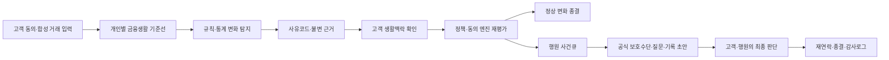
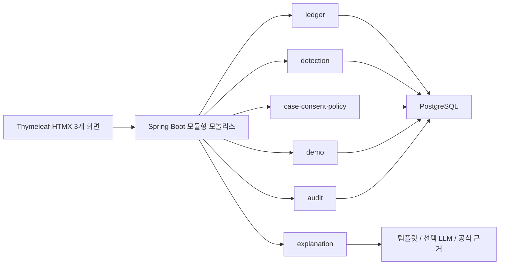
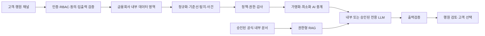

# ALZ's well 프로젝트 최종 통합 기준서

> 문서 상태: **최종 통합본 · Single Source of Truth (SSOT)**  
> 버전: **1.0**  
> 기준일: **2026-08-14**  
> 참가 대회: [2026 금융 AI Challenge](https://daker.ai/public/hackathons/2026-finance-ai-challenge)  
> 제출 마감: **2026-09-07 10:00 KST**

이 문서는 아래 네 문서를 비교·통합하고 충돌 항목을 하나로 확정한 프로젝트 최상위 기준서다.

- `안심리듬_프로젝트_최종방향.md`
- `Ansim_Rhythm_Project_Final_Direction.md`
- `Ansim_Rhythm_Project_Final_Summary.md`
- `PROJECT_DIRECTION.md`

앞으로 기획서, 기능명세서, 화면, 코드, 발표자료의 용어·범위·상태값이 충돌하면 이 문서를 따른다. 네 원본은 조사·의사결정 이력을 보존하는 참고자료로만 사용한다.

---

## 1. 최종 결론

### 서비스명

**ALZ's well**

과거 작업명 `치매머니`, `안심리듬`은 외부 문서, 고객 화면, 발표에서 사용하지 않는다. 필요할 경우 내부 변경 이력에서만 언급한다.

### 최종 부제

**금융생활 변화 조기알림 및 행원 보호업무 코파일럿**

`인지취약 고객`을 부제에 직접 넣지 않는다. 서비스가 고객을 인지취약자로 분류하거나 질병을 추론한다는 오해와 낙인을 피하기 위해서다.

### 한 문장 정의

> **ALZ's well은 치매를 진단하는 AI가 아니라, 고객 동의로 개인별 금융생활 기준선을 형성하고 평소와 다른 변화를 생활맥락으로 재확인한 뒤, 정상 변화는 종결하고 설명이 필요한 사건만 행원의 보호업무로 연결하는 B2B2C 금융안전 코파일럿이다.**

### 핵심 메시지

> **같은 경보, 다른 맥락, 다른 다음 행동**

> **더 많이 경보하는 AI가 아니라, 설명할 변화만 남기는 AI**

### 태그라인

> **진단이 아니라 조기경보, 차단이 아니라 확인과 연결**

### 최종 결정 요약

| 항목 | 최종 결정 |
|---|---|
| 사업 구조 | B2B2C, 금융회사 도입 중심 |
| MVP 주 사용자 | 은행 행원·소비자보호 담당자 |
| 공동 사용자·최종 수혜자 | 금융생활 변화 확인에 동의한 고객 |
| 핵심 가치 | 개인 기준선 → 생활맥락 확인 → 행원 보호업무 연결 |
| 기존 체계와 관계 | FDS·ASAP·안심차단·신탁·후견을 대체하지 않고 연결 |
| 탐지 | Java 기반 규칙·통계·시계열 분석 |
| 생성형 AI | 쉬운 설명·중립 질문·상담기록 초안만 담당 |
| 최종 판단·실행 | 고객, 행원, 법적 권한이 있는 금융회사 |
| MVP 구조 | Spring Boot 모듈형 모놀리스 |
| MVP 데이터 | 12개월 완전 합성데이터만 사용 |
| 핵심 데모 | 동일 거래·동일 경보에 맥락 패키지만 달리한 A/B 비교 |
| 추가학습 | MVP에서는 하지 않음. 평가로 필요성이 확인된 뒤 LoRA/QLoRA 검토 |
| RAG | P0는 공식 근거 카탈로그, 벡터 RAG는 P1 |
| LLM 장애 | 템플릿 폴백으로 전체 핵심 흐름 완주 |
| 실서비스 배치 | 내부망 또는 승인된 전용환경, 읽기 전용 분석부터 시작 |

---

## 2. 문제 정의와 서비스의 위치

금융권에는 이미 FDS·ASAP 같은 금융사기 탐지수단과 안심차단·지연이체·신탁·후견 같은 보호수단이 있다. 문제는 제도가 없다는 것이 아니라 다음 과정이 분절돼 있다는 점이다.

1. 고객 본인의 평소 금융생활에서 장기적인 변화를 발견한다.
2. 변화가 정상적인 생활사건인지 추가 확인이 필요한 사건인지 구분한다.
3. 고객에게 이유와 선택지를 이해하기 쉬운 말로 설명한다.
4. 설명이 필요한 사건만 행원의 보호업무로 연결한다.
5. 공식 보호수단의 적용조건을 확인하고 후속 상담·기록·재연락까지 관리한다.

### 고객의 어려움

- 여러 계좌·카드·자동이체에 흩어진 작은 변화를 장기 추세로 보기 어렵다.
- 중복결제, 반복송금, 신규 수취인, 공과금 누락을 서로 연결된 사건으로 이해하기 어렵다.
- 정상적인 입원·이사·여행·가족지원도 위험거래처럼 보일 수 있다.
- 안심차단, 지연이체, 신탁, 후견 등 여러 수단 중 무엇을 언제 선택할지 어렵다.
- 복잡한 금융용어와 정보량이 많은 비대면 화면은 고령층과 인지 부담이 있는 고객에게 특히 어렵다.
- 가족에게 계좌 통제권을 주지 않으면서 필요한 순간에 도움받을 방법이 제한적이다.

### 금융회사의 어려움

- FDS 경보 이후 거래 조회, 고객 연락, 사실확인, 질문 구성, 제도 검색, 기록, 재연락이 반복된다.
- 여러 거래 경보를 고객 단위 사건 하나로 묶어 파악하기 어렵다.
- 모든 동의 고객의 장기 금융생활을 직원이 전수검토할 수 없다.
- 거래정보, 고객서류, 내부 규정, 약관, 법률자료가 서로 다른 형태로 파편화돼 있다.
- 외부 AI와 모델 변경에는 보안성 평가, 승인, 검증 부담이 따른다.

### FDS·ASAP과의 경계

ALZ's well은 FDS를 대체하지 않는다. 사기형 탐지와 장기 재산관리 제도 사이에 `확인과 보호계획`이라는 조기 대응층을 추가한다.

| 구분 | FDS·ASAP | ALZ's well |
|---|---|---|
| 주요 목적 | 사기·계정탈취·의심계좌 탐지와 조치 | 개인 금융생활 변화 확인과 보호업무 지원 |
| 시간축 | 실시간·거래사건 중심 | 7·30·90일 및 6~12개월 개인 추세 |
| 주요 입력 | 거래·접속·기관 공유 사기정보 | 동의된 거래·정기납부·생활맥락 |
| 판단 기준 | 사기 패턴과 위험거래 규칙 | 고객 본인의 평소 금융생활 기준선 |
| 후속업무 | 확인·차단·신고 절차 | 질문·보호수단 조건·기록·재연락 초안 |
| 최종 결정 | 금융회사 정책과 담당자 | 고객과 권한 있는 금융회사 직원 |

### 차별점

차별점은 단일 이상탐지 모델, 다계좌 통합 또는 가족 알림 하나가 아니다. 다음 요소를 하나의 닫힌 업무 흐름으로 결합하는 데 있다.

1. 연령집단 평균이 아닌 고객 개인의 장기 기준선
2. 탐지 후 고객의 생활맥락과 구조적 근거를 통한 재평가
3. 동일 경보에도 맥락에 따라 달라지는 다음 행동
4. 강한 신호와 증거 불일치 시 정상종결을 막는 정책 가드레일
5. 고객용 쉬운 설명과 행원용 질문·기록·후속관리의 연결
6. 공식 보호수단의 적용조건과 최신 근거 연결
7. 동의·권한·감사로그 및 망분리 환경을 고려한 구조

`국내 최초`, `유일`, `금융권에 없던 기술`이라는 표현은 사용하지 않는다. EverSafe, Carefull 등 해외 서비스도 개인 기준선과 선택적 가족 알림을 제공하므로, ALZ's well의 차별성은 기능 하나가 아니라 위 조합과 국내 행원 업무의 폐루프에 둔다.

---

## 3. 사용자, 구매자, 가치

### 1차 구매·도입 부서

- 은행 소비자보호 부서
- FDS 경보 후속업무팀
- 고령·취약고객 보호 담당조직

### 주 사용자: 행원·소비자보호 담당자

AI가 묶은 사건, 변화 근거, 고객 답변, 중립 질문, 공식 보호수단 조건, 상담기록 초안을 검토하고 최종 판단한다.

**제공 가치**

- 모든 경보의 전수검토 대신 설명이 필요한 사건에 집중
- 거래 조회·질문 작성·규정 검색·기록 작성 시간 감소
- 근거, 고객 답변, 직원 결정의 추적 가능성 확보
- 미동의 연락과 무권한 조치를 시스템 수준에서 차단

### 공동 사용자·최종 수혜자: 고객

특정 연령이나 진단 여부로 위험고객이 되는 사람이 아니라, 자신의 금융생활 변화를 이해하고 필요한 도움을 스스로 선택하려는 동의 고객이다.

**제공 가치**

- 무엇이 평소와 달라졌는지 쉬운 말로 이해
- 정상 생활변화를 직접 설명하고 불필요한 상향을 줄임
- 필요한 경우 사람 상담과 공식 보호수단을 선택
- 동의·철회·이의제기·재검토 권한 유지

### 보조 참여자: 신뢰연락인

고객이 사전에 지정하고 정보·조건·기간을 별도로 동의한 가족 또는 지인이다. 신뢰연락인은 후견인이나 법정대리인이 아니며, 지정만으로 송금·해지·동결·차단 권한을 갖지 않는다.

### 제품 확장 단계

| 단계 | 범위 | 우선 가치 |
|---|---|---|
| 1. 공모전 MVP | 고객 맥락확인 최소 채널 + 행원 코파일럿 | 작동성·안전성·업무 연결 증명 |
| 2. 행원용 예방 AI | 비식별 사건, 규정검색, 기록·재연락 | 금융회사 업무효율 검증 |
| 3. 고객용 쉬운 금융 모드 | 큰 글씨, 고대비, 한 번에 한 질문, 읽어주기 | 금융접근성과 자기결정 지원 |
| 4. 안심지원 모드 | 고객 선택 또는 적법한 대리권 확인 후 공동관리 | 필수생활비·기억노트·공식 제도 연결 |

모든 고객용 장기 비전에는 금융생활 요약, 중복결제·구독 정리, 자연어 거래검색, 금융 기억노트, 하루 브리핑을 포함할 수 있다. 이 기능들은 공모전 P0가 아니다.

---

## 4. 절대 넘지 않는 선과 표현 원칙

### 금지 기능·행위

- 거래정보로 치매·인지저하·의사결정능력을 진단하거나 확률·점수·라벨로 저장
- 나이만으로 고객의 검토 우선순위를 높임
- AI가 자동으로 거래를 차단하거나 지급정지·한도변경을 실행
- 고객 동의 없이 가족 또는 신뢰연락인에게 연락하거나 정보를 제공
- 가족에게 별도 법적 권한 없이 송금·해지·동결 권한을 부여
- 탐지 신호를 대출·보험·마케팅·추심에 재사용
- 실제 고객 원문 거래내역이나 개인신용정보를 공개 외부 LLM에 전송
- 근거 없는 금융상품 추천, 법률·의료 판단, 가입 적합성 최종판정
- MVP에서 실제 마이데이터·여러 금융회사·실거래를 연결했다고 주장
- 합성데이터 성능을 실제 고객 대상 정확도나 임상 효과로 표현
- `규제를 완전히 준수`, `환각 0%`, `오탐 없음`과 같은 검증 불가능한 절대적 주장

### 금지·권장 표현

| 피해야 할 표현 | 사용하는 표현 |
|---|---|
| 치매를 조기진단한다 | 금융안전상 확인이 필요한 변화를 발견한다 |
| 치매 위험도 78% | 개인 기준선 대비 달라진 사실과 확인 필요 사유 |
| 고위험 고객을 선별한다 | 설명이 필요한 사건의 검토 우선순위를 정한다 |
| 인지취약성을 판별한다 | 평소와 다른 금융생활 변화를 확인한다 |
| AI가 보호조치를 결정한다 | 규칙 엔진이 후보를 제시하고 사람이 최종 결정한다 |
| 가족에게 자동으로 알린다 | 별도 동의한 신뢰연락인에게 최소정보 공동확인을 요청한다 |
| FDS를 대체한다 | FDS 이후 맥락확인·설명·후속업무를 보완한다 |
| 국내 최초·유일 | 기존 수단을 하나의 사용자 여정으로 결합한다 |
| 마이데이터로 전 금융사를 연결했다 | 표준 구조를 참고한 완전 합성 JSON을 사용했다 |
| 합성데이터 정확도는 실제 성능이다 | 코드 회귀와 설계 비교를 위한 합성 시나리오 결과다 |
| 완료 송금을 취소한다 | 은행 즉시 연락 등 공식 절차를 조건부 안내한다 |

고객 화면에는 `치매 의심`, `인지저하 확률`, `고위험 고객`을 사용하지 않는다. `쉬운 금융 모드`, `안심지원 모드`, `함께 관리 모드`처럼 중립적인 명칭을 쓴다.

---

## 5. 대회 적합성과 공식 일정

### 대회 적합성

| 대회 공식 예시 | ALZ's well 구현 |
|---|---|
| 이상거래 탐지 시 맞춤형 행동요령 | 변화 근거와 생활맥락에 따른 다음 행동 안내 |
| 고령층·장애인 디지털 격차 해소 및 포용금융 | 큰 글씨·쉬운 설명·단계적 확인·사람 상담 연결 |
| 이상금융거래 AI 분석·탐지 | 개인별 장기 기준선과 복합 변화신호 탐지 |

대회는 실제 작동 가능한 웹서비스를 요구한다. 공개된 세부 배점은 없으므로 임의의 배점표를 공식 평가기준처럼 제시하지 않는다.

### 공식 제출 일정

2026년 8월 14일 공식 대회 페이지에서 재확인한 기준이다. 일정은 운영기관 사정으로 변경될 수 있으므로 제출 직전에 다시 확인한다.

| 항목 | 공식 일정·조건 |
|---|---|
| 기획서 PDF 제출 | 2026-09-07 10:00까지 |
| 기능명세서 PDF·웹서비스 URL 제출 | 2026-09-07 10:00까지 |
| URL 필수 접근 기간 | 2026-09-07 11:00 ~ 2026-09-11 23:59 |
| 발표 심사 대상 발표 | 2026-09-22 |
| 발표 대상 최종 PDF·소스 ZIP | 2026-10-08 23:59까지 |
| 오프라인 발표 심사 | 2026-10-13 |
| 최종 결과 발표 | 2026-10-23 |
| 발표 대상 | 본선 상위 11팀 내외 |
| 발표 형식 | 15분 발표 + 5분 질의응답 |

대회에서 별도 데이터를 제공하지 않으므로 MVP는 자체 생성한 완전 합성데이터만 사용한다.

---

## 6. 전체 서비스 흐름과 역할 분리



| 구성요소 | 담당 역할 | 담당하지 않는 일 |
|---|---|---|
| 변화탐지 엔진 | 개인 기준선, MAD, 신규성, 반복·누락·추세, 사유코드 | 질병 추론 |
| 사건·맥락 엔진 | 신호 병합, 고객 답변과 구조적 근거 반영 | 자유문장 생성 |
| 정책·동의 엔진 | 상태전이, 연락권한, 보호수단 후보, 사람 승인 조건 | 법적 권한의 임의 생성 |
| 생성형 AI | 쉬운 설명, 중립 질문, 상담기록·체크리스트 초안 | 점수·상태·실행 결정 |
| 고객 | 본인거래·생활맥락 확인, 동의·철회, 도움 선택 | AI 판단의 수동적 수용 강요 |
| 행원 | 사실확인, 질문, 조치안 검토, 후속관리, 종결 | AI 초안의 무검토 실행 |
| 금융회사 | 내부정책과 법적 근거에 따른 실제 조치 | MVP의 모의 버튼을 실제 조치로 오인 |

핵심 원칙은 **탐지는 규칙·통계가, 설명 초안은 생성형 AI가, 중요한 판단과 실행은 사람이 담당한다**는 것이다.

---

## 7. 공모전 MVP 최종 범위

MVP는 **세 화면, 한 개의 동일조건 A/B 데모, 결정론적 안전장치**에 집중한다.

### 공통 데모 조건

- 첫 화면에서 로그인 없이 `90초 비교 데모 시작` 가능
- 각 익명 세션은 다른 세션과 완전히 분리
- `Reset`은 같은 seed와 같은 원시 스냅샷을 멱등적으로 복원
- 화면 상단에 `모든 데이터는 합성데이터입니다` 고정 표시
- 외부 LLM API 키가 없어도 전 과정 동작
- 공모전 공개 경로만 무로그인이고, PoC·운영 행원 화면은 RBAC를 적용

### 화면 1. 고객 금융생활 변화

- 12개월 완전 합성 금융생활 표시
- 최초 9개월 기준선, 최근 3개월 관찰구간
- 개인별 평소값과 현재값 비교
- 신규 수취인·반복송금·정기납부 누락 등 사유코드 표시
- 계산점수보다 `무엇이 얼마나 달라졌는지`를 사실로 설명
- 질병·인지상태 라벨 없음
- 동일 비교 데모의 `alertId`, 알고리즘 버전, 근거 거래 확인

### 화면 2. 생활맥락 확인

- 큰 글씨, 높은 명암, 명확한 버튼
- 한 화면에 질문 하나만 표시
- 변화 근거가 드러나는 중립적 질문
- 고객 응답 세트:
  - `내가 알고 한 거래예요`
  - `생활변화가 있었어요`
  - `본인 거래인지 확인하기 어려워요`
  - `나중에 확인할게요`
  - `은행에 문의할게요`
- 강한 신호는 고객의 단순 확인만으로 자동 해제하지 않음
- 정상종결에는 응답과 구조적 근거의 일치가 필요
- 신뢰연락인 동의 상태 및 최소정보 미리보기
- 미동의 시 연락 기능을 UI와 서버 모두에서 차단

### 화면 3. 행원 사건큐와 코파일럿

- 여러 변화신호를 고객 사건 하나로 묶은 타임라인
- 검토 우선순위, 사유코드, 평소값, 현재값, 근거 거래
- 고객 답변, 확인된 맥락, 미확인 항목
- 고객에게 물어볼 중립 질문 초안
- 공식 출처·기준일·적용조건이 있는 보호수단 후보
- 상담기록 및 재연락 일정 초안
- 비식별 LLM 입력과 `왜 이렇게 판단했나요?` 영역
- 직원 버튼:
  - `검토 시작`
  - `추가 확인 필요`
  - `안내 계획 승인` — 상담 계획 승인일 뿐 실제 계좌조치가 아님
  - `오탐 종결`
- 신뢰연락인 미동의 시 비활성화 사유와 차단 감사로그 표시

### MVP에서 구현하지 않는 것

- 실제 금융거래·코어뱅킹·마이데이터 연동
- 실제 가족 문자·전화·푸시 발송
- 실제 송금·지급정지·한도변경
- 질병 추론 모델 또는 판단능력 평가
- 모바일 네이티브 앱
- 자체 기반모델 사전학습 또는 운영 중 자동학습
- MSA, Kafka, Kubernetes, 전사 Agent 플랫폼
- 온프레미스 GPU 구축
- 실시간 음성 STT·대규모 OCR

---

## 8. 단일 기준 A/B 데모 명세

네 문서에 있던 `병원비 180만 원`과 `이사·부동산 송금` 시나리오 중 **이사·부동산 송금 시나리오 하나로 고정한다**. 계약·주소변경과 같은 구조적 근거를 사용할 수 있어 자기신고만으로 경보를 해제하는 문제를 피하기 쉽기 때문이다.

### 비교 통제 원칙

A와 B는 두 고객이 아니다. 같은 익명 데모 세션을 Reset해 재생하는 동일 사건이다.

다음 값은 완전히 고정한다.

- `scenarioSeed`
- `alertId`
- 12개월 원시 거래 스냅샷
- 기준선·특징값·사유코드
- 알고리즘·정책 버전
- `preDecision`

달라지는 것은 **후속 맥락 패키지**, 즉 고객 응답과 이를 검증할 구조적 근거뿐이다.

### 공통 최초 경보

| 항목 | 고정 내용 |
|---|---|
| 시나리오 ID | `MOVE_AB_001` |
| 경보 ID | `ALERT_MOVE_001` |
| 사전 판단 | `NEEDS_CONTEXT` |
| 신규 수취인 | 1명 |
| 반복송금 | 2회, 합계 1,850만 원 |
| 정기납부 누락 | 공과금 1건 |
| 핵심 사유코드 | `NEW_PAYEE`, `REPEATED_TRANSFER`, `MISSED_RECURRING` |
| 신뢰연락인 동의 | `false` |

실제 화면에는 합성 수취인명과 합성 거래일자를 표시할 수 있지만 LLM에는 아래와 같은 범주화된 사건요약만 보낸다.

### A 경로: 검증된 정상 생활변화

1. 고객이 `생활변화가 있었어요`를 선택한다.
2. 이사 보증금 분할송금이라고 설명한다.
3. 합성 임대차 계약 식별자와 주소변경 이벤트가 거래기간과 일치한다.
4. 공과금 누락도 주소이전 시점과 일치한다.
5. 정책엔진이 강한 신호와 구조적 근거의 정합성을 확인한다.
6. `postDecision=CLOSE_AS_NORMAL_CONTEXT`, 상태 `CLOSED_NORMAL`로 종결한다.
7. 자동 차단·외부 통보 없이 자동이체 재등록 체크리스트만 제공한다.

### B 경로: 본인 거래 확인 불가

1. 같은 사건을 Reset한다.
2. 고객이 `본인 거래인지 확인하기 어려워요`를 선택한다.
3. 계약·주소변경 등 정상 생활맥락의 구조적 근거가 없다.
4. 신규 수취인·반복송금·정기납부 누락 근거를 그대로 유지한다.
5. `postDecision=REQUIRE_BANK_REVIEW`, 상태 `PENDING_BANK_REVIEW`로 전환한다.
6. 신뢰연락인 미동의이므로 연락 시도는 `BLOCKED_BY_CONSENT`로 거절한다.
7. 행원 화면에 근거, 중립 질문, 보호수단 후보, 상담기록 초안을 표시한다.
8. 행원 승인 전 실제 거래차단·한도변경은 발생하지 않는다.

### 90초 시연 시간표

| 시간 | 시연 내용 |
|---|---|
| 0~15초 | 무로그인 데모 시작, 고객 홈에서 고정 경보 선택 |
| 15~38초 | A 맥락과 구조적 근거 확인 후 정상종결 |
| 38~48초 | 같은 seed·snapshot으로 Reset |
| 48~63초 | B 본인 거래 확인 불가 선택 후 행원 검토 전환 |
| 63~78초 | 미동의 연락 차단과 감사로그 확인 |
| 78~90초 | 행원 화면에서 근거·질문·보호수단·기록 초안 확인 |

### 데모 수용기준

- 로그인 0회
- 첫 상호작용 5초 이내
- 외부 API 키 0개로도 완주
- 동일 seed·버전 결과 재현율 100%
- 미동의 신뢰연락인 실제 호출 0건
- 행원 승인 전 실제 계좌조치 0건
- LLM 장애 시 템플릿 폴백 100%
- 익명 세션 간 상태 누출 0건
- Reset 멱등성 보장

---

## 9. 표준 상태, 판단, 사유코드

### 사건 상태

```text
OPEN
  → AWAITING_CONTEXT
      → CONTEXT_DEFERRED → AWAITING_CONTEXT
      → CLOSED_NORMAL
      → PENDING_BANK_REVIEW
          → IN_BANK_REVIEW
              → FOLLOW_UP_REQUIRED
              → CLOSED_GUIDANCE_PROVIDED
              → CLOSED_FALSE_POSITIVE
```

| 상태 | 의미 |
|---|---|
| `OPEN` | 변화신호가 사건으로 생성됨 |
| `AWAITING_CONTEXT` | 고객의 본인거래·생활맥락 확인 대기 |
| `CONTEXT_DEFERRED` | 고객이 나중에 확인을 선택함 |
| `CLOSED_NORMAL` | 구조적 근거와 일치한 정상 생활변화로 종결 |
| `PENDING_BANK_REVIEW` | 설명이 필요해 행원 큐에 등록됨 |
| `IN_BANK_REVIEW` | 행원이 검토를 시작함 |
| `FOLLOW_UP_REQUIRED` | 추가 고객확인·재연락 필요 |
| `CLOSED_GUIDANCE_PROVIDED` | 안내계획 제공 후 종결 |
| `CLOSED_FALSE_POSITIVE` | 데이터·규칙상 오탐으로 종결 |

`BLOCKED_BY_CONSENT`는 사건 상태가 아니라 **연락·정보제공 시도의 거절 결과 코드**다.

### 판단 필드

- `preDecision`: 생활맥락 확인 전 판단
- `postDecision`: 생활맥락 확인 후 판단
- `contextSource`: 고객 응답, 합성 계약, 주소변경 등 출처
- `contextValidFrom`, `contextValidTo`: 맥락 유효기간
- `evidenceIds`: 판단에 사용된 불변 근거 ID
- `algorithmVersion`, `policyVersion`: 계산·정책 버전

최초 판단을 덮어쓰지 않고 전후 판단과 근거를 모두 보존한다.

판단 코드는 다음 세 값으로 통일한다.

| 판단 코드 | 사용 시점 | 의미 |
|---|---|---|
| `NEEDS_CONTEXT` | `preDecision` | 생활맥락 확인이 필요함 |
| `CLOSE_AS_NORMAL_CONTEXT` | `postDecision` | 구조적 근거가 일치한 정상 생활변화 |
| `REQUIRE_BANK_REVIEW` | `postDecision` | 설명이 더 필요해 행원 검토로 전환 |

### 표준 사유코드

| 코드 | 의미 |
|---|---|
| `NEW_PAYEE` | 과거 기준선에 없던 신규 수취인 |
| `REPEATED_TRANSFER` | 동일·유사 수취인·금액의 반복송금 |
| `DUPLICATE_PAYMENT` | 시간창 내 중복 가능성이 있는 결제 |
| `MISSED_RECURRING` | 예상 정기납부의 유예기간 내 미발생 |
| `CASH_WITHDRAWAL_TREND` | 현금인출 금액·빈도의 지속 증가 |
| `UNUSUAL_AMOUNT` | 개인 기준선 대비 금액 변화 |
| `UNUSUAL_TIME` | 개인 기준선 대비 이용시간 변화 |
| `TREND_SHIFT` | 일정 기간 지속된 수준·추세 변화 |

과거 문서의 `MISSED_RECURRING_PAYMENT`는 구현과 문서에서 `MISSED_RECURRING`으로 통일한다.

각 신호에는 최소한 다음을 저장한다.

- `reasonCode`
- 평소값과 비교기간
- 현재값과 관찰기간
- 기여도 또는 사실 근거
- 근거 거래 ID
- 준비상태 `READY`, `LOW_CONFIDENCE`, `COLD_START`
- 규칙·알고리즘 버전
- 계산시각

---

## 10. 탐지엔진 설계

LLM은 수치 거래의 이상 여부를 판단하지 않는다. Java 기반 규칙·통계·시계열 엔진이 설명 가능한 사실 근거를 생성한다.

### 특징별 MVP 방식

| 신호 | 기본 방식 | 예외·안전처리 |
|---|---|---|
| 금액·횟수 급증 | 일·주 중앙값과 MAD 기반 단측 modified z | MAD=0·희소값이면 IQR·분위수·절대규칙 또는 `LOW_CONFIDENCE` |
| 신규 수취인 | 정규화된 수취인 사전과 최초 등장 규칙 | 본인계좌·표기변형·은행명 변형 구분 |
| 반복송금·중복결제 | 수취인·금액·시간창의 결정적 규칙 | 취소·환불·pending 거래 분리 |
| 정기납부 누락 | 주기 추정과 grace period | 데이터 단절·연결장애를 미납으로 오인하지 않음 |
| 점진 추세 | 연속 기간 증가 규칙, 필요 시 Theil–Sen 비교 | 명절·이사·여행·급여일 변화 반례 검증 |
| 수준 전환 | P1에서 온라인 변화점 탐지 비교 | 미래정보를 보는 오프라인 누수 금지 |
| 사건 융합 | 사유코드·기간·수취인 기반 정책표 | 중복억제, cooldown, 고객별 경보예산 |

Isolation Forest, LightGBM 등은 핵심 판정기가 아니라 오프라인 비교실험 후보로만 사용한다.

### 기준선과 콜드 스타트

- 공모전 데모는 최초 9개월을 기준선, 최근 3개월을 관찰구간으로 사용한다.
- 90일 미만 이력은 `COLD_START`로 표시하고 강한 결론을 내리지 않는다.
- 90일 이상이면 임시 기준선을 만들되 `LOW_CONFIDENCE`를 표시한다.
- 6~12개월 이력이 확보되면 기준선 신뢰도를 높인다.
- 연령집단 평균만으로 고객 위험을 분류하지 않는다.
- 이상기간을 즉시 정상 기준선으로 학습하지 않는다.
- 고객 또는 행원이 정상으로 확인한 관측만 제한적으로 반영한다.
- 맥락에는 유효기간을 두고 강한 신규증거가 나타나면 다시 확인한다.

### 안전한 맥락 재평가

- 고객의 `괜찮아요` 또는 `내가 한 거래예요` 응답만으로 강한 신호를 해제하지 않는다.
- 정상종결은 고객 응답과 계약·주소변경 등 구조적 근거가 일치할 때만 허용한다.
- 답변과 거래증거가 불일치하면 `PENDING_BANK_REVIEW`로 보낸다.
- 거래 사실 정합성은 LLM이 아니라 DB 조회와 결정론적 규칙으로 확인한다.
- 고객에게는 보정되지 않은 질병·위험 확률 대신 확인 가능한 사실을 보여준다.

---

## 11. 합성데이터와 평가 계획

### 데이터 구성

- 실제 고객정보, 실제 계좌, 실제 의료정보 사용 금지
- 12개월 합성 거래 프로필 **240개 생성 목표**
- 정상 패턴 80개
- 설명 가능한 생활변화 80개
- 행원 검토 필요 시나리오 80개
- 최소 60개를 튜닝 전에 고객·페르소나 단위 고정 테스트셋으로 분리
- 화면 시연용 페르소나와 평가용 골든셋 분리
- 기준선 기간과 사건 주입 기간을 시간으로 분리
- 생성기와 탐지기가 동일 임계값·정답 규칙을 공유하지 않음
- 여러 random seed로 반복 평가

### 반드시 포함할 정상 반례

- 이사 계약금·잔금과 주소이전
- 입원·의료비
- 여행·해외사용
- 가족지원
- 명절 지출
- 큰 합법 구매
- 급여일·소득 변화
- 신규 계좌 연결
- 데이터 수집 단절
- 결제 취소·환불·pending

### 비교실험

| 비교군 | 구성 | 검증 목적 |
|---|---|---|
| A. 전역 규칙 | 모든 고객에 공통 금액·횟수 임계값 | 개인차로 발생하는 과다 경보 측정 |
| B. 개인 기준선 | A + 중앙값·MAD + 신규성 + 정기납부 주기 | 개인화의 추가가치 측정 |
| C. 기준선 + 맥락 | B + 검증된 정상 생활사건 | 위험사건 검토를 유지하며 불필요한 상향 감소 측정 |

### 평가 지표

**탐지·사건**

- 사건 단위 precision·recall·F1, PR-AUC
- 사용자-월당 오경보 수
- 사건당 중복경보 수
- 변화 시작부터 첫 경보까지 탐지 지연
- cold-start coverage
- 정상맥락 종결률
- 위험사건 unsafe downgrade rate
- 근거 거래 ID 정확도와 허구 근거 수

**생성형 AI·RAG**

- 구조화 JSON 유효률
- 근거와 설명의 일치율
- 금지표현·근거 없는 안내 발생률
- 공식 출처·페이지 정확성
- 쉬운 말 이해도
- timeout·오류 시 폴백 성공률

**업무·시스템**

- 행원 사건 검토시간
- 상담기록 작성시간과 수정률
- 조회·화면이동·문서검색 횟수
- 직원 override 비율
- 90초 데모 완주율
- 미동의 연락·무권한 실행 차단률
- 익명 세션 교차누출과 Reset 오류

### MVP 목표값

아래 값은 달성 결과가 아니라 개발 목표·수용기준이다. 제출본에는 실제 측정값과 목표값을 구분한다.

| 지표 | 목표 |
|---|---:|
| 검토 필요 사건 재현율 | 90% 이상 |
| 정상 생활맥락 오경보 해제율 | 80% 이상 |
| 맥락 확인 후 불필요한 상향 감소 | 50% 이상 |
| 사유코드·화면 설명 추적 가능률 | 100% |
| 미동의 연락·자동조치 차단률 | 100% |
| LLM 입력 개인정보 노출 | 0건 |
| 근거 없는 보호수단 안내 | 0건 |
| 행원 사건 검토시간 | 수기 대비 30% 단축 목표 |
| 핵심 데모 E2E | 100회 중 99회 이상 성공 |

합성데이터 결과는 코드 회귀와 설계 비교를 위한 시뮬레이션이다. 실제 금융회사 성능, 고령층 효과 또는 임상 예측력으로 확대해 주장하지 않는다.

---

## 12. 생성형 AI, 모델, RAG 최종 방향

### 모델 전략

기반모델을 처음부터 만들지 않는다. 4명 팀과 공모전 일정에서 데이터, GPU, 평가, 보안을 감당하기 어렵고 서비스의 핵심 가치도 아니다.

우선순위는 다음과 같다.

1. 결정론적 탐지·정책·템플릿 경로 구현
2. 승인된 공식자료 카탈로그와 근거 표시
3. 고정 평가세트로 안전성과 실패 유형 측정
4. 선택형 생성형 AI로 표현 개선
5. 반복 실패가 증명될 때만 RAG 고도화·LoRA/QLoRA 검토

### 구성요소별 역할

| 구성요소 | 역할 | MVP 우선순위 |
|---|---|---|
| Java 규칙·통계·시계열 | 수치 거래 변화 탐지 | P0 |
| 정책·동의 엔진 | 상태·권한·보호수단 후보 강제 | P0 |
| 템플릿 생성기 | 키 없이 쉬운 설명·질문·기록 생성 | P0 |
| 공식 근거 카탈로그 | 구조화 조건·출처·기준일 제공 | P0 |
| 외부 또는 오픈웨이트 LLM | 문장 표현 개선, 구조화 초안 | P1 |
| 벡터 RAG | 공식 문서 검색 고도화 | P1 |
| KoBERT·KLUE-RoBERTa·KoELECTRA | 의도·위험표현·PII 분류 보조 | P2 |
| KR-FinBERT 계열 | 금융 문서·상담 텍스트 분류 보조 | P2 |
| LoRA/QLoRA | 반복 실패 업무의 제한적 개선 | 대회 이후 |

KoBERT 계열은 생성형 sLLM이 아니다. 여러 BERT 모델을 결합한다고 sLLM이 되지 않는다. 탐지는 작은 예측·규칙 모델, 설명은 생성형 모델, 최종 통제는 정책엔진과 사람으로 분리한다.

### 오픈웨이트 sLLM 선정 기준

P1 또는 PoC에서 내부형 모델을 검토할 경우 다음 기준으로 선정하고 특정 모델명은 기술검증 후 확정한다.

- 한국어 성능
- 상업적 이용조건
- 온프레미스·전용환경 배포 가능 여부
- 4bit 양자화 지원
- 구조화 JSON 출력 안정성
- 제한된 GPU 메모리에서의 구동 가능성
- 모델·토크나이저·라이선스 버전 고정 가능성

LoRA는 문체 흉내가 아니라 쉬운 설명, 정해진 상담기록 형식, 근거 필드가 있는 JSON, 금지행동 거부처럼 반복 측정 가능한 실패에만 사용한다. 실제 고객정보가 아니라 공개자료, 전문가 검토 문장, 완전 합성 사례만 학습에 쓴다.

### 공식 근거 카탈로그와 RAG

MVP P0는 벡터DB가 없어도 동작하는 구조화 공식 근거 카탈로그다. P1에서 pgvector 등 벡터검색을 추가할 수 있다.

허용 자료:

- 금융위원회·금융감독원·금융보안원 등 공식 자료
- 국민연금공단 등 공공기관의 공식 제도 안내
- 사용 허가를 받은 은행 내부 업무매뉴얼과 소비자보호 지침
- 승인된 FDS 경보 처리절차, 상담문구, 민원 대응 기준

각 문서는 다음 메타데이터를 가진다.

- 문서 ID, 문서명, 발행기관
- 출처 URL
- 시행·게시일, 효력 시작·종료일, 확인 기준일
- 조항·페이지·섹션
- 문서 버전·체크섬
- 접근등급과 허용 사용자

정책엔진이 적용 가능한 후보를 먼저 고르고, LLM은 그 후보만 쉬운 말로 설명한다. URL과 페이지는 LLM이 생성하지 않고 검색 메타데이터에서 서버가 조립한다. 근거나 최신성을 확인할 수 없으면 `확인 불가·행원 재확인 필요`로 남긴다.

### 비식별 LLM 입력

```json
{
  "alertId": "ALERT_MOVE_001",
  "reasonCodes": ["NEW_PAYEE", "REPEATED_TRANSFER", "MISSED_RECURRING"],
  "newPayeeCount": 1,
  "totalTransferAmountBand": "10M_20M_KRW",
  "repeatedTransferCount": 2,
  "missedRecurringCount": 1,
  "confirmedLifeContext": false,
  "trustedContactConsent": false,
  "allowedEvidenceIds": ["DOC-POLICY-001"]
}
```

이름, 계좌번호, 카드번호, 정확한 원문 거래내역, 상세 상호명, 질병 추정정보는 전달하지 않는다.

### LLM 출력 제한

LLM은 정해진 스키마의 다음 필드만 초안으로 반환한다.

- 고객용 쉬운 설명
- 중립 확인질문
- 행원 상담기록 초안
- 후속 체크리스트
- 사용한 `evidenceIds`

LLM은 `reasonCodes`, 사건 상태, 우선순위, 연락권한, `actionCode`를 변경할 수 없다. 자연어 출력을 실행 명령으로 사용하지 않는다.

### 결정론적 폴백

```text
탐지엔진
→ 정책결정
→ 구조화 ExplanationFacts
→ TemplateExplanationGenerator
→ 선택적으로 LLM이 표현만 개선
```

API 키 없음, timeout, 429, 5xx, malformed JSON, schema 오류, 금지표현 탐지 시 즉시 템플릿으로 전환한다. LLM이 없어도 탐지, 맥락확인, 동의차단, 행원검토, 감사로그가 모두 작동해야 한다.

---

## 13. 공모전 MVP 기술 아키텍처

### 최종 결정

**Spring Boot 기반 모듈형 모놀리스**를 사용한다. 별도 Python ML 서버, GPU 서버, MSA는 공모전 P0가 아니다.

### 기본 기술 구성

- Java 21
- Spring Boot
- Spring MVC·Spring Security
- Spring Data JPA를 기본 데이터 접근으로 사용
- 복잡한 분석 조회가 실제로 필요할 때만 JDBC 또는 jOOQ 보조
- PostgreSQL, Flyway
- Thymeleaf + HTMX
- Spring AI는 선택 사용
- Docker 기반 배포
- Actuator·Micrometer 기반 헬스체크
- Testcontainers 기반 통합시험 권장

정확한 라이브러리 버전은 실제 `build.gradle` 또는 `pom.xml`을 최종 기준으로 삼고 문서와 동기화한다.

### 처리 구조



### 모듈 책임

| 모듈 | 책임 |
|---|---|
| `ledger` | 합성거래 입력, 수취인·가맹점 정규화, 취소·환불·데이터 품질 |
| `detection` | feature, baseline, MAD, 추세, reasonCodes |
| `case` | 사건 병합, 맥락 이벤트, 상태기계, 직원 검토 |
| `consent` | 분석·신뢰연락인 동의, 철회, 최소정보 정책 |
| `policy` | 우선순위, 정상종결 조건, 보호수단 후보, 실행 금지 |
| `explanation` | 템플릿, 선택 LLM, 공식 근거검색, 출력검증 |
| `demo` | 익명 세션, 시나리오 seed, Reset, 3개 화면 |
| `audit` | 사건·근거·결정·모델·문서·직원 override 이력 |

의존방향은 가능한 한 `demo → case → detection → ledger`, `case → consent·policy·explanation`, 모든 중요 이벤트 → `audit`로 유지한다.

### 핵심 API 초안

```http
POST /demo/sessions
POST /demo/sessions/{sessionId}/reset
POST /demo/sessions/{sessionId}/scenarios/MOVE_AB_001/ingest

GET  /demo/sessions/{sessionId}/customers/{customerId}/alerts
GET  /demo/sessions/{sessionId}/alerts/{alertId}
POST /demo/sessions/{sessionId}/alerts/{alertId}/context
GET  /demo/sessions/{sessionId}/alerts/{alertId}/audit

GET  /demo/sessions/{sessionId}/staff/cases
GET  /demo/sessions/{sessionId}/cases/{caseId}
POST /demo/sessions/{sessionId}/cases/{caseId}/review
POST /demo/sessions/{sessionId}/cases/{caseId}/guidance-plan
```

### 최소 데이터 구조

| 테이블 | 핵심 필드 |
|---|---|
| `demo_session` | session_id, scenario_seed, expires_at, reset_version |
| `customer` | synthetic_customer_id, profile_type |
| `account` | synthetic_account_id, customer_id, account_type |
| `transaction` | occurred_at, posted_at, amount, payee_key, channel, status |
| `recurring_obligation` | obligation_code, expected_cycle, grace_period |
| `baseline_snapshot` | feature_code, window, median, mad, readiness, algorithm_version |
| `anomaly_signal` | reason_code, baseline_value, current_value, evidence_ids |
| `alert_incident` | alert_id, pre_decision, post_decision, state, reason_codes |
| `context_event` | context_code, source, evidence_period, expiry, user_response |
| `consent_snapshot` | purpose, recipient, fields, duration, granted_at, revoked_at |
| `protection_case` | case_id, alert_id, priority, assigned_role, state |
| `action_catalog` | action_code, eligibility_rule, source_document_id |
| `staff_review` | reviewer, decision, note, follow_up_at |
| `source_document` | issuer, source_url, version, effective_from/to, access_class, sha256 |
| `knowledge_chunk` | document_id, page, section, text, embedding_version |
| `decision_audit` | trace_id, event_type, policy/model/prompt/schema version, override |

`occurredAt`과 `postedAt`, 문서 효력시간과 시스템 수집시간을 분리한다. 원본 근거와 판단 snapshot은 불변 버전으로 관리한다.

---

## 14. 동의, 신뢰연락인, 보안

### 신뢰연락인 별도 동의

고객이 다음 항목을 구체적으로 선택해야 한다.

- 누구에게 알릴지
- 어떤 사건·조건에서 알릴지
- 어떤 최소정보를 보낼지
- 얼마 동안 허용할지
- 언제·어떻게 철회·교체할지
- 신뢰연락인 대신 행원에게만 알릴지

신뢰연락인도 초대 수락, 본인확인, 연락처 처리 동의를 거친다.

### 최소정보 원칙

가능한 알림 예시:

> 확인이 필요한 금융활동이 있습니다. 고객에게 연락하거나 은행 상담을 도와주세요.

기본적으로 보내지 않는 정보:

- 전체 거래내역과 잔액
- 상세 수취인·상호
- 정확한 거래금액
- 질병·인지상태 추정정보

### 권한 경계

- 알림, 제한열람, 공동확인, 송금, 해지, 차단 권한을 각각 분리한다.
- 가족이 금융착취 당사자일 가능성을 고려해 의심 연락인은 제외한다.
- 복수 연락인, 즉시 철회, 열람로그, 행원 전용 검토경로를 둔다.
- 미동의 상태에서는 UI뿐 아니라 서버 정책에서 연락을 차단한다.
- 이 설계가 모든 법적 요건을 충족한다고 단정하지 않는다. 실제 도입 전 법무·준법·정보보호·신용정보관리 부서가 검토한다.

### MVP 보안 원칙

- 완전 합성 거래·고객·음성만 사용
- 이름, 계좌, 카드, 주민번호 형식의 입력 차단 데모
- 실제 거래 원문 대신 구조화·가명화 사건요약만 모델에 전달
- prompt·completion 원문 로그 기본 비활성화
- 공식 문서는 프롬프트 지시가 아니라 비신뢰 데이터로 격리
- 승인된 출처 allowlist와 검색 결과 검증
- 모델·프롬프트·문서·정책·스키마 버전 감사
- 중요 직원행위에 역할별 접근통제와 운영환경 추가인증
- kill switch, 템플릿 모드, 감사 가능한 직원 override
- 익명 세션 만료·격리·Reset 테스트

---

## 15. 실서비스 목표 구조와 망분리

공모전의 단일 Spring 앱과 실서비스 목표 구조를 구분한다. 공모전 구조를 금융회사 운영 구조라고 주장하지 않는다.



### 내부 보호영역에서 완결할 업무

- 실제 거래 정규화와 개인 기준선 계산
- 이상변화 탐지와 사건 우선순위
- 생활맥락·동의·권한 확인
- 행동코드와 연락 가능 여부 결정
- 행원 사건큐와 감사로그

### 내부 또는 승인된 전용 LLM 업무

- 고객 거래의 쉬운 설명
- 행원 사건요약과 중립 질문
- 상담기록 초안
- 내부 규정·약관 검색

### 승인된 외부 환경을 검토할 수 있는 업무

- 실제 고객정보가 없는 금융용어 쉬운 말 변환
- 공개 제도·법령·약관 요약
- 완전 합성데이터 기반 데모
- 직원 교육용 가상사례

검색 문서가 입력보다 더 민감하면 데이터 등급을 상향한다.

```text
effectiveDataClass = max(inputDataClass, retrievedDocumentDataClass)
```

실거래 원문과 식별정보는 금융회사 통제영역에 남긴다. 외부 생성형 AI와 고객정보 전송이 자동 허용된다고 표현하지 않으며, 서비스 목적·데이터·배치구조별 보안성 평가와 법적 검토를 전제로 한다.

### 단계별 배치

| 단계 | 배치 방식 |
|---|---|
| 공모전 | 공개 URL의 단일 Spring 앱, 합성데이터만 사용 |
| 은행 PoC | 은행 전용 VPC·내부망, 가상·비식별 사건, 직원 RBAC |
| 제한 실증 | 한 금융회사, 동의 고객, 읽기 전용 분석, 실행권한 제외 |
| 운영 | 내부 또는 승인된 전용 배치, 기존 업무시스템과 제한 연계 |

### 선택형 GCP·GPU 참고안

MVP 기본경로는 GPU가 없어도 동작해야 한다. 오픈웨이트 sLLM을 P1에서 검증할 때만 Spring 업무 서버와 별도 추론 서버를 고려한다.

- 추론 후보: L4 24GB급 GPU 1장과 4bit 양자화 모델
- 업무 서버: 소형 VM 또는 관리형 컨테이너
- 개발 중 GPU 자동 종료, 심사기간에만 필요한 시간 운영
- 모델·어댑터·인덱스를 이미지·스토리지에 보관
- 예산 알림과 GPU 쿼터를 사전 확인
- AI 서버 장애 시 규칙·템플릿 데모 지속

클라우드 무료 크레딧, GPU 제한, 가격, SKU는 변경될 수 있으므로 이 문서에서 고정 예산으로 간주하지 않는다. 사용 직전에 [Google Cloud 무료 프로그램](https://cloud.google.com/free)과 공식 가격·쿼터 문서를 다시 확인한다.

---

## 16. 개발 우선순위

### P0 — 제출 전 반드시 구현

- 무로그인 익명 데모 세션과 멱등 Reset
- 12개월 합성 거래와 고정 A/B fixture
- 개인 중앙값·MAD 기준선과 cold-start 처리
- 신규 수취인·반복송금·정기납부 누락 탐지
- 동일 `alertId`의 맥락 재평가
- 세 개 화면의 end-to-end 동작
- 정상종결과 행원검토 상태전이
- 미동의 신뢰연락인 hard block
- 행원 승인 전 실행 이벤트 0건
- 템플릿 설명과 no-key 폴백
- 공식 보호수단 카탈로그와 출처·기준일 표시
- 사건·근거·동의·결정·직원행위 감사로그
- 공개 URL, 헬스체크, 시크릿모드 smoke test
- 기획서·기능명세서·화면·코드의 용어·수치 일치

### P1 — 완성도 향상

- 선택형 LLM의 쉬운 설명·질문·상담기록 생성
- 공식문서 벡터 RAG와 pgvector
- 큰 글씨·고대비·읽어주기
- 금융 기억노트
- 비교군 A/B/C 평가 대시보드
- 탐지 결과 설명 시각화
- 평가 리포트 자동 생성
- 익명 세션 모니터링과 복구 자동화

### P2 — 발표 진출 또는 대회 이후

- 실제 음성검색·TTS 고도화
- KoELECTRA·KoBERT 기반 위험문장·PII 분류
- 내부·외부 모델 데이터등급 라우팅 PoC
- 모델 registry·shadow·canary·kill switch 고도화
- LoRA/QLoRA 추가학습
- 다기관 정책문서 RAG와 권한 분리
- 금융회사·마이데이터 제휴 검토
- 제한된 동의 고객 실증 설계
- 신탁·후견·안심차단 등 공식 제도와 실제 상담 연계

---

## 17. 4명 팀 역할

| 역할 | 핵심 책임 |
|---|---|
| 백엔드·인프라 | Spring API, 상태기계, 권한·동의, 감사로그, DB, 배포 |
| 프론트엔드·UX | 고객 접근성 화면, 행원 큐, 익명 세션, 90초 데모 흐름 |
| AI·데이터 | 합성데이터, 탐지·평가, 템플릿/LLM, 공식 근거검색, 출력검증 |
| 기획·도메인·QA | 금융제도·문구, 골든 시나리오, 안전성, 문서·발표 일치 검수 |

정책 규칙은 백엔드와 기획이 함께 확정하고, 고객 문구는 UX와 기획이 함께 검토하며, AI 입출력 스키마는 프론트·백엔드·AI 담당자가 공동으로 고정한다.

---

## 18. 25일 실행계획

| 기간 | 구현 내용 | 완료 기준 |
|---|---|---|
| Day 1~2 | 문제정의, 사용자, 금지표현, A/B fixture, 동의 매트릭스 | 본 문서와 상태·사유코드 확정 |
| Day 3~5 | 합성 생성기, 정답 라벨, 고정 테스트셋 | 합성 거래가 화면 카드에 표시 |
| Day 6~9 | 중앙값·MAD·신규 수취인·반복송금·미납·추세 엔진 | `reasonCode` API와 단위테스트 |
| Day 10~12 | 사건 병합, 상태기계, 동의차단, 감사로그 | A/B 기대상태와 차단 재현 |
| Day 13~15 | 고객·맥락확인·행원 3화면 | 90초 흐름 전체 완주 |
| Day 16~18 | 공식 근거 카탈로그, 비식별화, 템플릿 폴백, 선택 LLM | API 키·오류 없이 완주 |
| Day 19~20 | 배포, 헬스체크, Reset, 브라우저 E2E | 공개 URL 안정화 |
| Day 21~22 | KPI 측정, 접근성·사용성 시험, 치명 오류 수정 | 목표·실측 분리 리포트 |
| Day 23 | 기획서·기능명세서·웹서비스 일치 검수 | 용어·상태·수치 불일치 0건 |
| Day 24 | 기능 동결, Q&A 레드팀, 새 기기·시크릿모드·저속망 검증 | 제출 후 변경 금지 기준 통과 |
| Day 25 | 08:00 이전 제출 목표, 외부 URL 재검증, 모니터링 | 공식 마감 전 제출 완료 |

### 중간 완료 기준

- Day 5: 합성데이터가 변화카드로 표시됨
- Day 15: 동일사건 A/B 분기 데모 완주
- Day 18: LLM 장애 시에도 전 과정 완주
- Day 20: 공개 URL과 헬스체크 안정화
- Day 24: 기능 동결

---

## 19. MVP 완료 조건과 출시 전 체크리스트

### 기능 완료

- [ ] 세 화면만으로 핵심 가치가 설명된다.
- [ ] `MOVE_AB_001`이 매번 동일하게 재현된다.
- [ ] A/B의 원시 거래·근거·버전·사전판정은 동일하고 맥락 패키지만 다르다.
- [ ] 모든 경보에 평소값·현재값·사유코드·근거 ID가 표시된다.
- [ ] A는 구조적 근거와 일치할 때만 `CLOSED_NORMAL`이 된다.
- [ ] B는 `PENDING_BANK_REVIEW`로 이동한다.
- [ ] 미동의 연락은 `BLOCKED_BY_CONSENT`로 차단된다.
- [ ] 행원 승인 전 외부 발송·계좌 실행이 0건이다.
- [ ] LLM 키가 없어도 전체 데모가 동작한다.
- [ ] 모든 상태전이와 직원 override가 감사로그에 남는다.

### 탐지·데이터 안전

- [ ] MAD=0, cold-start, 결측, 데이터 지연을 처리한다.
- [ ] 취소·환불·pending 거래를 분리한다.
- [ ] 데이터 단절을 미납으로 오인하지 않는다.
- [ ] 이상기간이 기준선을 오염시키지 않는다.
- [ ] 사건 병합, 중복억제, cooldown을 시험한다.
- [ ] 미래정보가 새는 오프라인 평가를 하지 않는다.
- [ ] 시연 페르소나와 평가 골든셋이 분리돼 있다.
- [ ] 합성데이터임을 화면과 문서에 표시한다.

### AI·보안

- [ ] 질병·인지상태 점수·라벨이 0개다.
- [ ] 개인정보·계좌·카드·주민번호 형식 입력이 차단된다.
- [ ] 비식별 구조화 요약만 LLM에 전달한다.
- [ ] 근거 없는 보호수단 안내가 없다.
- [ ] timeout, 429, 5xx, schema 오류가 템플릿으로 폴백된다.
- [ ] 프롬프트 인젝션과 비허용 출처를 차단한다.
- [ ] 모델·프롬프트·문서·정책·스키마 버전을 기록한다.
- [ ] 익명 세션 간 교차누출이 없다.

### 제출·운영

- [ ] 새 브라우저에서 로그인 없이 5초 이내 시작한다.
- [ ] 모바일·데스크톱에서 한글·표·버튼이 깨지지 않는다.
- [ ] Reset이 멱등적이다.
- [ ] 공개 URL smoke test와 복구절차가 있다.
- [ ] 기획서, 기능명세서, 화면, 코드의 명칭과 숫자가 일치한다.
- [ ] 목표값과 실제 측정값이 구분돼 있다.
- [ ] URL 필수 접근기간 동안 모니터링 담당자가 정해져 있다.

---

## 20. 도입·사업화 로드맵

| 단계 | 범위 | 검증 목표 |
|---|---|---|
| 1. 공모전 MVP | 합성데이터, 3개 화면, 90초 A/B 데모 | 작동성·설명가능성·안전게이트 |
| 2. 금융회사 내부 PoC | 비식별 사건, 제한된 직원 사용 | 검토시간·기록시간·수정률 |
| 3. 제한 실증 | 단일 금융회사, 동의 고객, 읽기 전용 분석 | 오경보·고객이해·업무효율·민원 영향 |
| 4. 제휴·운영 | 금융회사 또는 허가받은 마이데이터 사업자 | 적법한 데이터 연결과 운영통제 |
| 5. 보호체계 확장 | 신탁·후견·공공상담의 선택 연결 | 장기 금융안전 폐루프 |

마이데이터 상용제도가 존재하더라도 팀이 즉시 전 금융거래를 가져올 권한을 의미하지 않는다. 상용화는 금융회사 또는 허가받은 사업자와의 적법한 제휴·위탁·동의 구조를 전제로 한다.

장기적으로는 전사 AI 플랫폼을 새로 만드는 제품이 아니라, 금융회사의 기존 업무·Agent 플랫폼에 탑재할 수 있는 **소비자보호 업무 Agent**로 포지셔닝한다.

---

## 21. 발표 문장

### 발표용 한 문장

> **ALZ's well은 고령자를 통제하거나 치매를 진단하는 AI가 아니라, 설명 가능한 개인 기준선 탐지와 생활맥락 확인을 통해 정상 변화는 덜어내고 필요한 사건만 고객과 행원의 안전한 다음 행동으로 연결하는 포용금융 안전망입니다.**

### 기술 한 문장

> **규칙·통계 엔진이 금융생활 변화를 발견하고, 생성형 AI가 봉인된 근거와 승인 문서를 바탕으로 고객 설명과 행원 업무초안을 만들며, 최종 판단과 실행은 고객과 행원이 담당합니다.**

### 망분리 한 문장

> **탐지·동의·정책·감사는 금융회사 내부 보호영역에서 완결하고, 고객정보가 필요한 생성형 AI는 내부·전용 모델에 배치하며, 외부 AI는 승인된 공개자료 업무에만 제한합니다.**

### 30초 설명

> 기존 금융권에는 FDS, 안심차단, 신탁과 후견 같은 보호수단이 이미 있습니다. 하지만 고객의 장기 금융생활 변화를 발견하고 정상 생활맥락을 확인한 뒤, 적절한 대응책과 행원 후속업무로 연결하는 과정은 분절돼 있습니다. ALZ's well은 개인 기준선으로 변화를 찾고 고객에게 이유를 물은 후, 정상 변화는 종결하고 설명이 필요한 사건만 행원에게 근거·질문·보호수단·기록 초안과 함께 전달합니다. AI가 결정하거나 거래를 차단하지 않고 고객과 행원이 최종 판단합니다.

### 최종 발표 결론

> **ALZ's well의 기술적 새로움은 경보를 하나 더 만드는 데 있지 않습니다. 개인 기준선과 생활맥락으로 정상 변화를 해제하고, 남은 사건을 설명 가능한 근거와 함께 안전한 사람의 판단으로 연결하는 데 있습니다.**

---

## 22. 문서·산출물 운영 원칙

### 우선순위

충돌 시 다음 순서를 따른다.

1. 대회 최신 공식 공지와 제공 양식
2. 이 문서 `ALZS_WELL_PROJECT_SSOT.md`
3. 기능명세서
4. 실제 구현과 테스트 결과
5. 네 원본 방향·정리 문서와 기존 조사보고서

실제 구현이 이 문서와 다르면 조용히 구현을 기준으로 삼지 않는다. 의도된 변경인지 검토한 뒤 문서와 구현을 함께 갱신한다.

### 산출물 통일 항목

- 서비스명·부제·파일명
- 표지·머리말·메타데이터·키워드
- 화면명·버튼명·상태코드·사유코드
- 합성데이터 수치와 데모 fixture
- 기획서·기능명세서·웹서비스
- 소스 패키지명·README·API 문서
- 목표값과 실제 측정값

최종 제출 전에는 공식 대회 양식, 법령·제도·상품의 최신 상태, 모든 URL을 다시 확인한다.

---

## 부록 A. 네 문서 비교와 통합 결정

### 문서별 강점

| 문서 | 강점 | 통합본에서의 사용 |
|---|---|---|
| `안심리듬_프로젝트_최종방향.md` | AI 모델 전략, sLLM·BERT 역할, GCP, 팀 역할, P0/P1/P2 | 모델·인프라·확장전략에 반영 |
| `Ansim_Rhythm_Project_Final_Direction.md` | 문제·구매자, FDS 비교, Spring 구현, API·엔터티, 법·윤리, 25일 일정 | 실행 명세의 주요 뼈대로 반영 |
| `Ansim_Rhythm_Project_Final_Summary.md` | 연구·국내외 근거, 탐지 예외, 평가, 망분리, 보안, 체크리스트 | 안전·검증·운영 세부에 반영 |
| `PROJECT_DIRECTION.md` | 가장 간결한 MVP 의사결정, 공식 일정, 240개 데이터 목표, 수치형 수용기준 | 최상위 실행 결정의 출발점으로 반영 |

### 주요 충돌과 최종 선택

| 충돌 항목 | 문서별 차이 | 최종 선택 |
|---|---|---|
| 부제 | `인지취약 고객` 포함 여부 | 낙인 없는 `금융생활 변화 조기알림 및 행원 보호업무 코파일럿` |
| MVP 중심 사용자 | 행원 중심 vs 전 고객용 기능 | MVP는 행원 중심 + 고객 맥락확인 최소 채널, 전 고객 기능은 확장 |
| 데모 소재 | 병원비 180만 원 vs 이사·부동산 송금 | 구조적 근거가 가능한 이사 시나리오 |
| A/B 통제 | B에만 추가 신호가 있는 버전 존재 | 원거래·신호·버전 고정, 맥락 패키지만 변경 |
| 정상종결 | 고객 자기확인만으로 가능해 보이는 버전 | 구조적 근거와 일치할 때만 허용 |
| 사건 상태 | `BANK_REVIEW` vs `PENDING_BANK_REVIEW` | `PENDING_BANK_REVIEW`로 통일 |
| 동의 차단 | 사건 상태처럼 표현된 버전 | `BLOCKED_BY_CONSENT`는 행위 거절 결과 코드 |
| MVP 구조 | 별도 AI 서버 vs 단일 Spring 앱 | MVP는 모듈형 모놀리스, 별도 AI 서버는 P1·PoC |
| LLM 우선순위 | 오픈웨이트 sLLM 핵심 vs 선택사항 | 결정론적 P0, 생성형 AI는 선택형 P1 |
| RAG | 벡터 RAG 필수 여부 | 공식 근거 카탈로그 P0, 벡터 RAG P1 |
| 데이터 접근 | JPA vs JDBC·jOOQ | JPA 기본, 필요 시 JDBC·jOOQ 보조 |
| GPU | L4 서버 구체화 vs GPU 제외 | P0 제외, 오픈웨이트 검증 시 선택 부록 |
| 추가학습 | Colab/HF 학습 vs 자체학습 제외 | MVP 제외, 평가로 반복 실패가 확인된 뒤 LoRA 검토 |
| 공개 인증 | 인증·RBAC vs 무로그인 URL | 합성데모만 무로그인, PoC·운영은 RBAC |
| 합성데이터 규모 | 20~30 페르소나 vs 240 프로필 | 시연 페르소나는 소수, 평가 프로필은 240개 목표 |

---

## 부록 B. 주요 연구·제도·기술 참고자료

아래 자료는 문제 배경과 제도·보안 방향의 참고자료다. 제출 전 최신 원문과 적용범위를 다시 확인한다.

### 대회

- [2026 금융 AI Challenge 공식 페이지](https://daker.ai/public/hackathons/2026-finance-ai-challenge)

### 국내 금융·공공 제도

- [금융위원회 FDS·ASAP 운영자료](https://www.fsc.go.kr/po010102/86997)
- [금융위원회 금융거래 안심차단](https://www.fsc.go.kr/no010101/85644)
- [금융위원회 마이데이터 2.0](https://www.fsc.go.kr/po010101/84780)
- [국민연금공단 치매안심 재산관리서비스](https://www.nps.or.kr/pnsgdnc/nscvrgdata/getOHAE0002M1.do?menuId=MN24000898&pstId=ZZ202600000000000453)
- [대한민국 법원 성년후견 안내](https://www.scourt.go.kr/nm/min_3/min_3_12/index.html)

### AI·개인정보·보안

- [금융위원회 금융분야 AI 가이드라인](https://www.fsc.go.kr/po010101/87142)
- [금융위원회 금융분야 망분리 개선 로드맵](https://fsc.go.kr/po010102/82885)
- [금융보안원 금융분야 인공지능 보안 안내서](https://www.fsec.or.kr/bbs/detail?bbsNo=11977&menuNo=222)
- [개인정보보호법](https://www.law.go.kr/법령/개인정보보호법)
- [신용정보의 이용 및 보호에 관한 법률](https://www.law.go.kr/법령/신용정보의이용및보호에관한법률)
- [인공지능 발전과 신뢰 기반 조성 등에 관한 기본법](https://www.law.go.kr/LSW/lsInfoP.do?lsId=014820)

### 연구와 해외 원칙

- [JAMA Internal Medicine 2020](https://jamanetwork.com/journals/jamainternalmedicine/fullarticle/2773241)
- [Neurology 2009](https://www.neurology.org/doi/10.1212/WNL.0b013e3181b87971)
- [JAMA Network Open 2025](https://jamanetwork.com/journals/jamanetworkopen/fullarticle/2835294)
- [FINRA Trusted Contact](https://www.finra.org/rules-guidance/notices/22-31)
- [FINRA Rule 2165](https://www.finra.org/rules-guidance/rulebooks/finra-rules/2165)
- [FCA FG21/1](https://www.fca.org.uk/publication/finalised-guidance/fg21-1.pdf)
- [EverSafe](https://www.eversafe.com/for-families/)
- [Carefull](https://getcarefull.com/)
- [Sibstar](https://www.sibstar.co.uk/)
- [True Link](https://www.truelinkfinancial.com/)
- [Singapore Money Lock](https://www.moneysense.gov.sg/scams/moneylock/)

---

## 부록 C. 근거와 벤치마크 해석 범위

### 금융행동 연구의 사용 범위

연구에서는 인지저하·치매 전후에 청구서 연체, 계좌관리 실수, 금융관리 능력 저하, 사기 취약성이 집단 수준에서 증가하는 경향이 관찰됐다. 그러나 개인의 거래만으로 질병을 진단할 수 없고 모든 거래 패턴이 질병 특이 신호로 검증된 것도 아니다.

| 금융행동 | 근거 해석 | ALZ's well의 사용 방식 |
|---|---|---|
| 청구서 누락·연체 | 상대적으로 강한 연관 근거 | 반복·지속과 데이터 단절 여부를 함께 확인 |
| 계좌·명세서 관리 실수 | 상대적으로 강한 연관 근거 | 단일 실수보다 다중 신호와 기간을 확인 |
| 과잉지출·현금흐름 악화 | 부분적 연관 근거 | 소득·필수지출·생활사건과 함께 설명 |
| 금융사기 취약성 | 연관 근거 | 보이스피싱 위험과 금융관리 변화는 구분 |
| 중복결제·잊은 구독 | 금융관리 오류 가설 | 진단 신호가 아니라 본인확인 대상으로 사용 |
| 낯선 시간·지역·ATM 이용 | 직접 근거 제한 | 여행·이사 등 생활맥락을 우선 확인 |
| 동일 유형 상품 반복가입 | 직접 근거 제한 | 불완전판매 예방·소비자보호 검토 신호로만 사용 |

### 국내 보호수단과의 경계

| 현재 수단 | 작동 방식 | ALZ's well의 역할 경계 |
|---|---|---|
| FDS·ASAP | 사기정보와 거래·접속 패턴으로 의심거래 탐지·확인·조치 | 장기 개인 기준선과 탐지 이후 맥락·업무 연결을 보완 |
| 치매안심 재산관리서비스 | 자격·계약에 따라 맡긴 자산을 계획적으로 지급·관리 | 가입자격을 자동판정하지 않고 공식 상담 경로로만 안내 |
| 공공후견·성년후견 | 신청·심판에 따라 정해진 범위의 법적 지원 | 조기탐지 기능이 아니라 적법한 상담·연결 대상으로 취급 |
| 민간 신탁 | 사전계약과 발동조건에 따라 맡긴 자산 관리 | 맡긴 자산·가입조건의 범위를 명확히 설명 |
| 지정인 알림 | 특정 상품·조건에서 선택 지정인에게 알림 | 별도 동의와 최소정보 원칙을 적용한 공동확인만 지원 |
| 안심차단·지연이체·어카운트인포·두낫콜 | 사전차단, 조회·해지, 영업연락 차단 등 개별 제도 | 직접 실행하지 않고 조건과 공식 이용경로를 안내 |

### 해외 벤치마크에서 가져올 원칙

| 유형 | 대표 사례 | 적용할 원칙 |
|---|---|---|
| 읽기 전용 다계좌 모니터링 | EverSafe, Carefull | 개인 기준선, 고객 중심 알림, 자체 차단권한 없음 |
| 제한형 선불카드 | Sibstar, True Link | 사전 설정된 최소개입, 보호범위의 한계 명시 |
| 신뢰연락인·거래별 보류 | FINRA 등 | 연락인과 법적 대리권 분리, 사건별 조건 적용 |
| 취약고객 지원 | FCA 지침 | 쉬운 지원, 직원 확인, 이의제기, 사람의 감독 |
| 일상 금전관리·자금 잠금 | 일본 지원제도, Singapore Money Lock | 일상비 지원과 큰 자산 보호를 분리 |

공통적으로 가져올 원칙은 사전 동의, 최소개입, 본인 재확인, 이의제기, 사람의 최종판단, 은행·경찰·복지·법적 제도로 이어지는 명확한 상향 절차다.

---

## 문서 면책

이 문서는 공모전용 제품·기술 개념설계이며 의료·법률·투자자문이 아니다. 실제 금융회사 도입 시 법무, 준법, 소비자보호, 정보보호, 신용정보관리 부서의 사전검토와 필요한 인허가·샌드박스 절차를 거쳐야 한다.
