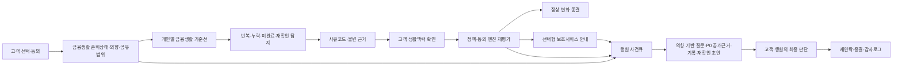
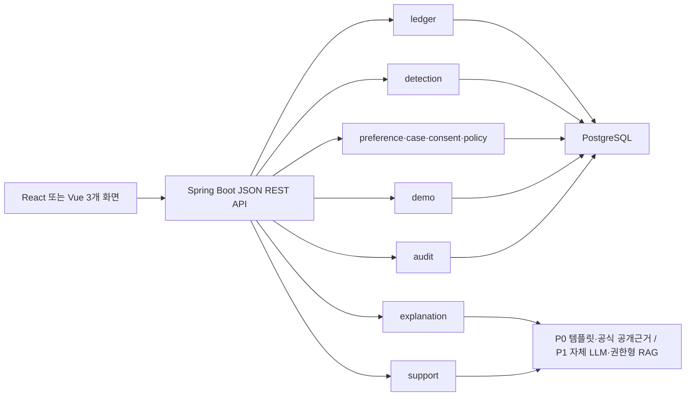
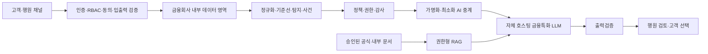

# ALZ's well 프로젝트 최종 통합 기준서

> 문서 상태: **최종 통합본 · Single Source of Truth (SSOT)**  
> 버전: **1.4**
> 기준일: **2026-08-20**
> 참가 대회: [2026 금융 AI Challenge](https://daker.ai/public/hackathons/2026-finance-ai-challenge)  
> 제출 마감: **2026-09-07 10:00 KST**

이 문서는 프로젝트의 확정된 결론만 담는 최상위 기준서다. 앞으로 기획서, 기능명세서, 화면, 코드, 발표자료의 용어·범위·상태값이 충돌하면 이 문서를 따른다. 과거 방향 문서는 `archive`에 보존되며 현행 기준이 아니다.

---

## 1. 최종 결론

### 서비스명

**ALZ's well**

`치매머니`는 서비스명이 아니라 고령화와 인지기능 저하 전후에 발생할 수 있는 **금융관리 공백·고객 의사 단절·금융착취·휴면자산 문제영역**을 설명하는 용어로 사용한다. 고객 개인을 치매환자·인지취약자로 분류하거나 거래정보로 건강상태를 추론하는 명칭으로는 사용하지 않는다. `안심리듬`은 내부 변경 이력에서만 언급한다.

### 최종 부제

**금융생활 연속성 준비·조기알림 및 행원 보호업무 코파일럿**

`인지취약 고객`을 부제에 직접 넣지 않는다. 서비스가 고객을 인지취약자로 분류하거나 질병을 추론한다는 오해와 낙인을 피하기 위해서다.

### 한 문장 정의

> **ALZ's well은 치매를 진단하는 AI가 아니라, 고객이 금융생활 의사와 도움받을 범위를 미리 준비하고, 정기납부 누락·중복거래·업무 미완료·반복확인 같은 개인별 금융관리 행동변화가 생기면 본인에게 먼저 확인한 뒤, 필요한 경우 행원이 고객의 의사에 맞는 보호서비스를 안내하도록 돕는 B2B2C 금융생활 연속성 플랫폼이다. 공모전 MVP는 결정론적 규칙·템플릿·공식 공개근거 카탈로그로 동작하고, 자체 호스팅 금융특화 AI와 은행 내부문서 RAG는 P1·금융회사 PoC의 목표 구조다.**

### 핵심 메시지

> **같은 경보, 다른 맥락, 다른 다음 행동**

> **더 많이 경보하는 AI가 아니라, 설명할 변화만 남기는 AI**

> **사후 통제보다 사전 준비, 건강 추정보다 고객 의사 보존**

### 태그라인

> **기억이 흐려져도, 금융생활의 의사는 흐려지지 않도록**

### 최종 결정 요약

| 항목 | 최종 결정 |
|---|---|
| 사업 구조 | B2B2C, 금융회사 도입 중심 |
| MVP 주 사용자 | 은행 행원·소비자보호 담당자 |
| 공동 사용자·최종 수혜자 | 금융생활 변화 확인에 동의한 고객 |
| 핵심 가치 | 금융생활 의사·지원범위 사전 준비 → 개인 기준선 → 변화 본인확인 → 보호서비스 안내 → 행원 코파일럿·후속관리 |
| 기존 체계와 관계 | 보이스피싱·부정거래 FDS를 대체하거나 중복 탐지하지 않고, 장기 금융관리 행동변화와 후속 보호업무에 집중 |
| 탐지 | Java 기반 규칙·통계·시계열 분석이 권위 경로. Isolation Forest는 P0-AI 비교평가·행원 보조정렬에만 선택 적용 |
| 생성형 AI | P0는 검증된 템플릿으로 준비 체크리스트·의향서 예시·쉬운 설명·업무초안을 만들고, P1·PoC부터 자체 호스팅 모델이 고객 승인형 의향서 초안과 표현 개선을 담당 |
| 최종 판단·실행 | 고객, 행원, 법적 권한이 있는 금융회사 |
| MVP 구조 | Spring Boot 모듈형 모놀리스 |
| MVP 데이터 | 12개월 완전 합성데이터만 사용 |
| 핵심 데모 | 동일한 T0 경보 스냅샷에서 T1 검증맥락만 달리한 반사실적 정책 분기 비교 |
| 추가학습 | MVP에서는 하지 않음. 평가로 필요성이 확인된 뒤 LoRA/QLoRA 검토 |
| RAG | P0는 공식 공개근거 카탈로그, P1·PoC부터 사용 허가된 은행 내부 규정·매뉴얼 기반 권한형 벡터 RAG |
| LLM 장애 | 템플릿 폴백으로 전체 핵심 흐름 완주 |
| 실서비스 배치 | 외부 상용 AI API 없이 은행 내부망·은행 통제 전용환경에 자체 호스팅, 읽기 전용 분석부터 시작 |

---

## 2. 문제 정의와 서비스의 위치

금융권에는 이미 FDS·ASAP 같은 금융사기 탐지수단과 여러 금융보호 절차가 있다. 그러나 인지기능 저하 전후의 `치매머니` 문제는 손실거래 하나로 끝나지 않는다. 건강할 때 금융생활 의사와 도움받을 범위를 준비하기 어렵고, 금융관리 변화가 생겨도 고객 본인확인·보호서비스 안내·행원 후속업무가 분절되며, 고객이 원했던 방식이 가족과 금융회사에 안전하게 전달되지 않을 수 있다. ALZ's well은 이 금융생활 연속성 공백을 해결한다.

1. 고객이 금융생활 의사, 접근성 방식, 도움받을 조건과 정보공유 범위를 미리 준비한다.
2. 고객 본인의 평소 금융생활에서 장기적인 변화를 발견한다.
3. 변화가 정상적인 생활·처리 맥락으로 설명되는지 추가 확인이 필요한지 고객에게 먼저 묻는다.
4. 고객이 원할 때 이용 가능한 비상품성 금융보호·편의 서비스를 쉬운 말과 공식 근거로 안내한다.
5. 설명이 필요한 사건만 고객의 승인된 의향과 함께 행원의 보호업무로 연결한다.
6. MVP에서는 공식 공개근거와 합성 데모 업무규칙으로, 금융회사 PoC에서는 사용 허가된 내부 규정으로 후속 상담·기록·재확인 일정을 관리한다.

### 고객의 어려움

- 여러 계좌·카드·자동이체에 흩어진 작은 변화를 장기 추세로 보기 어렵다.
- 건강할 때 유지하고 싶은 납부·설명 방식·도움받을 조건과 정보공유 범위를 구조적으로 남기기 어렵다.
- 정기납부 누락, 중복결제·중복송금, 업무 미완료, 반복문의와 반복확인을 서로 연결된 변화로 이해하기 어렵다.
- 데이터 단절, 처리지연, 취소·환불, 앱 오류도 금융관리 변화처럼 보일 수 있다.
- 필수 납부일정과 월 생활비를 스스로 관리하고, 문제가 반복될 때 누구의 도움을 받을지 미리 정하기 어렵다.
- 복잡한 금융용어와 정보량이 많은 비대면 화면은 고령층과 인지 부담이 있는 고객에게 특히 어렵다.
- 가족에게 계좌 통제권을 주지 않으면서 필요한 순간에 도움받을 방법이 제한적이다.
- 지정인 알림, 지연이체, 입금계좌 지정, 접근성 지원, 직원 상담, 후견지원신탁 등 보호수단이 흩어져 있어 자신의 필요에 맞는 선택지를 찾고 차이를 이해하기 어렵다.

### 금융회사의 어려움

- 금융관리 변화 사건마다 거래 조회, 고객 연락, 사실확인, 질문 구성, 내부 규정 검색, 기록, 재연락이 반복된다.
- 여러 거래 경보를 고객 단위 사건 하나로 묶어 파악하기 어렵다.
- 모든 동의 고객의 장기 금융생활을 직원이 전수검토할 수 없다.
- 거래정보, 고객서류, 내부 규정, 약관, 법률자료가 서로 다른 형태로 파편화돼 있다.
- 외부 상용 AI API는 고객정보·내부문서 통제와 모델 변경 검증 부담이 크다.

### FDS·ASAP과의 경계

ALZ's well은 FDS를 대체하지 않는다. FDS가 사기·계정탈취 같은 급성 위험을 다룬다면, ALZ's well은 고객 본인의 장기 금융관리 행동변화와 그 이후의 확인·지원 업무를 다룬다.

| 구분 | FDS·ASAP | ALZ's well |
|---|---|---|
| 주요 목적 | 사기·계정탈취·의심계좌 탐지와 조치 | 반복·누락·미완료·재확인 등 금융관리 행동변화와 보호업무 지원 |
| 시간축 | 실시간·거래사건 중심 | 7·30·90일 및 6~12개월 개인 추세 |
| 주요 입력 | 거래·접속·기관 공유 사기정보 | 동의된 거래·정기납부·업무진행·상담이력·생활맥락 |
| 판단 기준 | 사기 패턴과 위험거래 규칙 | 고객 본인의 평소 금융생활 기준선 |
| 후속업무 | 확인·차단·신고 절차 | 사건요약·중립질문·내부규정·기록·재확인 초안 |
| 최종 결정 | 금융회사 정책과 담당자 | 고객과 권한 있는 금융회사 직원 |

### 차별점

차별점은 단일 이상탐지 모델, 다계좌 통합 또는 가족 알림 하나가 아니다. 다음 요소를 하나의 닫힌 업무 흐름으로 결합하는 데 있다.

1. 연령집단 평균이 아닌 고객 개인의 장기 기준선
2. 탐지 후 고객 응답과 검증된 생활·처리 맥락을 통한 재평가
3. 동일 경보에도 맥락에 따라 달라지는 다음 행동
4. 강한 신호와 증거 불일치 시 정상종결을 막는 정책 가드레일
5. 고객용 쉬운 설명과 행원용 질문·기록·후속관리의 연결
6. 고객이 미리 승인한 금융생활 의향·접근성·정보공유 범위와 사건처리의 연결
7. 정책엔진이 허용한 비상품성 보호서비스만 AI·RAG가 찾아 설명하는 내비게이터
8. P0의 결정론적 템플릿·공식 공개근거와 P1·PoC 목표인 자체 호스팅 금융특화 모델·권한형 내부 규정 RAG
9. 고객의 일정·필수생활비 지원과 단계적 신뢰연락인 연결
10. 동의·권한·감사로그 및 망분리 환경을 고려한 구조

`국내 최초`, `유일`, `금융권에 없던 기술`이라는 표현은 사용하지 않는다. EverSafe, Carefull 등 해외 서비스도 개인 기준선과 선택적 가족 알림을 제공하므로, ALZ's well의 차별성은 기능 하나가 아니라 위 조합과 국내 행원 업무의 폐루프에 둔다.

---

## 3. 사용자, 구매자, 가치

### 1차 구매·도입 부서

- 은행 소비자보호 부서
- FDS 경보 후속업무팀
- 고령·취약고객 보호 담당조직

### 주 사용자: 행원·소비자보호 담당자

P0 엔진이 묶은 사건, 변화 근거, 고객 답변, 중립 질문, 공식 공개근거·합성 데모 규칙, 상담기록과 재확인 일정 초안을 검토하고 최종 판단한다. 사용 허가된 내부 규정 검색은 P1·PoC 목표다.

**제공 가치**

- 모든 경보의 전수검토 대신 설명이 필요한 사건에 집중
- 거래 조회·질문 작성·규정 검색·기록 작성 시간 감소
- 근거, 고객 답변, 직원 결정의 추적 가능성 확보
- 미동의 연락과 무권한 조치를 시스템 수준에서 차단

### 공동 사용자·최종 수혜자: 고객

특정 연령이나 진단 여부로 위험고객이 되는 사람이 아니라, 자신의 금융생활 변화를 이해하고 필요한 도움을 스스로 선택하려는 동의 고객이다.

**제공 가치**

- 건강할 때 금융생활 의사와 도움받을 범위를 직접 준비·수정·철회
- 무엇이 평소와 달라졌는지 쉬운 말로 이해
- 정상 생활변화를 직접 설명하고 불필요한 상향을 줄임
- 납부일정·필수생활비 현황과 이용 가능한 보호서비스를 쉬운 말로 확인하고 필요한 경우 사람 상담 선택
- 동의·철회·이의제기·재검토 권한 유지

### 보조 참여자: 신뢰연락인

고객이 사전에 지정하고 정보·조건·기간을 별도로 동의한 가족 또는 지인이다. 신뢰연락인은 후견인이나 법정대리인이 아니며, 지정만으로 송금·해지·동결·차단 권한을 갖지 않는다.

### 제품 확장 단계

| 단계 | 범위 | 우선 가치 |
|---|---|---|
| 1. 공모전 MVP | 합성 금융생활 의향서·준비상태 + 고객 맥락확인 + 보호서비스 안내 + 행원 코파일럿 | 치매머니 문제의 사전준비·변화확인·업무연결 증명 |
| 2. 고객용 준비 AI | 대화형 준비 체크리스트, 고객 승인형 금융생활 의향서, 접근성·공유범위 재확인 | 고객 의사 보존과 자기결정 지원 |
| 3. 행원용 예방 AI | 사건 분류·요약, 규정검색, 의향서 기반 질문, 상담기록·재확인 | 금융회사 업무효율 검증 |
| 4. 고객용 일정·생활비·지원안내 모드 | 납부일정, 필수지출, 중복거래, 가용생활비, 쉬운 설명, 비상품성 지원 서비스 안내 | 금융접근성과 자기관리 지원 |
| 5. 신뢰연락인 연결 | 본인 우선 알림, 반복 시 최소정보 알림, 공동확인 | 계좌 통제권 없이 단계적 금융안전망 제공 |

고객용 장기 비전은 납부일정, 필수생활비, 중복거래 확인, 비상품성 금융지원 서비스 안내와 동의 기반 신뢰연락인 연결에 집중한다. 자연어 거래검색, 돌봄·의료·복지기관 연결, 광범위한 자산관리 추천은 현재 제품 범위에서 제외한다. 지원 서비스 안내는 금융생활 변화나 고객이 직접 선택한 필요에 따라 이용 가능한 일정관리·접근성·거래확인·직원상담·신뢰연락인 공동확인 기능의 존재와 이용방법을 중립적으로 보여주는 것이며, 금융상품 추천이나 가입 적합성 판단이 아니다.

정기납부·구독 관리는 외부 결제나 자동이체를 실행하지 않는 합성 read model로 제공한다. 고객은 본인 소유 데이터의 예상일·금액·미발생 후보·중복 후보·발생 이력을 확인하고 인앱 확인 알림만 설정할 수 있다. `cancellation-guidance`, 자동 납부, 외부 알림 전송은 구현 범위에 포함하지 않는다.

계좌 조회는 안심은행·안심증권의 고정 합성 snapshot만 사용한다. 계좌번호는 마스킹된 값만 저장·반환하고, 잔액·잔액추세·제약·이자·명세 요약과 반복 거래 상대·고객 지정 계좌 그룹을 본인에게 제공한다. 원천 snapshot은 불변으로 유지하며 별칭·노출 순서·숨김 여부만 별도 고객 소유 설정에서 낙관적 잠금과 추가 전용 변경 이력으로 관리한다. 실제 이체, 출금, 계좌 해지, 명세 파일 다운로드와 외부 기관 호출은 생성하지 않는다.

거래내역은 마스킹된 설명·상대방과 고정 합성 원장만 조회한다. 원천 거래와 결정론적 enrichment는 추가 전용 불변 snapshot이며 검색·기간/범주 요약·반복상대 맥락만 제공한다. 고객 범주 보정과 금융 기억노트는 별도 고객 소유 설정에서 낙관적 잠금과 추가 전용 이력으로 관리하고, 노트에는 식별정보·계좌·연락처·질병 표현을 허용하지 않는다. 실제 거래 취소·정정·이체·파일 export는 실행하지 않는다.

통합자산·현금흐름은 계좌·거래·정기납부·연결의 합성 snapshot을 고객 단위로 집계한다. 자산·순자산 추세, 부채, 현금흐름, 지출, 급여·이자·납부·만기 일정, 기관별 최신성을 함께 제공하며 원천별 기준일과 불완전 상태를 숨기지 않는다. 부채·자산일정 snapshot은 추가 전용이고 실제 대출 심사·상환·카드 결제·외부 동기화는 실행하지 않는다.

이체 기능은 실제 송금 대신 안전 미리보기로 제한한다. 고객은 서버가 보유한 마스킹 합성 수취인·합성 한도를 조회하고, 본인 합성 출금계좌와 수취인 ID로 가용잔액·건별한도·일일 잔여한도·수취인 확인 조건을 모의검증할 수 있다. 원문 계좌번호를 입력·저장하지 않고 이체 예약·OTP/MFA 승인·외부 금융사 호출·실제 실행 이벤트를 생성하지 않는다. 실제 이체·확정·취소 API는 참조 계약으로만 유지한다.

카드 기능은 안심은행의 고정 합성 snapshot을 사용하는 읽기 전용 화면으로 제한한다. 카드번호는 마지막 네 자리 외 전부 마스킹하고 가맹점은 합성 이름만 저장하며, 카드·이용내역·청구 snapshot을 추가 전용으로 보존한다. 고객은 본인 카드의 상태·이용내역·청구요약·결제예정액·한도를 확인할 수 있지만 잠금·해제·재발급·결제·출금·한도 변경·외부 금융사 호출은 실행하지 않는다.

고객지원 콘텐츠는 승인된 ALZ's well 합성 FAQ와 안심은행 합성 공지만 읽기 전용으로 제공한다. 원본 snapshot은 추가 전용으로 보존하고 범주·게시일·건수만 제한해 조회한다. 실제 문의 접수, 상담원 연결, 외부 고객센터·금융기관 API 호출은 구현하지 않는다.

외환 기능은 안심은행의 고정 합성 환율과 마스킹 외화계좌·해외송금 이력을 읽기 전용으로 제공한다. 환전 모의계산은 KRW와 승인된 외화 사이 금액만 결정론적으로 계산하고 실제 환전·송금·승인·외부 금융망 호출을 만들지 않는다.

---

## 4. 절대 넘지 않는 선과 표현 원칙

### 금지 기능·행위

- 거래정보로 치매·인지저하·의사결정능력을 진단하거나 확률·점수·라벨로 저장
- 나이만으로 고객의 검토 우선순위를 높임
- AI가 자동으로 거래를 차단하거나 지급정지·한도변경을 실행
- 고객 동의 없이 가족 또는 신뢰연락인에게 연락하거나 정보를 제공
- 가족에게 별도 법적 권한 없이 송금·해지·동결 권한을 부여
- 탐지 신호를 대출·보험·마케팅·추심에 재사용
- 연령·금융생활 변화·반복실수·고객 응답을 이용해 금융상품을 자동 추천하거나 판매 우선순위를 결정
- 비상품성 지원 서비스 안내 결과를 금융상품 가입 권유, 교차판매 또는 고객 적합성 판단으로 전환
- 실제 고객 원문 거래내역이나 개인신용정보를 외부 상용 LLM API에 전송
- 치매안심센터·요양·복지·주거 등 돌봄서비스를 직접 중개하거나 의료기관처럼 진단·검사 권유를 자동화
- 근거 없는 금융상품 추천, 법률·의료 판단, 가입 적합성 최종판정
- MVP에서 실제 마이데이터·여러 금융회사·실거래를 연결했다고 주장
- 합성데이터 성능을 실제 고객 대상 정확도나 임상 효과로 표현
- `규제를 완전히 준수`, `환각 0%`, `오탐 없음`과 같은 검증 불가능한 절대적 주장

### 금지·권장 표현

| 피해야 할 표현 | 사용하는 표현 |
|---|---|
| 치매를 조기진단한다 | 금융안전상 확인이 필요한 변화를 발견한다 |
| 치매 위험도 78% | 개인 기준선 대비 달라진 사실과 확인 필요 사유 |
| 고위험 고객을 선별한다 | 설명이 필요한 사건의 검토 우선순위를 정한다 |
| 인지취약성을 판별한다 | 평소와 다른 금융생활 변화를 확인한다 |
| AI가 보호조치를 결정한다 | 규칙 엔진이 후보를 제시하고 사람이 최종 결정한다 |
| 가족에게 자동으로 알린다 | 별도 동의한 신뢰연락인에게 최소정보 공동확인을 요청한다 |
| FDS를 대체한다 | FDS와 별도로 장기 금융관리 행동변화와 후속업무를 지원한다 |
| 국내 최초·유일 | 기존 수단을 하나의 사용자 여정으로 결합한다 |
| 마이데이터로 전 금융사를 연결했다 | 표준 구조를 참고한 완전 합성 JSON을 사용했다 |
| 합성데이터 정확도는 실제 성능이다 | 코드 회귀와 설계 비교를 위한 합성 시나리오 결과다 |
| 완료 송금을 취소한다 | 은행 즉시 연락 등 공식 절차를 조건부 안내한다 |

고객 화면에는 `치매 의심`, `인지저하 확률`, `고위험 고객`을 사용하지 않는다. `쉬운 금융 모드`, `안심지원 모드`, `함께 관리 모드`처럼 중립적인 명칭을 쓴다.

---

## 5. 대회 적합성과 공식 일정

### 대회 적합성

| 대회 공식 예시 | ALZ's well 구현 |
|---|---|
| 이상거래 탐지 시 맞춤형 행동요령 | 변화 근거와 생활맥락에 따른 다음 행동 안내 |
| 고령층·장애인 디지털 격차 해소 및 포용금융 | 큰 글씨·쉬운 설명·단계적 확인·사람 상담 연결 |
| 이상금융거래 AI 분석·탐지 | 개인별 장기 기준선과 복합 변화신호 탐지 |

대회는 실제 작동 가능한 웹서비스를 요구한다. 공개된 세부 배점은 없으므로 임의의 배점표를 공식 평가기준처럼 제시하지 않는다.

### 공식 제출 일정

2026년 8월 14일 공식 대회 페이지에서 재확인한 기준이다. 일정은 운영기관 사정으로 변경될 수 있으므로 제출 직전에 다시 확인한다.

| 항목 | 공식 일정·조건 |
|---|---|
| 기획서 PDF 제출 | 2026-09-07 10:00까지 |
| 기능명세서 PDF·웹서비스 URL 제출 | 2026-09-07 10:00까지 |
| URL 필수 접근 기간 | 2026-09-07 11:00 ~ 2026-09-11 23:59 |
| 발표 심사 대상 발표 | 2026-09-22 |
| 발표 대상 최종 PDF·소스 ZIP | 2026-10-08 23:59까지 |
| 오프라인 발표 심사 | 2026-10-13 |
| 최종 결과 발표 | 2026-10-23 |
| 발표 대상 | 본선 상위 11팀 내외 |
| 발표 형식 | 최신 본선 공지 확인 필요(`TBD`) |

대회에서 별도 데이터를 제공하지 않으므로 MVP는 자체 생성한 완전 합성데이터만 사용한다.

---

## 6. 전체 서비스 흐름과 역할 분리



| 구성요소 | 담당 역할 | 담당하지 않는 일 |
|---|---|---|
| 준비·의향 관리 | 준비 체크리스트, 고객 승인형 금융생활 의향서, 접근성·공유범위 버전관리 | 법적 후견·유언·신탁계약 대체, 고객 의사의 임의 추가 |
| 변화탐지 엔진 | 개인 기준선, 반복 누락·중복·재시도·미완료·반복문의·재확인, 사유코드 | 질병·사기 추론 |
| 사건·맥락 엔진 | 신호 병합, 고객 답변과 구조적 근거 반영 | 자유문장 생성 |
| 정책·동의 엔진 | 상태전이, 연락권한, P0 공식 공개근거·합성 데모 업무조치 후보, 사람 승인 조건 | 법적 권한의 임의 생성 |
| 보호서비스 내비게이터 | 정책엔진이 허용한 비상품성 서비스의 조건·이용방법·출처 검색과 설명 | 상품 적합성 판단, 서비스 후보의 임의 생성·자동가입 |
| 설명 생성기 | P0 템플릿과 P1 자체 모델로 쉬운 설명, 중립 질문, 상담기록·체크리스트 초안 | 점수·상태·실행 결정 |
| 고객 | 본인거래·생활맥락 확인, 동의·철회, 도움 선택 | AI 판단의 수동적 수용 강요 |
| 행원 | 사실확인, 질문, 조치안 검토, 후속관리, 종결 | AI 초안의 무검토 실행 |
| 금융회사 | 내부정책과 법적 근거에 따른 실제 조치 | MVP의 모의 버튼을 실제 조치로 오인 |

핵심 원칙은 **탐지는 규칙·통계가, 설명 초안은 P0 템플릿과 선택형 P1 자체 모델이, 중요한 판단과 실행은 사람이 담당한다**는 것이다.

---

## 7. 공모전 MVP 최종 범위

MVP는 **세 화면, 합성 금융생활 의향서 한 개, 한 개의 반사실적 정책 분기 비교 데모, 결정론적 안전장치**에 집중한다. 의향서 작성 전체를 90초 안에 시연하지 않고, 고객이 건강할 때 미리 승인한 합성 의향이 변화 확인과 행원 업무에 어떻게 사용되는지를 보여준다.

### 공통 데모 조건

- 첫 화면에서 로그인 없이 `90초 비교 데모 시작` 가능
- 무로그인은 무권한을 뜻하지 않는다. 생성 시 발급한 세션 capability로 모든 세션 API의 소유권·역할·만료를 검증
- 각 익명 세션과 각 `demoRunId`는 다른 세션·실행과 완전히 분리
- `Reset`은 같은 seed와 같은 원시 스냅샷을 복원하되 새 실행은 새 `demoRunId`로 분리하고, 동일 멱등키·동일 요청의 재시도에는 같은 결과를 반환
- 화면 상단에 `모든 데이터는 합성데이터입니다` 고정 표시
- 외부 상용 LLM API를 사용하지 않으며, 자체 모델이 없어도 템플릿 폴백으로 전 과정 동작
- 공모전 공개 경로만 무로그인이고, PoC·운영 행원 화면은 RBAC를 적용

### 화면 1. 나의 금융생활 안심 준비와 변화

- 합성 고객의 금융생활 준비상태와 승인된 의향서 요약 표시
- 유지하고 싶은 필수납부, 선호 설명방식, 도움받을 조건, 정보공유 범위를 구분해 표시
- 의향서는 법적 후견·유언·신탁계약을 대신하지 않는 고객 참고기록임을 고정 표시
- 12개월 완전 합성 금융생활 표시
- 최초 9개월 기준선, 최근 3개월 관찰구간
- 개인별 평소값과 현재값 비교
- 정기납부 반복 누락·중복결제·중복송금·업무 재시도·미완료·반복확인 등 사유코드 표시
- 계산점수보다 `무엇이 얼마나 달라졌는지`를 사실로 설명
- 질병·인지상태 라벨 없음
- 동일 비교 데모의 `alertId`, 알고리즘 버전, 거래·정기납부 의무·상호작용 등 typed 근거 확인

### 화면 2. 고객 응답과 검증맥락 확인

- 큰 글씨, 높은 명암, 명확한 버튼
- 한 화면에 질문 하나만 표시
- 변화 근거가 드러나는 중립적 질문
- 고객 응답 세트:
  - `내가 알고 한 거래예요`
  - `생활변화가 있었어요`
  - `본인 거래인지 확인하기 어려워요`
  - `내가 하지 않은 거래예요`
  - `나중에 확인할게요`
  - `은행에 문의할게요`
- 강한 신호는 고객의 단순 확인만으로 자동 해제하지 않음
- 정상종결에는 응답과 구조적 근거의 일치가 필요
- 고객이 원할 때만 정책엔진이 허용한 비상품성 보호·편의 서비스 3~5개의 목적·조건·신청경로·공식 출처를 표시
- `서비스 살펴보기`, `직원에게 문의하기`, `지금은 보지 않기`를 동등한 선택지로 제공
- 안내는 건강상태 판단이나 금융상품 추천이 아니며 자동 신청되지 않는다고 고정 표시
- 신뢰연락인 동의 상태 및 최소정보 미리보기
- 미동의 시 연락 기능을 UI와 서버 모두에서 차단

### 화면 3. 행원 금융생활 연속성 사건큐와 코파일럿

- 여러 변화신호를 고객 사건 하나로 묶은 타임라인
- 긴급도, 생활영향도, 반복성, 재발 여부에 따른 검토 우선순위
- 사유코드, 평소값, 현재값, 거래·정기납부 의무·상호작용·상담·업무이력 근거
- 고객 답변, 확인된 맥락, 미확인 항목
- 고객이 공유에 동의한 최신 금융생활 의향 항목과 접근성·정보공유 범위. 비동의 항목은 조회하지 않음
- 과거 기준선과 최근 변화를 한 화면에 보여주는 사건 자동요약
- 고객에게 물어볼 비낙인·중립 질문 초안
- 의향서와 공식 근거에 따른 권장 확인 순서, 금지 표현, 보호서비스 설명 초안
- 공식 공개출처·기준일·조항과 버전 고정된 합성 데모 업무규칙에 근거한 업무조치 후보
- 고객 확인결과·거래 의도·시행조치가 포함된 상담기록 자동작성 초안
- 7일·30일 재확인, 동일 패턴 재발 감시, 미완료 사건 재배정 등 사후관리 초안
- P0 템플릿에 사용한 최소화·가명화 구조화 사실과 `왜 이렇게 판단했나요?` 영역. P1 모델 입력 미리보기는 목표 기능으로 명시
- 직원 버튼:
  - `검토 시작`
  - `추가 확인 필요`
  - `안내 계획 승인` — 상담 계획 승인일 뿐 실제 계좌조치가 아님
  - `오탐 종결`
- 신뢰연락인 미동의 시 비활성화 사유와 차단 감사로그 표시

### MVP에서 구현하지 않는 것

- 실제 금융거래·코어뱅킹·마이데이터 연동
- 실제 가족 문자·전화·푸시 발송
- 실제 송금·지급정지·한도변경
- 질병 추론 모델 또는 판단능력 평가
- 모바일 네이티브 앱
- 자체 기반모델 사전학습 또는 운영 중 자동학습
- MSA, Kafka, Kubernetes, 전사 Agent 플랫폼
- 온프레미스 GPU 구축
- 실시간 음성 STT·대규모 OCR

---

## 8. 단일 기준 반사실적 정책 분기 데모 명세

데모는 **정기납부 반복 누락·중복송금·거래완료 반복확인이라는 금융관리 행동변화 시나리오 하나로 고정한다**. 동일한 최초 경보에 검증된 정상 맥락이 들어온 경우와 들어오지 않은 경우의 정책 결과를 나란히 보여준다.

이 비교는 사용자를 무작위 배정해 효과를 추정하는 통계적 A/B 실험이 아니다. **동일한 T0 경보 스냅샷에서 T1 검증맥락만 달리한 반사실적 정책 분기 데모**이며, 발표에서도 인과효과를 증명했다고 표현하지 않는다.

### 비교 통제 원칙

A와 B는 두 고객이 아니다. 하나의 익명 `sessionId`에서 Reset으로 각각 새 `demoRunId`를 만든 뒤 재생하는 동일 논리사건이다.

T0 `alertSnapshotAt` 시점에 다음 값은 완전히 고정한다.

- `scenarioSeed`, `snapshotHash`, `fixtureVersion`
- 논리 `alertId`와 12개월 원시 거래·상호작용 스냅샷
- `alertEvidenceIds`, 기준선·특징값·사유코드
- 알고리즘·정책·스키마 버전
- `preDecision`

T1에는 고객 응답과 그 응답을 검증하는 `contextEvidenceIds`만 분기별로 달라진다. 각 맥락 근거는 `effectiveAt`, `observedAt`, `ingestedAt`, `sourceType`, `integrityHash`를 가지며 T0 경보 근거를 소급해 바꾸지 않는다. 따라서 API와 화면은 `alertEvidenceIds`와 `contextEvidenceIds`를 서로 다른 필드로 표시한다.

분기 코드는 A=`FIN_MGMT_A_NORMAL_CONTEXT`, B=`FIN_MGMT_B_NO_CONTEXT`로 고정한다.

### 공통 T0 최초 경보 fixture

| 항목 | 고정 내용 |
|---|---|
| 시나리오 ID | `FIN_MGMT_AB_001` |
| 논리 경보 ID | `ALERT_FIN_MGMT_001` |
| 사전 판단 | `NEEDS_CONTEXT` |
| 정기납부 누락 | 최근 60일간 예상 정기납부 3건 미발생, `missedRecurringCount60d=3` |
| 중복송금 | 같은 합성 수취인·금액의 10분 이내 완료 송금 2건, `duplicateTransferCount=2` |
| 거래완료 반복확인 | 동일 거래 결과를 1시간 내 7회 조회, `repeatedConfirmationCount1h=7` |
| 핵심 사유코드 | `MISSED_RECURRING`, `DUPLICATE_TRANSFER`, `REPEATED_CONFIRMATION` |
| 신뢰연락인 동의 | `false` |

`NEW_PAYEE`와 `REPEATED_TRANSFER`는 이 고정 fixture의 사유코드로 사용하지 않는다. 화면에는 합성 수취인명과 합성 거래일자를 표시할 수 있지만, P1 자체 모델을 연결할 때도 모델에는 아래 §12의 최소화·가명화된 구조화 사건요약만 전달한다.

### A 경로: 검증된 정상 시스템·처리 맥락

1. 새 `demoRunId`에서 고객이 `KNOWN_AND_INTENTIONAL`(`내가 알고 한 거래예요`)을 선택한다.
2. T1 맥락 패키지에 `PAYMENT_PROVIDER_DELAY_VERIFIED`, `ACCOUNT_CONNECTION_OUTAGE_VERIFIED`, `DUPLICATE_TRANSFER_REFUNDED`, `RESULT_SCREEN_DELAY_VERIFIED`가 들어온다.
3. 정책엔진이 세 사유코드 각각에 대해 고객 응답과 신뢰 가능한 구조적 근거의 정합성을 확인한다.
4. 설명되지 않은 강한 신호가 하나라도 남으면 정상종결하지 않는다.
5. 모든 가드가 충족되면 `postDecision=CLOSE_AS_NORMAL_CONTEXT`, 상태 `CLOSED_NORMAL`로 종결한다. 이는 불이익이나 계좌조치가 없는 워크플로 자동종결이며, 새 모순 근거가 들어오면 재개할 수 있다.
6. 자동 차단·외부 통보 없이 확인된 처리결과와 다음 확인방법만 제공한다.

### B 경로: 본인 거래 확인 불가

1. Reset으로 같은 T0 스냅샷을 가진 새 `demoRunId`를 만든다.
2. 고객이 `UNABLE_TO_CONFIRM`(`본인 거래인지 확인하기 어려워요`)을 선택한다.
3. `contextEvidenceIds`에는 처리지연·취소·환불·데이터 단절을 검증하는 적격 근거가 없다.
4. T0의 정기납부 반복 누락·중복송금·반복확인 근거는 A와 동일하게 유지한다.
5. `postDecision=REQUIRE_BANK_REVIEW`, 상태 `PENDING_BANK_REVIEW`로 전환한다.
6. 신뢰연락인 미동의이므로 연락 게이트는 평가하되 외부 발송은 시도하지 않고 `BLOCKED_BY_CONSENT`를 기록한다.
7. 행원 화면에는 사건요약, 근거, 중립 질문, **공식 공개근거와 버전 고정된 합성 데모 업무규칙** 기반 조치후보, 상담기록·재확인 초안을 표시한다.
8. 행원 승인 전 실제 거래차단·한도변경은 발생하지 않는다.

### 90초 시연 시간표

| 시간 | 시연 내용 |
|---|---|
| 0~15초 | 무로그인 데모 시작, 고객 홈에서 고정 경보 선택 |
| 15~38초 | A 맥락과 구조적 근거 확인 후 정상종결 |
| 38~48초 | 같은 seed·snapshot으로 Reset하고 새 `demoRunId` 생성 |
| 48~63초 | B 본인 거래 확인 불가 선택 후 행원 검토 전환 |
| 63~78초 | 미동의 연락 차단과 감사로그 확인 |
| 78~90초 | 행원 화면에서 근거·질문·공식 공개근거·합성 데모 규칙·기록·재확인 초안 확인 |

### 데모 수용기준

- 로그인 0회
- 첫 상호작용 5초 이내
- 외부 상용 AI API 호출 0건으로 완주
- 동일 seed·버전 결과 재현율 100%
- 미동의 신뢰연락인 실제 호출 0건
- 행원 승인 전 실제 계좌조치 0건
- LLM 장애 시 템플릿 폴백 100%
- 익명 세션 간 상태 누출 0건
- 동일 멱등키·동일 요청의 Reset 결과 재현과 새 `demoRunId` 중복생성 방지

---

## 9. 표준 상태, 판단, 사유코드

### 사건 상태

```text
OPEN
  → AWAITING_CONTEXT
      → CONTEXT_DEFERRED → AWAITING_CONTEXT | PENDING_BANK_REVIEW
      → CLOSED_NORMAL
          → REOPENED → PENDING_BANK_REVIEW
      → PENDING_BANK_REVIEW
          → IN_BANK_REVIEW
              → FOLLOW_UP_REQUIRED
                  → IN_BANK_REVIEW
              → GUIDANCE_PLAN_APPROVED
                  → CLOSED_GUIDANCE_DELIVERED
              → CLOSED_FALSE_POSITIVE
```

| 상태 | 의미 |
|---|---|
| `OPEN` | 변화신호가 사건으로 생성됨 |
| `AWAITING_CONTEXT` | 고객의 본인거래·생활맥락 확인 대기 |
| `CONTEXT_DEFERRED` | 고객이 나중에 확인을 선택했고 `deferredUntil`과 재시도 횟수가 설정됨 |
| `CLOSED_NORMAL` | 고객 응답과 검증된 생활·처리 근거가 일치한 정상 맥락으로 종결 |
| `REOPENED` | 종결 뒤 모순되거나 더 강한 새 근거가 들어와 사건을 재개함 |
| `PENDING_BANK_REVIEW` | 설명이 필요해 행원 큐에 등록됨 |
| `IN_BANK_REVIEW` | 행원이 검토를 시작함 |
| `FOLLOW_UP_REQUIRED` | 추가 고객확인·재연락 필요 |
| `GUIDANCE_PLAN_APPROVED` | 행원이 안내계획을 승인했으나 아직 고객에게 제공하지 않음 |
| `CLOSED_GUIDANCE_DELIVERED` | 승인된 안내가 고객에게 실제 제공된 사실을 기록한 뒤 종결 |
| `CLOSED_FALSE_POSITIVE` | 데이터·규칙상 오탐으로 종결 |

`BLOCKED_BY_CONSENT`는 사건 상태가 아니라 **연락·정보제공 시도의 거절 결과 코드**다.

미동의 신뢰연락인 경로의 표준 결과는 `gateEvaluated=true`, `dispatchAttempted=false`, `resultCode=BLOCKED_BY_CONSENT`다. 정책 게이트 평가와 실제 외부 발송 시도를 같은 `attempted` 필드로 표현하지 않는다.

### 상태 전이 권한과 가드

| From → To | 허용 actor | 필수 가드 | 필수 감사 이벤트 |
|---|---|---|---|
| `OPEN → AWAITING_CONTEXT` | `SYSTEM` | T0 스냅샷·사유코드·불변 근거·버전 저장 완료 | `ALERT_OPENED` |
| `AWAITING_CONTEXT → CLOSED_NORMAL` | `POLICY_ENGINE` | 응답이 `KNOWN_AND_INTENTIONAL` 또는 `LIFE_CONTEXT_CHANGED`이고, 모든 강한 신호에 유효한 T1 구조적 근거가 일치하며 모순근거가 없음 | `CONTEXT_EVALUATED`, `INCIDENT_CLOSED_NORMAL` |
| `AWAITING_CONTEXT → PENDING_BANK_REVIEW` | `POLICY_ENGINE` | 확인 불가·은행검토 요청·본인 미실행 응답, 근거 불일치, 강한 미설명 신호 중 하나 이상 | `CONTEXT_EVALUATED`, `BANK_REVIEW_QUEUED` |
| `AWAITING_CONTEXT → CONTEXT_DEFERRED` | `CUSTOMER` | `DEFERRED`, `deferredUntil`, `retryCount`, `maxRetries` 저장 | `CONTEXT_DEFERRED` |
| `CONTEXT_DEFERRED → AWAITING_CONTEXT` | `CUSTOMER` 또는 `SYSTEM` | 유효기간 내 고객 재진입 또는 예약 재확인 시점 도달 | `CONTEXT_REOPENED` |
| `CONTEXT_DEFERRED → PENDING_BANK_REVIEW` | `SYSTEM` | 유효기간 만료 또는 `maxRetries` 초과 뒤에도 강한 신호가 남음 | `CONTEXT_TIMEOUT_ESCALATED` |
| `PENDING_BANK_REVIEW → IN_BANK_REVIEW` | `STAFF` | `DEMO_STAFF` 권한, 사건 버전 일치, 담당자 기록 | `STAFF_REVIEW_STARTED` |
| `IN_BANK_REVIEW → FOLLOW_UP_REQUIRED` | `STAFF` | 후속사유와 `followUpAt` 존재 | `FOLLOW_UP_SCHEDULED` |
| `FOLLOW_UP_REQUIRED → IN_BANK_REVIEW` | `STAFF` | 후속결과 저장, 사건 버전 일치 | `FOLLOW_UP_COMPLETED` |
| `IN_BANK_REVIEW → GUIDANCE_PLAN_APPROVED` | `STAFF` | 조치후보 근거·승인자·승인시각 저장, 실제 금융실행 없음 | `GUIDANCE_PLAN_APPROVED` |
| `GUIDANCE_PLAN_APPROVED → CLOSED_GUIDANCE_DELIVERED` | `STAFF` | 고객 제공 채널·시각·결과가 별도 이벤트로 확인됨 | `GUIDANCE_DELIVERED`, `INCIDENT_CLOSED` |
| `IN_BANK_REVIEW → CLOSED_FALSE_POSITIVE` | `STAFF` | 오탐 근거와 검토 메모 존재 | `INCIDENT_CLOSED_FALSE_POSITIVE` |
| 종결상태 → `REOPENED → PENDING_BANK_REVIEW` | `STAFF` 또는 `SYSTEM` | 새 모순근거·재발신호 ID와 재개사유 존재 | `INCIDENT_REOPENED`, `BANK_REVIEW_QUEUED` |

정상종결은 금융상 불이익이나 계좌조치가 없는 워크플로 종결에 한해서만 정책엔진이 수행한다. 금융회사의 실제 판단·연락·거래조치는 권한 있는 사람이 승인한다. `alert_incident.state`를 사건 생명주기의 단일 기준으로 삼고, `protection_case`에는 배정·검토 작업상태만 저장해 두 상태가 서로 경쟁하지 않게 한다.

P0 데모의 미루기 정책은 `deferredUntil=응답시각+24시간`, `maxRetries=1`로 고정하며 실제 대기 대신 고정 데모시계로 만료를 재현한다. 운영값은 금융회사 정책으로 별도 승인한다.

### 고객 응답과 검증맥락 코드

`ContextResponseCode`는 다음 값으로 고정한다.

| 코드 | 화면 문구 | 기본 정책 결과 |
|---|---|---|
| `KNOWN_AND_INTENTIONAL` | 내가 알고 한 거래예요 | 적격 구조적 근거가 모든 강한 신호를 설명할 때만 정상종결 후보 |
| `LIFE_CONTEXT_CHANGED` | 생활변화가 있었어요 | 유효기간·출처가 있는 구조적 근거 확인 후 정상종결 후보 |
| `UNABLE_TO_CONFIRM` | 본인 거래인지 확인하기 어려워요 | `PENDING_BANK_REVIEW` |
| `NOT_MY_TRANSACTION` | 내가 하지 않은 거래예요 | `PENDING_BANK_REVIEW` 및 기존 FDS·긴급 은행연락 경로 안내. ALZ's well은 사기 여부를 판정하지 않음 |
| `DEFERRED` | 나중에 확인할게요 | `CONTEXT_DEFERRED` |
| `REQUEST_BANK_REVIEW` | 은행에 문의할게요 | `PENDING_BANK_REVIEW` |

고정 fixture에서 허용하는 `ContextEvidenceCode`는 다음 네 값이다.

| 코드 | 의미 |
|---|---|
| `PAYMENT_PROVIDER_DELAY_VERIFIED` | 합성 납부기관의 처리지연이 출처·시간·무결성값으로 확인됨 |
| `ACCOUNT_CONNECTION_OUTAGE_VERIFIED` | 데이터 연결장애가 해당 누락 관찰기간과 일치함 |
| `DUPLICATE_TRANSFER_REFUNDED` | 중복송금 한 건의 취소·환불 완료가 T1 상태이력으로 확인됨 |
| `RESULT_SCREEN_DELAY_VERIFIED` | 반복확인 시간대의 앱 결과화면 지연이 시스템 이벤트로 확인됨 |

고객 응답은 사실 주장이고 구조적 근거는 별도 검증자료다. 응답 코드만으로 `CLOSED_NORMAL`을 만들지 않으며, 근거 없음은 별도의 긍정적 증거코드로 만들지 않는다.

### 판단 필드

- `preDecision`: 생활맥락 확인 전 판단
- `postDecision`: 생활맥락 확인 후 판단
- `contextSource`: `USER_RESPONSE`, `SYSTEM_EVENT`, `PAYMENT_PROVIDER_EVENT`, `STAFF_VERIFICATION` 중 출처
- `contextValidFrom`, `contextValidTo`: 맥락 유효기간
- `alertSnapshotAt`: 최초 경보의 T0 기준시각
- `alertEvidenceIds`: 최초 판단에 사용된 불변 T0 근거
- `contextEvidenceIds`: 재평가에 사용된 T1 검증근거
- `effectiveAt`, `observedAt`, `ingestedAt`: 실제 효력·관측·시스템 수집 시각
- 근거 참조 형식: `{type, id, version, integrityHash}`
- `algorithmVersion`, `policyVersion`: 계산·정책 버전

최초 판단을 덮어쓰지 않고 전후 판단과 근거를 모두 보존한다.

판단 코드는 다음 세 값으로 통일한다.

| 판단 코드 | 사용 시점 | 의미 |
|---|---|---|
| `NEEDS_CONTEXT` | `preDecision` | 생활맥락 확인이 필요함 |
| `CLOSE_AS_NORMAL_CONTEXT` | `postDecision` | 고객 응답과 구조적 근거가 일치한 정상 생활·처리 맥락 |
| `REQUIRE_BANK_REVIEW` | `postDecision` | 설명이 더 필요해 행원 검토로 전환 |

### 표준 사유코드

| 코드 | 의미 |
|---|---|
| `DUPLICATE_PAYMENT` | 시간창 내 중복 가능성이 있는 결제 |
| `DUPLICATE_TRANSFER` | 동일 수취인·금액·시간창 내 중복 가능성이 있는 송금 |
| `MISSED_RECURRING` | 예상 정기납부의 유예기간 내 미발생 |
| `REPEATED_RETRY` | 동일 금융업무의 취소·재시도 반복 |
| `UNFINISHED_TASK` | 시작한 납부·송금·조회 업무의 미완료 증가 |
| `REPEATED_INQUIRY` | 같은 내용의 고객센터·영업점 문의 반복 |
| `POST_EXPLANATION_RECURRENCE` | 행원 설명·상담 후 동일 질문·행동 재발 |
| `REPEATED_CONFIRMATION` | 완료된 거래·납부 결과의 단시간 반복 확인 |

정기납부 누락 사유코드는 모든 구현과 현행 문서에서 `MISSED_RECURRING`만 사용한다.

각 신호에는 최소한 다음을 저장한다.

- `reasonCode`
- 평소값과 비교기간
- 현재값과 관찰기간
- 기여도 또는 사실 근거
- 근거 거래·정기납부 의무·상호작용·시스템 이벤트의 typed 참조
- 준비상태 `READY`, `LOW_CONFIDENCE`, `COLD_START`
- 규칙·알고리즘 버전
- 계산시각

---

## 10. 탐지엔진 설계

LLM은 수치 거래의 이상 여부를 판단하지 않는다. Java 기반 규칙·통계·시계열 엔진이 설명 가능한 사실 근거를 생성한다.

### 특징별 MVP 방식

| 신호 | 기본 방식 | 예외·안전처리 |
|---|---|---|
| 중복송금·중복결제 | 수취인·금액·시간창의 결정적 규칙 | 취소·환불·pending 거래 분리 |
| 정기납부 누락 | 주기 추정과 grace period | 데이터 단절·연결장애를 미납으로 오인하지 않음 |
| 취소·재시도 | 동일 업무 ID·목적·시간창의 반복 규칙 | 네트워크 오류·인증 장애·앱 오류 분리 |
| 업무 미완료 | 시작·진행·완료 이벤트의 상태전이와 중단율 | 정상 취소·세션 만료·채널 전환 분리 |
| 반복문의 | 정규화된 문의주제·기간·상담결과의 반복 규칙 | 민원 후속문의·미해결 사건 분리 |
| 설명 후 재발 | 상담 완료시각 이후 동일 주제·행동 재발 규칙 | 안내 불충분·직원 재연락 요청 분리 |
| 거래결과 반복확인 | 완료 거래 ID의 단시간 조회횟수와 개인 기준선 비교 | 결과화면 지연·푸시 미수신·앱 오류 분리 |
| 사건 융합 | 사유코드·기간·업무목적 기반 정책표 | 중복억제, cooldown, 고객별 경보예산 |

Isolation Forest, LightGBM 등은 핵심 판정기가 아니라 오프라인 비교실험 후보로 사용한다. 검증된 Isolation Forest 결과는 아래 P0-AI 선택 트랙에서 행원용 비권위적 보조점수로 표시할 수 있다.

### P0-AI 보조점수 검증 트랙

공모전에서 AI가 향후 계획으로만 보이지 않도록, 기존 결정론적 핵심 흐름과 분리된 **비권위적(advisory-only) Isolation Forest 보조점수**를 실제 비교평가와 행원 화면에 추가할 수 있다. 이 트랙은 `reasonCode`, `preDecision`, `postDecision`, 사건 상태, 연락권한, `actionCode`를 생성하거나 변경하지 않는다. 모델이 없어도 기존 P0 데모가 동일하게 완주하며, 모델 결과가 규칙·정책 결과와 충돌하면 규칙·정책 결과를 우선한다.

```text
합성 거래·상호작용
→ 공통 FeatureExtractor
→ A. 규칙·MAD·정책의 권위 경로
→ B. Isolation Forest 보조점수 경로
→ 행원 화면에서 근거와 함께 비교 표시
```

#### 모델이 답하는 질문

> 최근 관찰된 금융행동 특징의 조합이 해당 고객의 기준기간 금융생활에 비해 얼마나 드문가?

모델 출력은 질병, 인지상태, 사기 가능성, 의사결정능력 또는 고객 위험도가 아니다. 고객 화면에는 원점수나 `고위험` 라벨을 표시하지 않고, 행원 화면에서만 `검토 우선순위 보조`임을 명시한다.

#### 입력 특징 최소 집합

| 특징군 | 예시 `featureCode` | 계산 원칙 |
|---|---|---|
| 거래금액·빈도 | `TRANSFER_AMOUNT_MAD_DISTANCE`, `TRANSFER_COUNT_7D` | 절대금액보다 개인 중앙값·MAD 대비 거리 사용 |
| 수취인·시간 | `NEW_PAYEE_RATIO_30D`, `OFF_HOUR_RATIO_30D` | 연령집단 평균이 아닌 고객 과거 분포와 비교 |
| 정기납부 | `MISSED_RECURRING_COUNT_60D`, `DUE_DATE_DEVIATION_DAYS` | 데이터 단절·처리지연·grace period 분리 |
| 반복·중복 | `DUPLICATE_TRANSFER_COUNT`, `RETRY_COUNT_7D` | 취소·환불·pending·장애 이벤트 제외 |
| 업무완료 | `UNFINISHED_TASK_RATE_30D`, `TASK_DURATION_MAD_DISTANCE` | 정상 취소·세션 만료·채널 전환 분리 |
| 확인·문의 | `CONFIRMATION_COUNT_1H`, `INQUIRY_REPEAT_COUNT_30D` | 결과화면 지연·미해결 상담 분리 |

특징 정의, 결측치 처리, 범주 인코딩, 윈도우와 정규화 방식은 `featureVersion`으로 고정한다. 학습 입력과 웹 추론 입력은 동일한 FeatureExtractor 계약을 사용하고, 원문 거래명·상호명·정확한 계좌식별자는 모델 입력에서 제외한다.

#### 학습·추론·배치 원칙

- 정상 프로필과 각 고객의 기준기간을 중심으로 학습하고, 사건 주입 관찰기간은 학습에서 제외한다.
- 최소 60개 고정 테스트 프로필은 임계값·모델 선택·특징 튜닝에 사용하지 않는다.
- 합성데이터 생성기와 모델이 동일한 임계값 또는 정답 규칙을 공유하지 않는다.
- 학습은 개발환경의 오프라인 도구로 수행할 수 있지만, 공모전 웹의 제품 경로에 별도 Python API 서버를 두지 않는다.
- 고정된 모델 artifact와 특징·모델 manifest의 checksum을 배포물에 포함한다.
- 런타임 추론이 필요하면 Spring 프로세스 내부의 검증된 Java 추론 또는 호환 모델 runtime을 사용한다. ONNX는 Python 학습결과와 Java 추론결과의 일치가 자동검증될 때만 채택한다.
- 런타임 연결이 일정상 어렵다면 고정 fixture 전체에 대한 배치추론 결과를 버전·checksum과 함께 적재할 수 있으나, 발표에서 이를 실시간 추론이라고 표현하지 않는다.
- 모델 로딩 실패, 특징 버전 불일치, 비정상 점수, timeout 시 `aiScoreStatus=UNAVAILABLE`로 두고 기존 규칙·정책·템플릿 경로로 완주한다.

#### 출력 계약

```json
{
  "algorithmType": "ISOLATION_FOREST",
  "modelVersion": "iforest-v0.1",
  "featureVersion": "finance-feature-v1",
  "modelArtifactHash": "sha256:...",
  "anomalyScore": 0.87,
  "scoreBand": "HIGH_REVIEW_PRIORITY",
  "topContributions": [
    {
      "featureCode": "MISSED_RECURRING_COUNT_60D",
      "baselineValue": 0,
      "currentValue": 3,
      "evidenceIds": ["OBLIGATION-001"]
    }
  ],
  "advisoryOnly": true,
  "aiScoreStatus": "AVAILABLE",
  "calculatedAt": "2026-08-19T10:00:00Z"
}
```

`scoreBand`는 행원 큐의 보조 정렬값일 뿐이며, 표시 문구는 `AI 보조 검토순위`로 고정한다. 모델 특성상 개별 특징의 정확한 인과 기여도를 제공하기 어렵다면 `topContributions`를 모델 설명값으로 가장하지 않고, 같은 사건에서 규칙·통계 엔진이 확인한 상위 변화사실을 별도로 표시한다.

#### 행원 화면 수용기준

- 규칙이 확인한 평소값·현재값·관찰기간·typed 근거와 AI 보조점수를 함께 표시한다.
- `이 점수는 고객의 질병·인지상태·사기 가능성을 뜻하지 않습니다`를 고정 표시한다.
- AI 점수가 없어도 사건 조회·검토·상태전이·감사로그가 동일하게 작동한다.
- 모델 버전, 특징 버전, 계산시각, artifact checksum과 폴백 여부를 감사로그에서 확인할 수 있다.
- 규칙·정책 결과와 AI 점수의 불일치는 숨기지 않고 비교평가 자료로 보존한다.

### 기준선과 콜드 스타트

- 공모전 데모는 최초 9개월을 기준선, 최근 3개월을 관찰구간으로 사용한다.
- 90일 미만 이력은 `COLD_START`로 표시하고 강한 결론을 내리지 않는다.
- 90일 이상이면 임시 기준선을 만들되 `LOW_CONFIDENCE`를 표시한다.
- 6~12개월 이력이 확보되면 기준선 신뢰도를 높인다.
- 연령집단 평균만으로 고객 위험을 분류하지 않는다.
- 이상기간을 즉시 정상 기준선으로 학습하지 않는다.
- 고객 또는 행원이 정상으로 확인한 관측만 제한적으로 반영한다.
- 맥락에는 유효기간을 두고 강한 신규증거가 나타나면 다시 확인한다.

### 안전한 맥락 재평가

- 고객의 `괜찮아요` 또는 `내가 한 거래예요` 응답만으로 강한 신호를 해제하지 않는다.
- 정상종결은 고객 응답과 처리상태·취소·환불·데이터품질·시스템 이벤트 등 출처가 검증된 구조적 근거가 일치할 때만 허용한다.
- 답변과 거래증거가 불일치하면 `PENDING_BANK_REVIEW`로 보낸다.
- 거래 사실 정합성은 LLM이 아니라 DB 조회와 결정론적 규칙으로 확인한다.
- 고객에게는 보정되지 않은 질병·위험 확률 대신 확인 가능한 사실을 보여준다.

---

## 11. 합성데이터와 평가 계획

### 데이터 구성

- 실제 고객정보, 실제 계좌, 실제 의료정보 사용 금지
- 12개월 합성 거래 프로필 **240개 생성 목표**
- 정상 패턴 80개
- 설명 가능한 생활변화 80개
- 행원 검토 필요 시나리오 80개
- 최소 60개를 튜닝 전에 고객·페르소나 단위 고정 테스트셋으로 분리
- 화면 시연용 페르소나와 평가용 골든셋 분리
- 기준선 기간과 사건 주입 기간을 시간으로 분리
- 생성기와 탐지기가 동일 임계값·정답 규칙을 공유하지 않음
- 여러 random seed로 반복 평가

### 배포·운영 검증용 synthetic-v3

- `SMOKE`: CI·로컬 회귀용 고객 10명, 계좌 20개, 거래 600건
- `DEMO`: 프론트·발표 통합 시연용 고객 50명, 계좌 100개, 거래 12,000건
- `LOAD`: 일상적인 통합·탐지 품질 검증용 고객 250명, 계좌 500개, 거래 75,000건
- `DEV`: 페이지네이션·탐지·인덱스 검증용 고객 1,000명, 계좌 2,000개, 거래 1,000,000건
- 같은 `fixtureVersion + profile + seed`는 고객·계좌·거래·탐지 데이터셋 ID와 manifest hash가 항상 같아야 함
- 생성기는 합성 전용 migrator 일회성 Job이며 공개 API, 실제 금융기관 adapter, 실제 금융실행 또는 외부 전송을 만들지 않음
- 대량 파생 데이터는 Git과 Flyway seed SQL에 넣지 않고, V63이 관리하는 결정론적 batch 생성기로 배포 DB에 적재
- 고객별 `NORMAL`, `MISSED_PAYMENT`, `DUPLICATE_TRANSFER`, `REPEATED_CONFIRMATION` 시나리오와 기대 신호 수를 별도 manifest 테이블에 보존
- 선택적 탐지 품질 검증은 활성 정책을 모든 fixture 고객에 실행하고 정책 버전·오탐·미탐·precision·recall을 추가 전용 리포트로 고정

### 반드시 포함할 정상 반례

- 데이터 수집 단절
- 결제 취소·환불·pending
- 은행·납부기관 처리지연
- 네트워크·인증·앱 장애
- 상담 미해결에 따른 정당한 반복문의
- 고객이 요청한 재연락과 채널 전환
- 자동이체 계좌 변경·만료·재등록

### 비교실험

| 비교군 | 구성 | 검증 목적 |
|---|---|---|
| A. 전역 규칙 | 모든 고객에 공통 금액·횟수 임계값 | 개인차로 발생하는 과다 경보 측정 |
| B. 개인 기준선 | A + 개인별 반복·누락·미완료·재확인 기준선 | 개인화의 추가가치 측정 |
| C. 기준선 + 맥락 | B + 검증된 정상 생활·처리 맥락 | 위험사건 검토를 유지하며 불필요한 상향 감소 측정 |
| D. 기준선 + 맥락 + AI 보조점수 | C + Isolation Forest 비권위적 검토순위 | 안전한 상태전이를 유지하며 검토필요 사건의 상위 집중도와 행원 검토량 개선 측정 |

### 평가 지표

**탐지·사건**

- 사건 단위 precision·recall·F1, PR-AUC
- 사용자-월당 오경보 수
- 사건당 중복경보 수
- 변화 시작부터 첫 경보까지 탐지 지연
- cold-start coverage
- 정상맥락 종결률
- 위험사건 unsafe downgrade rate = `검토필요 골든사건 중 CLOSED_NORMAL로 잘못 하향된 수 / 검토필요 골든사건 수`
- typed 근거 참조 정확도와 허구 근거 수
- AI 상위 10%·20% 사건의 검토필요 사건 포착률과 lift
- 규칙·기준선 대비 AI 보조정렬 적용 후 행원 검토량 감소
- 모델 미사용·장애 대비 폴백 결과 동일성

**P1 생성형 AI·RAG**

- 구조화 JSON 유효률
- 근거와 설명의 일치율
- 금지표현·근거 없는 안내 발생률
- 공식 출처·페이지 정확성
- 쉬운 말 이해도
- timeout·오류 시 폴백 성공률
- 서비스 안내 검색 top-k 적중률과 허용 서비스 recall
- 허용되지 않은 서비스·판매성 문구·근거 없는 연락처 생성 건수

**업무·시스템**

- 행원 사건 검토시간
- 상담기록 작성시간과 수정률
- 조회·화면이동·문서검색 횟수
- 직원 override 비율
- 90초 데모 완주율
- 미동의 연락·무권한 실행 차단률
- 익명 세션 교차누출과 Reset 오류

### MVP 목표값

아래 값은 달성 결과가 아니라 개발 목표·수용기준이다. 제출본에는 실제 측정값과 목표값을 구분한다.

`unsafe downgrade rate=0%`는 다른 평균지표보다 먼저 적용하는 **출시 안전 게이트**다. 단 한 건이라도 검토필요 골든사건이 `CLOSED_NORMAL`로 내려가면 정상맥락 해제율이나 업무시간 목표를 달성했더라도 해당 빌드는 출시 실패다. 각 비율은 분자·분모·평가 seed·fixture 버전·데이터 manifest checksum을 함께 기록한다.

| 지표 | 목표 |
|---|---:|
| 위험사건 unsafe downgrade rate | **0% — 위반 시 출시 실패** |
| 검토 필요 사건 재현율 | 90% 이상 |
| 검증된 정상맥락 오경보 해제율 | 80% 이상 |
| 맥락 확인 후 불필요한 상향 감소 | 50% 이상 |
| 사유코드·화면 설명 추적 가능률 | 100% |
| 미동의 연락·자동조치 차단률 | 100% |
| P1 모델 입력 직접식별자 노출 | 0건 |
| 근거 없는 공식·합성 데모 업무조치 안내 | 0건 |
| 행원 사건 검토시간 | 수기 대비 30% 단축 목표 |
| 핵심 데모 E2E | 100회 중 99회 이상 성공 |

합성데이터 결과는 코드 회귀와 설계 비교를 위한 시뮬레이션이다. 실제 금융회사 성능, 고령층 효과 또는 임상 예측력으로 확대해 주장하지 않는다.

---

## 12. 생성형 AI, 모델, RAG 최종 방향

### 모델 전략

기반모델을 처음부터 만들지 않는다. 4명 팀과 공모전 일정에서 데이터, GPU, 평가, 보안을 감당하기 어렵고 서비스의 핵심 가치도 아니다.

실서비스 목표 원칙은 **외부 상용 생성형 AI API를 호출하지 않고, 은행 내부망 또는 은행이 통제하는 전용환경에 오픈웨이트 기반 금융특화 모델과 권한형 RAG를 자체 호스팅하는 것**이다. 공모전 MVP의 현재 구현 범위는 GPU·LLM·벡터 RAG 없이도 완주하는 결정론적 규칙·템플릿·공식 공개근거 카탈로그다. 이후 문장에서 자체 모델이나 내부 RAG를 언급할 때는 `P1·PoC 목표`라고 명시하며, MVP에 이미 구현됐다고 발표하지 않는다.

우선순위는 다음과 같다.

1. 결정론적 탐지·정책·템플릿 경로 구현
2. 승인된 공식자료 카탈로그와 근거 표시
3. 고정 평가세트로 안전성과 실패 유형 측정
4. 자체 호스팅 오픈웨이트 금융특화 모델로 표현 개선
5. 은행 내부 규정·매뉴얼의 권한형 벡터 RAG 고도화
6. 반복 실패가 증명될 때만 LoRA/QLoRA 검토

### 구성요소별 역할

| 구성요소 | 역할 | MVP 우선순위 |
|---|---|---|
| Java 규칙·통계·시계열 | 수치 거래 변화 탐지 | P0 |
| Isolation Forest 보조점수 | 개인 기준선 대비 복합 이상도와 행원 검토순위의 비권위적 비교평가 | P0-AI 선택 트랙 |
| 정책·동의 엔진 | 상태·권한·공식 공개근거 및 합성 데모 업무규칙 기반 조치후보 강제 | P0 |
| 준비·의향 템플릿 | 합성 준비 체크리스트와 고객이 승인한 금융생활 의향서 예시 생성 | P0 |
| 템플릿 생성기 | 키 없이 쉬운 설명·질문·기록·보호서비스 안내 생성 | P0 |
| 공식 공개근거 카탈로그 | 공개된 공식자료의 구조화 조건·출처·기준일 제공 | P0 |
| 자체 호스팅 오픈웨이트 금융특화 LLM | 고객 승인형 의향서, 문장 표현 개선, 사건요약·질문·상담기록·사후관리 구조화 초안 | P1 |
| 권한형 벡터 RAG | 은행 내부 규정·매뉴얼과 공식 문서 검색 고도화 | P1 |
| 로컬 임베딩 서비스 검색 | 정책엔진이 허용한 비상품성 지원 서비스 문서의 의미검색 | P1 선택 트랙 |
| KoBERT·KLUE-RoBERTa·KoELECTRA | 의도·위험표현·PII 분류 보조 | P2 |
| KR-FinBERT 계열 | 금융 문서·상담 텍스트 분류 보조 | P2 |
| LoRA/QLoRA | 반복 실패 업무의 제한적 개선 | 대회 이후 |

KoBERT 계열은 생성형 sLLM이 아니다. 여러 BERT 모델을 결합한다고 sLLM이 되지 않는다. 탐지는 작은 예측·규칙 모델, 설명은 생성형 모델, 최종 통제는 정책엔진과 사람으로 분리한다.

### AI 금융생활 준비 가이드와 의향서

AI의 치매머니 관련 핵심 역할은 건강상태 추론이 아니라 고객의 금융생활 준비와 의사 보존을 돕는 것이다. P0는 완전 합성 응답과 검증된 템플릿으로 준비 체크리스트와 승인된 의향서 예시를 재현하고, P1·PoC에서는 자체 호스팅 모델이 고객의 자유응답을 다음 구조로 정리하는 초안만 만든다.

- 유지하고 싶은 필수납부·생활비 항목
- 선호하는 설명·접근성 방식
- 도움이 필요할 때 우선 확인받고 싶은 조건
- 행원·신뢰연락인별 공유 가능한 최소정보와 기간
- 관심 있는 비상품성 보호·편의 서비스
- 다음 재확인 시점

의향서는 고객이 원문과 구조화 결과를 직접 확인·수정·승인한 뒤에만 유효해지며, 언제든 철회하거나 새 버전으로 대체할 수 있다. 법적 후견, 유언, 신탁계약, 대리권 또는 의료 의사결정 문서를 대신하지 않는다. 모델은 고객이 말하지 않은 의사를 추가하거나 질병·인지상태·의사결정능력을 추론할 수 없다. 행원과 신뢰연락인은 고객이 역할별로 동의한 최신 유효 항목만 조회한다.

P0 화면에서는 실제 생성형 모델이 작성했다고 주장하지 않고 `합성 고객이 사전에 승인한 데모용 금융생활 의향서`로 표시한다. P1 모델이 실패하거나 출력 검증을 통과하지 못하면 빈 문서를 자동 승인하지 않고 항목별 직접입력 템플릿으로 전환한다.

### 오픈웨이트 sLLM 선정 기준

P1 또는 PoC에서 자체 호스팅 모델을 선정할 때 다음 기준을 적용하고 특정 모델명은 기술검증 후 확정한다.

- 한국어 성능
- 상업적 이용조건
- 온프레미스·전용환경 배포 가능 여부
- 4bit 양자화 지원
- 구조화 JSON 출력 안정성
- 제한된 GPU 메모리에서의 구동 가능성
- 모델·토크나이저·라이선스 버전 고정 가능성

LoRA는 문체 흉내가 아니라 쉬운 설명, 정해진 상담기록 형식, 근거 필드가 있는 JSON, 금지행동 거부처럼 반복 측정 가능한 실패에만 사용한다. 실제 고객정보가 아니라 공개자료, 전문가 검토 문장, 완전 합성 사례만 학습에 쓴다.

### 공식 공개근거 카탈로그와 RAG

MVP P0는 벡터DB가 없어도 동작하는 구조화 공식 공개근거 카탈로그다. P0에서 허용하는 근거는 금융위원회·금융감독원·금융보안원 등 공식기관이 공개한 자료와 출처·버전이 고정된 **합성 데모 업무규칙**뿐이다. 합성 규칙은 화면과 응답에서 `실제 은행 내부규정이 아닌 데모용 규칙`으로 표시한다.

사용 허가를 받은 은행 내부 업무매뉴얼·소비자보호 지침·상담문구·민원 대응 기준은 실제 금융회사와의 P1·PoC에서만 적재한다. 그때도 문서별 접근권한을 강제하는 보안 필터와 pgvector 등 권한형 검색을 적용하며, 공개 공모전 데이터에 실제 내부문서가 포함됐다고 주장하지 않는다.

각 문서는 다음 메타데이터를 가진다.

- 문서 ID, 문서명, 발행기관
- 출처 URL
- 시행·게시일, 효력 시작·종료일, 확인 기준일
- 조항·페이지·섹션
- 문서 버전·체크섬
- 접근등급과 허용 사용자

정책엔진이 적용 가능한 후보를 먼저 고르고, LLM은 그 후보만 쉬운 말로 설명한다. URL과 페이지는 LLM이 생성하지 않고 검색 메타데이터에서 서버가 조립한다. 근거나 최신성을 확인할 수 없으면 `확인 불가·행원 재확인 필요`로 남긴다. publish는 검수된 버전을 `APPROVED/PENDING_ACTIVATION`으로만 만들며 기존 ACTIVE 근거를 중단하지 않는다. Spring 권위 카탈로그에는 exact `SUCCEEDED` ingestion 실행과 전체 chunk를 재검증하고 DB가 proof를 생성한 결과만 반영하며, target 활성화·이전 governance 대체·passage 적재·현재 버전 전환·이전 version supersede를 한 트랜잭션으로 처리한다. AI ingestion과 Spring publish/import는 같은 문서 ID advisory lock을 사용하고, `AI_DB_SNAPSHOT_V1` proof가 생성된 문서·버전의 AI chunk·manifest snapshot과 참조 terminal ingestion run을 불변으로 동결한다. 이후 내용 변경은 새 `versionLabel`로 적재한다. 내부 FastAPI는 import 전 `APPROVED/PENDING_ACTIVATION` snapshot을 후보로 반환할 수 있으나 권한 부여로 취급하지 않고, Spring의 current `APPROVED/ACTIVE` governance·proof 검증을 통과한 결과만 외부에 노출한다. 실패하면 기존 ACTIVE head를 유지한다. 목록·상세·passage·검색·안내 후보와 보호수단 상세 citation은 current `APPROVED/ACTIVE` governance와 `AI_DB_SNAPSHOT_V1` import proof를 공통으로 요구하며 legacy·미검증 자료는 숨긴다. action citation은 고정 UUID가 아니라 승인 document의 현재 버전 stable passage에서 선택하고, 근거가 없으면 빈 결과로 fail-closed한다. AI 장애 또는 Spring의 citation 전부 거부 시 결정론적 폴백은 같은 ACL·audience·효력 조건을 적용하고 제목·본문의 stored `simple` tsvector GIN과 별도 keyword GIN에서 parameter-bound query로 최대 200개 후보만 조회한다.

### 비상품성 금융지원 서비스 안내

지원 서비스 안내는 공모전 핵심 90초 데모의 필수 상태전이를 변경하지 않는 **P1 고객지원 확장 기능**이다. 목적은 상품을 판매하는 것이 아니라, 고객이 확인한 필요와 금융생활 변화에 대응해 은행이 제공할 수 있는 비상품성 보호·편의 기능의 존재와 이용방법을 찾기 쉽게 설명하는 것이다. 연령은 서비스 홍보·접근성 안내 대상을 정하는 제한적 기준으로 사용할 수 있지만, 서비스 후보의 적합도, 사건 우선순위, AI 점수, 금융조치에는 사용하지 않는다.

#### 안내 가능한 범위

- 정기납부 일정 확인과 자동이체 내역 관리 지원
- 중복거래·거래완료 여부 확인 지원
- 큰 글씨·쉬운 표현·한 화면 한 질문 등 접근성 기능
- 미완료 업무 이어서 하기와 영업점·전화 등 사람 상담 연결
- 고객이 별도로 동의한 신뢰연락인 지정·공동확인 방법
- 승인된 공식 소비자보호 절차와 금융교육·디지털 이용 지원
- 고객이 이미 이용 중인 서비스의 객관적인 사용방법

금융상품의 존재를 단순히 고지해야 하는 경우에도 AI가 특정 상품을 선택하거나 우선순위를 정하지 않는다. 상품 설명·적합성·적정성 확인·가입 권유·계약은 권한 있는 직원과 기존 금융회사 절차로 분리한다. 고객용 출력은 `이용할 수 있는 지원 기능이 있습니다`, `원하면 살펴보거나 직원에게 문의할 수 있습니다`와 같은 선택형·중립형 문장으로 제한한다.

#### 처리 흐름과 역할 분리

```text
확인된 reasonCodes·고객이 선택한 필요
→ 정책엔진이 supportNeedCodes 확정
→ 서비스 카탈로그에서 허용 후보 필터링
→ P0 템플릿 또는 P1 권한형 RAG가 설명 근거 조회
→ 선택적으로 자체 LLM이 쉬운 표현만 생성
→ 출력 스키마·금지표현·근거 일치 검증
→ 고객 선택 또는 직원 상담 연결
```

| 구성요소 | 허용 역할 | 금지 역할 |
|---|---|---|
| 탐지엔진 | 사유코드와 설명 가능한 변화 근거 제공 | 서비스·상품 추천 |
| 정책엔진 | `reasonCode → supportNeedCode`, 허용 대상·동의·채널·서비스 유형 결정 | 고객에게 특정 선택 강제 |
| 서비스 카탈로그 | 서비스명, 이용목적, 공개범위, 조건, 공식 근거, 상담 필요 여부 제공 | 임의의 적합성 점수 생성 |
| RAG | 정책엔진이 허용한 문서에서 이용방법·조건·근거 검색 | 접근권한 밖 문서 검색, 서비스 후보 신규 생성 |
| 자체 LLM | 검색된 사실의 쉬운 설명, 선택지·확인질문 초안 | 서비스 ID·노출순위·가입 적합성·사건 상태 변경 |
| 고객 | 안내 보기, 건너뛰기, 서비스 선택, 직원 상담 요청 | AI 선택의 수동적 수용 강요 |
| 행원 | 필요한 설명 보완, 상담 연결, 금융상품 절차의 별도 수행 | 탐지 신호를 무단 마케팅에 재사용 |

#### 표준 지원 필요 코드와 서비스 매핑

| `supportNeedCode` | 연결 가능한 사유·고객 선택 | 허용 서비스 예시 |
|---|---|---|
| `PAYMENT_SCHEDULE_SUPPORT` | `MISSED_RECURRING`, 납부일 관리가 어려움 | 정기납부 일정 확인, 자동이체 내역 확인, 직원 상담 |
| `TRANSACTION_CONFIRMATION_SUPPORT` | `DUPLICATE_PAYMENT`, `DUPLICATE_TRANSFER`, 거래완료 확인 필요 | 거래내역·취소·환불 상태 확인, 공식 문의절차 |
| `TASK_COMPLETION_SUPPORT` | `REPEATED_RETRY`, `UNFINISHED_TASK` | 이어서 하기, 단계별 도움, 사람 상담 |
| `EASY_ACCESS_SUPPORT` | `REPEATED_CONFIRMATION`, 화면 이해·사용 도움 선택 | 큰 글씨, 쉬운 설명, 확인결과 저장 |
| `STAFF_CONSULTATION_SUPPORT` | 고객의 상담 요청, 확인 불가 | 영업점·전화·공식 상담채널 연결 |
| `TRUSTED_CONTACT_SETUP_SUPPORT` | 고객의 공동확인 희망 | 별도 동의 범위·기간 설정과 신뢰연락인 지정 안내 |

사유코드는 안내의 자동 적합성 판정이 아니라 후보 검색의 입력일 뿐이다. 고객이 도움을 원하지 않으면 안내를 건너뛸 수 있고, `PENDING_BANK_REVIEW` 등 기존 사건 상태는 서비스 선택 여부와 독립적으로 유지한다. `NOT_MY_TRANSACTION`처럼 기존 FDS·긴급 은행연락 안내가 필요한 응답에서는 일반 서비스 탐색보다 공식 긴급경로를 우선한다.

#### 서비스 카탈로그 최소 계약

```json
{
  "serviceId": "CS-001",
  "serviceType": "NON_PRODUCT_SUPPORT",
  "name": "정기납부 일정 확인 지원",
  "supportNeedCodes": ["PAYMENT_SCHEDULE_SUPPORT"],
  "allowedAudience": ["CUSTOMER", "STAFF"],
  "accessClass": "CUSTOMER_GUIDANCE",
  "requiresConsent": true,
  "requiresStaffReview": false,
  "customerSelectable": true,
  "salesProduct": false,
  "sourceDocumentId": "SERVICE-DEMO-001",
  "version": "1.0",
  "effectiveFrom": "2026-08-19",
  "effectiveTo": null
}
```

`serviceType`은 최소 `NON_PRODUCT_SUPPORT`, `FINANCIAL_PRODUCT_INFORMATION`으로 구분한다. P1 고객 자동안내는 `NON_PRODUCT_SUPPORT`만 허용한다. `FINANCIAL_PRODUCT_INFORMATION`은 `recommendationAllowed=false`, `staffConsultationRequired=true`를 강제하고 고객용 자동 순위화에서 제외한다. 공모전 합성 서비스는 `sourceType=SYNTHETIC_DEMO_SERVICE`와 `실제 은행 서비스가 아닌 시연용 안내`를 화면에 표시한다.

#### P0·P1·PoC 구현 범위

| 단계 | 구현 방식 | 수용 조건 |
|---|---|---|
| P0 | 고정 `reasonCode → supportNeedCode → serviceId` 정책표와 검증된 문구 템플릿 | LLM·벡터DB 없이 재현 가능, 기존 90초 데모에 영향 없음 |
| P1 | 합성 서비스 설명서와 공식 공개자료를 청크화하고 자체 호스팅 임베딩·LLM으로 권한형 RAG 구성 | 허용 서비스 안에서만 검색·표현, 템플릿 폴백, 출처 표시 |
| 금융회사 PoC | 은행이 승인한 실제 지원 서비스 카탈로그와 고객 공개 가능 문서로 교체 | 문서별 RBAC, 효력일 검증, 행원 검토, 읽기 전용 시작 |
| 고객 확장 | 동의 고객에게 쉬운 설명·선택·상담 연결 제공 | 상품추천 금지, 건너뛰기·이의제기·상담 연결 제공 |

초기 RAG 문서는 `정기납부 일정 확인`, `거래결과 확인`, `쉬운 금융 모드`, `직원 상담 연결`, `신뢰연락인 지정`, `디지털 금융 이용 지원`의 6종으로 제한한다. 문서는 Markdown 등 구조화 형식으로 작성하고 `serviceId`, 문서유형, 공개대상, 버전, 효력기간, 출처, 접근등급을 필수 메타데이터로 갖는다.

#### 로컬 의미검색 최소 시연

P1에서 생성형 LLM 전체 연결이 일정상 어려워도, 외부 API 없이 실행되는 소형 한국어·다국어 임베딩 모델로 고객의 지원 필요 문장과 승인된 서비스 문서를 의미검색하는 최소 시연을 구성할 수 있다. 예를 들어 `공과금 날짜를 자꾸 놓쳐요`를 `PAYMENT_SCHEDULE_SUPPORT` 및 `CS-001` 문서와 연결한다. 이 검색은 서비스 적합성 판정이 아니라 정책엔진이 이미 허용한 후보 안에서 관련 설명을 찾는 작업이다.

```text
고객의 선택 또는 최소화된 지원 필요 문장
→ 금지정보·직접식별자 제거
→ 정책엔진이 허용 serviceIds 확정
→ 로컬 임베딩으로 허용 문서만 top-k 검색
→ 임계값·접근등급·효력기간 검증
→ 템플릿 또는 자체 LLM이 쉬운 설명 생성
```

- 임베딩 모델·토크나이저·문서 인덱스·chunking 버전과 checksum을 고정한다.
- 권위 모델 카탈로그는 `EVALUATION_ONLY`, `STAGED_APPROVED`, `APPROVED`를 구분한다.
- `STAGED_APPROVED` 모델은 승인된 AWS AI staging과 별도 승인 플래그를 모두 만족할 때만
  활성화한다. 모델 revision·artifact SHA-256·사람 승인 운영 골든셋 SHA-256 중 하나라도
  다르면 기동을 거부한다.
- staging 승격은 운영 기본 모델을 자동 변경하지 않는다. 기본 Hash와 Spring 결정론적
  폴백은 별도 운영 승인 전까지 유지한다.
- 고객 자유문장이 없어도 버튼형 `supportNeedCode`만으로 전체 흐름이 작동해야 한다.
- 검색 점수가 임계값보다 낮거나 top-k 결과가 서로 충돌하면 임의 안내를 생성하지 않고 직원 상담 또는 고정 카탈로그 화면으로 전환한다.
- 생성형 LLM이 없어도 검색된 서비스명·공식 설명·이용방법은 서버 템플릿으로 표시한다.
- P0 공개 데모에 선택적으로 포함할 경우 합성 문장과 합성 서비스 문서만 사용하고, 이를 실제 은행 내부문서 RAG라고 표현하지 않는다.

#### 출력 검증과 감사

- 검색 결과의 모든 문장은 허용된 `serviceId`와 `sourceDocumentId`에 연결한다.
- 고객 출력에는 서비스명, 지원 목적, 이용방법, 선택 가능 여부, 공식 출처·기준일을 표시한다.
- LLM이 반환한 `serviceId`, URL, 연락처, 이용조건을 신뢰하지 않고 서버 카탈로그 값으로 다시 조립한다.
- 근거 없음, 효력기간 만료, 접근권한 불일치, 스키마 오류, 금지표현 탐지 시 템플릿으로 전환하거나 `직원에게 확인이 필요합니다`로 종료한다.
- `SERVICE_GUIDANCE_OFFERED`, `SERVICE_GUIDANCE_SKIPPED`, `SERVICE_SELECTED`, `STAFF_CONSULTATION_REQUESTED`, `SERVICE_GUIDANCE_BLOCKED`를 감사 이벤트로 기록한다.
- 감사로그에는 입력 사유코드, 고객이 선택한 필요, 허용 후보, 최종 노출 서비스, 문서·정책·프롬프트·모델 버전, 고객 선택을 저장하되 원문 자유문장은 최소화한다.

#### 서비스 안내 평가 지표

- 허용되지 않은 서비스 노출률 0%
- 금융상품 자동추천·판매성 문구 발생 0건
- 근거 없는 서비스·URL·연락처 생성 0건
- 서비스 설명과 출처 일치율 100%
- 접근등급 위반 검색·출력 0건
- LLM 장애 시 템플릿 폴백 성공률 100%
- 쉬운 말 이해도와 고객 과업완료율
- 안내 후 직원 상담 전환율과 상담기록 수정률
- 고객의 건너뛰기·동의철회·이의제기 정상 처리율 100%

### P1 최소화·가명화 모델 입력

아래는 P1 자체 호스팅 모델을 연결할 때의 허용 예시다. P0에서는 같은 구조를 `TemplateExplanationGenerator`가 사용하며 모델 호출은 없다. 가명화 정보도 개인정보·신용정보가 될 수 있으므로 `비식별이라 안전하다`고 단정하지 않는다.

```json
{
  "demoRunId": "RUN-A-001",
  "alertId": "ALERT_FIN_MGMT_001",
  "reasonCodes": ["MISSED_RECURRING", "DUPLICATE_TRANSFER", "REPEATED_CONFIRMATION"],
  "missedRecurringCount60d": 3,
  "duplicateTransferCount": 2,
  "repeatedConfirmationCount1h": 7,
  "confirmedLifeContext": false,
  "trustedContactConsent": false,
  "allowedEvidenceIds": ["DOC-POLICY-001"]
}
```

이름, 계좌번호, 카드번호, 정확한 원문 거래내역, 상세 상호명, 질병 추정정보는 전달하지 않는다.

### LLM 출력 제한

LLM은 정해진 스키마의 다음 필드만 초안으로 반환한다.

- 고객용 쉬운 설명
- 중립 확인질문
- 행원 상담기록 초안
- 정책엔진이 허용한 공식 공개근거·합성 데모 규칙 기반 업무조치 후보
- 재확인 일정·사후관리 체크리스트
- 사용한 `evidenceIds`

LLM은 `reasonCodes`, 사건 상태, 우선순위, 연락권한, `actionCode`를 변경할 수 없다. 자연어 출력을 실행 명령으로 사용하지 않는다.

### 결정론적 폴백

```text
탐지엔진
→ 정책결정
→ 구조화 ExplanationFacts
→ TemplateExplanationGenerator
→ 선택적으로 자체 호스팅 LLM이 표현만 개선
```

자체 모델 미배치, timeout, 5xx, malformed JSON, schema 오류, 금지표현 탐지 시 즉시 템플릿으로 전환한다. LLM이 없어도 탐지, 맥락확인, 동의차단, 행원검토, 감사로그가 모두 작동해야 한다.

---

## 13. 공모전 MVP 기술 아키텍처

### 최종 결정

**Spring Boot 기반 모듈형 모놀리스**를 사용한다. 별도 Python ML 서버, GPU 서버, MSA는 공모전 P0가 아니다.

P1 AI 통합 staging은 업무 도메인을 분리하는 MSA 전환이 아니라 내부 RAG 어댑터를 위한
FastAPI 프로세스 분리다. 외부 Spring API 계약과 최종 ACL·정책·인용 검증·감사는 계속
Spring이 소유한다.

### 기본 기술 구성

- Java 21
- Spring Boot
- Spring MVC·Spring Security
- Spring Data JPA를 기본 데이터 접근으로 사용
- 복잡한 분석 조회가 실제로 필요할 때만 JDBC 또는 jOOQ 보조
- PostgreSQL, Flyway
- React 또는 Vue 기반 프론트엔드와 JSON REST API 계약
- Spring AI는 선택 사용
- Docker 기반 배포
- Actuator·Micrometer 기반 헬스체크
- Testcontainers 기반 통합시험 권장
- OpenAPI 3.1 자동 계약과 실행이 비활성화된 Swagger UI

정확한 라이브러리 버전은 실제 `build.gradle` 또는 `pom.xml`을 최종 기준으로 삼고 문서와 동기화한다.

### 처리 구조



### 모듈 책임

| 모듈 | 책임 |
|---|---|
| `ledger` | 합성거래 입력, 수취인·가맹점 정규화, 취소·환불·데이터 품질 |
| `preference` | 금융생활 준비상태, 고객 승인형 의향서 버전, 접근성·역할별 공유범위, 철회 |
| `detection` | feature, baseline, MAD, 추세, reasonCodes |
| `case` | 사건 병합, 맥락 이벤트, 상태기계, 직원 검토 |
| `consent` | 분석·신뢰연락인 동의, 철회, 최소정보 정책 |
| `policy` | 우선순위, 정상종결 조건, 공식 공개근거·합성 데모 업무조치 후보, 실행 금지 |
| `explanation` | P0 템플릿·공식 공개근거, P1 자체 금융특화 LLM·권한형 내부 규정검색, 출력검증 |
| `support` | P0 고정 정책표와 P1 의미검색 기반 비상품성 지원 필요 코드, 서비스 카탈로그, 허용 후보 필터, 고객 선택·상담연결 |
| `demo` | 익명 세션 capability, 시나리오 seed, `demoRunId`, Reset, 3개 화면 |
| `audit` | 사건·근거·결정·모델·문서·직원 override 이력 |

의존방향은 가능한 한 `demo → case → detection → ledger`, `case → consent·policy·explanation`, 모든 중요 이벤트 → `audit`로 유지한다.

### 핵심 API 초안

```http
POST /api/v1/demo/sessions
POST /api/v1/demo/sessions/{sessionId}/reset
POST /api/v1/demo/sessions/{sessionId}/scenarios/FIN_MGMT_AB_001/ingest

GET  /api/v1/demo/sessions/{sessionId}/customers/{customerId}/preparedness
GET  /api/v1/demo/sessions/{sessionId}/customers/{customerId}/preference-statement

GET  /api/v1/demo/sessions/{sessionId}/customers/{customerId}/alerts
GET  /api/v1/demo/sessions/{sessionId}/alerts/{alertId}
POST /api/v1/demo/sessions/{sessionId}/alerts/{alertId}/context
GET  /api/v1/demo/sessions/{sessionId}/alerts/{alertId}/audit

GET  /api/v1/demo/sessions/{sessionId}/alerts/{alertId}/support-services
POST /api/v1/demo/sessions/{sessionId}/alerts/{alertId}/support-needs
POST /api/v1/demo/sessions/{sessionId}/alerts/{alertId}/support-services/{serviceId}/select

GET  /api/v1/demo/sessions/{sessionId}/staff/cases
GET  /api/v1/demo/sessions/{sessionId}/cases/{caseId}
POST /api/v1/demo/sessions/{sessionId}/cases/{caseId}/review
POST /api/v1/demo/sessions/{sessionId}/cases/{caseId}/guidance-plan
```

### 최소 데이터 구조

| 테이블 | 핵심 필드 |
|---|---|
| `demo_session` | session_id, capability_hash, scenario_seed, expires_at, reset_version |
| `demo_run` | demo_run_id, session_id, run_sequence, branch_code, snapshot_hash, context_package_hash, fixture_version, created_at |
| `customer` | synthetic_customer_id, profile_type |
| `financial_preparedness_profile` | customer_id, checklist_version, completed_items, pending_items, assessed_at |
| `financial_preference_statement` | statement_id, customer_id, version, status, approved_at, revoked_at, next_review_at, disclaimer_version |
| `financial_preference_item` | statement_id, category, structured_value, source_type, customer_confirmed, effective_from/to |
| `information_sharing_scope` | statement_id, recipient_role, allowed_fields, purpose, duration, consent_snapshot_id |
| `account` | synthetic_account_id, customer_id, account_type |
| `transaction` | occurred_at, posted_at, amount, payee_key, channel, status |
| `transaction_status_history` | transaction_id, status, effective_at, observed_at, ingested_at, source_type |
| `interaction_event` | event_id, transaction_id, event_type, occurred_at, channel, integrity_hash |
| `system_context_event` | event_id, context_evidence_code, effective_from/to, observed_at, ingested_at, source_type, integrity_hash |
| `recurring_obligation` | obligation_code, expected_cycle, grace_period |
| `baseline_snapshot` | feature_code, window, median, mad, readiness, algorithm_version |
| `anomaly_signal` | demo_run_id, reason_code, baseline_value, current_value, alert_evidence_ids |
| `ai_advisory_score` | demo_run_id, alert_id, algorithm_type, model_version, feature_version, artifact_hash, anomaly_score, score_band, status, calculated_at |
| `alert_incident` | demo_run_id, alert_id, alert_snapshot_at, pre_decision, post_decision, state, reason_codes |
| `context_event` | demo_run_id, response_code, context_evidence_code, source, effective_at, observed_at, ingested_at, valid_to |
| `consent_snapshot` | purpose, recipient, fields, duration, status, proof_hash, granted_at, revoked_at |
| `protection_case` | case_id, demo_run_id, alert_id, priority, assigned_role, work_state |
| `action_catalog` | action_code, eligibility_rule, source_document_id |
| `staff_review` | reviewer, decision, note, follow_up_at, expected_incident_version |
| `guidance_plan` | case_id, plan_version, status, approved_by, approved_at, delivered_at |
| `follow_up_task` | case_id, task_type, due_at, assigned_role, status, completed_at |
| `source_document` | issuer, source_url, version, effective_from/to, access_class, sha256 |
| `knowledge_chunk` | document_id, page, section, text, embedding_version |
| `support_service_catalog` | service_id, service_type, support_need_codes, allowed_audience, access_class, consent_required, staff_review_required, sales_product, source_document_id, version, effective_from/to |
| `support_guidance_event` | demo_run_id, alert_id, support_need_code, allowed_service_ids, displayed_service_ids, selected_service_id, result_code, versions, occurred_at |
| `decision_audit` | audit_id, demo_run_id, trace_id, actor_type/id, target_type/id, event_type, before/after_state, versions, evidence_hash, occurred_at |

`occurredAt`과 `postedAt`, 문서 효력시간과 시스템 수집시간을 분리한다. 원본 근거와 판단 snapshot은 불변 버전으로 관리한다.

### `demoRunId`, Reset, 감사 의미

- `sessionId`는 브라우저 데모 컨테이너, `demoRunId`는 그 안에서 한 번 재생한 불변 실행이다.
- 논리 `alertId=ALERT_FIN_MGMT_001`은 재현성을 위해 유지하되, 저장·조회 키는 `(sessionId, demoRunId, alertId)`로 한다.
- Reset은 기존 실행을 수정·삭제하지 않고 같은 `scenarioSeed`, `snapshotHash`, `fixtureVersion`으로 새 실행을 만든다.
- `snapshotHash`는 seed 문자열이 아니라 정렬·정규화한 T0 fixture manifest와 실제 원시 이벤트 내용으로 계산한다. T1 분기 맥락은 별도 `contextPackageHash`로 계산해 A/B의 T0 hash 동일성을 훼손하지 않는다.
- 멱등 범위는 `(capabilitySubject, operation, Idempotency-Key)`이며 요청 본문 hash까지 같을 때만 기존 응답을 재생한다. 같은 키에 다른 본문이면 `409 IDEMPOTENCY_CONFLICT`를 반환한다.
- 감사로그는 append-only로 `DEMO_RESET_REQUESTED`, `DEMO_RUN_CREATED`, 상태전이, 동의 게이트 평가, 직원행위를 기록한다. 세션·fixture 정리와 함께 cascade 삭제하지 않으며 보존기간 종료는 별도 정책 이벤트로 남긴다.
- 각 감사행은 actor와 인증맥락, 대상, 전후 상태, 근거·정책·스키마 버전, 이전 감사 hash와 현재 hash를 저장해 사후 변조를 탐지한다.

---

## 14. 동의, 신뢰연락인, 보안

### 신뢰연락인 별도 동의

고객이 다음 항목을 구체적으로 선택해야 한다.

- 누구에게 알릴지
- 어떤 사건·조건에서 알릴지
- 어떤 최소정보를 보낼지
- 얼마 동안 허용할지
- 언제·어떻게 철회·교체할지
- 신뢰연락인 대신 행원에게만 알릴지

신뢰연락인도 초대 수락, 본인확인, 연락처 처리 동의를 거친다.

### 최소정보 원칙

가능한 알림 예시:

> 확인이 필요한 금융활동이 있습니다. 고객에게 연락하거나 은행 상담을 도와주세요.

기본적으로 보내지 않는 정보:

- 전체 거래내역과 잔액
- 상세 수취인·상호
- 정확한 거래금액
- 질병·인지상태 추정정보

### 권한 경계

- 알림, 제한열람, 공동확인, 송금, 해지, 차단 권한을 각각 분리한다.
- 가족이 금융착취 당사자일 가능성을 고려해 의심 연락인은 제외한다.
- 복수 연락인, 즉시 철회, 열람로그, 행원 전용 검토경로를 둔다.
- 미동의 상태에서는 UI뿐 아니라 서버 정책에서 연락을 차단한다.
- 이 설계가 모든 법적 요건을 충족한다고 단정하지 않는다. 실제 도입 전 법무·준법·정보보호·신용정보관리 부서가 검토한다.

### 공개 익명 데모 세션 보안 계약

공개 데모는 사용자 계정 로그인을 생략할 뿐, `sessionId`를 아는 사람에게 권한을 주는 구조가 아니다.

- 공개 세션 생성 시 최소 128bit 엔트로피의 고객용 일회성 capability만 발급한다. 공모전 Vercel BFF는 현재 고객 capability로 같은 합성 세션의 존재와 역할을 AWS에 먼저 검증한 뒤 서버 전용 bootstrap 토큰으로 직원 capability를 발급하고, 발급할 때마다 이전 값을 회전한다. 서버에는 원문이 아닌 hash만 저장하며 원문은 URL·응답로그·감사로그에 남기지 않는다. 실제 운영 전에는 이 공개 시연 경로를 기업 IdP·MFA·RBAC로 교체한다.
- Vercel 공개 배포에서는 BFF가 세션 생성 응답의 capability 헤더를 브라우저에 노출하지 않고 `Secure`·`HttpOnly`·`SameSite=Strict` host cookie로 전환한다. 자바스크립트와 `localStorage`·`sessionStorage`에는 원문을 저장하지 않으며, `sessionStorage`에는 비밀값이 아닌 세션·시나리오 식별자만 둔다. BFF가 AWS 요청 시에만 cookie 값을 `X-Demo-Capability` 헤더로 바꾸고 cookie 자체는 전달하지 않는다. 로컬에서 AWS 백엔드를 직접 호출하는 개발 모드는 capability를 모듈 메모리에만 보관한다. 세션 폐기 시 cookie를 만료시키고 서버 만료·회전 검증을 항상 적용한다.
- 고객 API는 `CUSTOMER_DEMO`, 모의 행원 API는 별도 `DEMO_STAFF` capability를 요구한다. 고객 capability만으로 `/staff/**`, `/cases/**`를 조회·변경할 수 없다.
- 모든 세션 하위 API는 capability subject, `sessionId`, 역할, 만료시각, `demoRunId` 소유권을 객체 단위로 확인한다. UUID 자체를 접근권한으로 취급하지 않는다.
- 초기 운영 제한값은 세션 생성 `클라이언트당 분당 10회`, 조회 `클라이언트·capability 각각 분당 120회`, 상태변경 `클라이언트·capability 각각 분당 30회`, 요청 본문 `32KiB`다. 직접 gateway 요청은 신뢰 proxy 처리 후의 연결 원본 IP를 쓴다. Vercel BFF 경유 요청은 브라우저 요청의 same-origin을 먼저 확인하고 `Origin`·`Referer`·플랫폼 전달 헤더를 AWS로 넘기지 않으며, 서버 전용 공유 비밀로 인증된 HMAC 익명 client key를 사용한다. 공유 비밀·익명 key 헤더는 Nginx에서 소비하고 Spring으로 전달하지 않는다. 신뢰 프록시는 환경별 CIDR allowlist로 제한하고, 초과 시 `429`와 `Retry-After`를 반환한다.
- 브라우저는 Vercel의 같은 origin `/api`만 호출한다. Vercel BFF는 들어온 `Origin`이 자기 origin과 다르면 AWS에 연결하기 전에 거절하고, 통과한 요청의 브라우저 origin은 서버 간 요청으로 전달하지 않는다. AWS의 고객·직원 CORS allowlist와 역할별 capability 검증은 직접 gateway 접근에 대한 별도 방어선으로 유지한다. 공개 배포 cookie 경로는 `Secure`·`HttpOnly`·`SameSite=Strict` host cookie와 BFF의 same-origin 검증을 함께 적용한다. 로컬 직접 호출의 header 기반 경로는 cookie 인증을 사용하지 않는다. Vercel BFF, Gateway와 애플리케이션 모두에 요청 크기 제한과 timeout을 둔다.
- 공개 금융서비스 체험은 회원가입 없이 성공한 `PUBLIC` 합성 fixture의 `demo001`~`demo300`만 허용한다. 각 인증 주체는 서로 다른 합성 고객·계좌·거래·정기납부·수취인·카드·예금·대출·투자·외환·연금·신탁 snapshot에 연결하며 모든 고객 API가 URL의 customerId와 인증 소유권을 다시 비교한다. access·refresh token 원문은 Vercel BFF가 Secure·HttpOnly·SameSite=Strict 쿠키로만 보관하고 브라우저 JavaScript·웹 저장소·응답 본문에는 노출하지 않는다. 기존 공용 `synthetic-customer`는 공개 인증 경로에서 거부한다.
- 만료·폐기된 capability는 즉시 거절한다. 만료 세션 업무데이터는 transaction advisory lock과 제한된 batch로 자동 정리하고 `DEMO_SESSION_EXPIRED_PURGED`를 추가하되, 감사 hash chain은 cascade 삭제하지 않는다.
- 오류 응답에는 capability, 세션 존재 여부, DB·스택 정보가 노출되지 않는다. 교차세션 IDOR, 역할상승, 비허용 Origin, 향후 쿠키 경로의 CSRF, 멱등충돌, 과다요청을 공개 배포 전 자동시험한다.

### MVP 보안 원칙

- 완전 합성 거래·고객·음성만 사용
- 이름, 계좌, 카드, 주민번호 형식의 입력 차단 데모
- 실제 거래 원문 대신 구조화·가명화 사건요약만 모델에 전달
- prompt·completion 원문 로그 기본 비활성화
- 공식 문서는 프롬프트 지시가 아니라 비신뢰 데이터로 격리
- 승인된 출처 allowlist와 검색 결과 검증
- 모델·프롬프트·문서·정책·스키마 버전 감사
- 고객·직원 변경 이벤트에는 논리 고객 ID와 별도로 실제 인증 principal·session·actor type snapshot을 남기고 통합 감사 조회에서 누락하지 않는다. 신규 무결성 해시는 event ID·발생시각과 이 actor snapshot까지 결속하고 기존 형식은 명시적인 legacy 버전으로 구분한다.
- 중요 직원행위에 역할별 접근통제와 운영환경 추가인증
- 직원의 전역 권한(`*_ALL`)만으로 임의 고객 자원에 접근할 수 없게 하고, 고객·직원 principal·업무목적·scope·만료를 결합한 유효 접근권을 서비스 계층에서 추가 검증한다. 접근권의 생성·평가·사용·철회는 불변 감사이력에 남긴다.
- 사건 검토·안내승인·메모·후속처리는 현재 인증 직원이 해당 사건의 배정 담당자와 일치할 때만 허용한다. 메모·사유·결과에는 식별정보·계좌번호·연락처·질병 표현을 저장하지 않는다.
- kill switch, 템플릿 모드, 감사 가능한 직원 override
- 익명 세션 만료·격리·Reset 테스트
- guardrail 설정이 위험하거나 활성 탐지정책이 정확히 하나가 아니면 readiness를 실패시키는 fail-closed 기동검사
- AWS AI 통합 staging에서는 업무 EC2의 Spring strict readiness가 AI EC2 health의
  `STAGED_APPROVED`, revision, artifact·골든셋 SHA-256, index version, `AWS_STAGING`을
  다시 검증하고 불일치·AI 무응답 시 target 등록을 거부한다. 로컬과 AI 선택 환경은
  핵심 업무 가용성을 위해 결정론적 템플릿 폴백을 유지한다.

### 공모전 AI 통합 staging 토폴로지

```text
WAF + HTTPS ALB
  → 업무 EC2(private): Nginx + Spring Boot
  → AI EC2(private): FastAPI + Arctic-ko + SSM 전용 ingestion CLI
  → Private RDS PostgreSQL + pgvector
```

- AI 8000은 업무 EC2 보안그룹에서만, RDS 5432는 업무·AI EC2 보안그룹에서만 허용한다.
- 인터넷에서 AI와 RDS로의 직접 접근 및 SSH는 차단하고 Session Manager를 사용한다.
- Spring·AI는 RDS TLS `verify-full`과 역할별 계정을 사용한다.
- ingestion은 ALB에 라우팅하지 않고 승인 manifest를 대상으로 SSM 일회성 작업으로 실행한다.
- 단일 EC2는 AI 없는 최소 staging, 로컬 개발은 단일 Docker Compose로 한정한다.

---

## 15. 실서비스 목표 구조와 망분리

공모전의 단일 Spring 앱과 실서비스 목표 구조를 구분한다. 공모전 구조를 금융회사 운영 구조라고 주장하지 않는다.



### 내부 보호영역에서 완결할 업무

- 실제 거래 정규화와 개인 기준선 계산
- 이상변화 탐지와 사건 우선순위
- 생활맥락·동의·권한 확인
- 행동코드와 연락 가능 여부 결정
- 행원 사건큐와 감사로그

### 자체 호스팅 금융특화 LLM 업무

- 고객 거래의 쉬운 설명
- 행원 사건요약과 중립 질문
- 상담기록 초안
- 내부 규정·약관 검색

### 외부 상용 AI API 비사용 원칙

- 운영·PoC에서는 고객정보 유무와 관계없이 외부 상용 생성형 AI API를 제품 경로에 사용하지 않는다.
- 공개 제도·법령·약관은 내부 수집·검증 후 권한형 RAG에 적재한다.
- 공모전의 완전 합성데이터 데모도 외부 API 없이 완주한다.
- 직원 교육용 가상사례 역시 내부 모델 또는 템플릿 경로를 사용한다.

검색 문서가 입력보다 더 민감하면 데이터 등급을 상향한다.

```text
effectiveDataClass = max(inputDataClass, retrievedDocumentDataClass)
```

실거래 원문과 식별정보는 금융회사 통제영역에 남긴다. 자체 모델에도 최소화·가명화된 구조화 사실만 전달하며, 서비스 목적·데이터·배치구조별 보안성 평가와 법적 검토를 전제로 한다.

### 단계별 배치

| 단계 | 배치 방식 |
|---|---|
| 공모전 | 공개 URL의 단일 Spring 앱, 합성데이터만 사용 |
| 은행 PoC | 은행 전용 VPC·내부망, 합성·가명화 사건, 직원 RBAC |
| 제한 실증 | 한 금융회사, 동의 고객, 읽기 전용 분석, 실행권한 제외 |
| 운영 | 은행 내부망 또는 은행 통제 전용환경의 자체 호스팅 배치, 기존 업무시스템과 제한 연계 |

### 선택형 GCP·GPU 참고안

MVP 기본경로는 GPU가 없어도 동작해야 한다. 오픈웨이트 sLLM을 P1에서 검증할 때만 Spring 업무 서버와 별도 추론 서버를 고려한다.

- 추론 후보: L4 24GB급 GPU 1장과 4bit 양자화 모델
- 업무 서버: 소형 VM 또는 관리형 컨테이너
- 개발 중 GPU 자동 종료, 심사기간에만 필요한 시간 운영
- 모델·어댑터·인덱스를 이미지·스토리지에 보관
- 예산 알림과 GPU 쿼터를 사전 확인
- AI 서버 장애 시 규칙·템플릿 데모 지속

클라우드 무료 크레딧, GPU 제한, 가격, SKU는 변경될 수 있으므로 이 문서에서 고정 예산으로 간주하지 않는다. 사용 직전에 [Google Cloud 무료 프로그램](https://cloud.google.com/free)과 공식 가격·쿼터 문서를 다시 확인한다.

---

## 16. 개발 우선순위

### P0 — 제출 전 반드시 구현

- 무로그인 익명 데모 세션과 멱등 Reset
- 12개월 합성 거래와 고정 반사실적 정책 분기 fixture
- 개인 중앙값·MAD 기준선과 cold-start 처리
- 정기납부 반복 누락·중복송금·반복확인 탐지
- 동일 `alertId`의 맥락 재평가
- 세 개 화면의 end-to-end 동작
- 합성 고객의 데모용 금융생활 준비상태·승인 의향서 1개와 법적 효력 면책 표시
- 의향서의 필수납부·설명방식·도움조건·역할별 공유범위를 행원 사건과 연결
- 고정 `reasonCode → supportNeedCode → serviceId` 정책표 기반 비상품성 보호서비스 3~5개 선택형 안내
- 모든 서비스 안내의 출처·버전·기준일과 `건너뛰기`·`직원에게 문의하기` 선택지
- 정상종결과 행원검토 상태전이
- 미동의 신뢰연락인 hard block
- 행원 승인 전 실행 이벤트 0건
- 템플릿 설명과 no-key 폴백
- 공식 공개근거 카탈로그와 버전 고정된 합성 데모 업무규칙의 출처·기준일·데모 표식 표시
- 사건·근거·동의·결정·직원행위 감사로그
- 공개 URL, 헬스체크, baseline 모니터링, 세션 정리, rate limit, 시크릿모드 smoke test
- capability 기반 세션 소유권·역할 검증과 교차세션 IDOR·비허용 Origin·멱등충돌 시험
- 기획서·기능명세서·화면·코드의 용어·수치 일치

P0 필수항목이 모두 안정화된 뒤에만 다음 P0-AI 선택 트랙을 진행한다.

- Isolation Forest 고정 모델·특징 manifest와 오프라인 A/B/C/D 비교평가
- 행원 화면의 비권위적 AI 보조점수·모델 버전·근거 표시
- 모델 미배치·오류 시 기존 규칙·정책·템플릿 결과 동일성 검증

### P1 — 완성도 향상

- 대화형 금융생활 준비 가이드와 고객 확인·수정·승인형 의향서 작성
- 의향서 버전관리·철회·주기적 재확인과 역할별 접근제어
- 자체 호스팅 금융특화 LLM의 사건요약·쉬운 설명·질문·상담기록·사후관리 생성
- 내부 규정·공식문서 권한형 벡터 RAG와 pgvector
- 큰 글씨·고대비·읽어주기
- 납부일정·필수생활비·중복거래 확인
- 실제 금융회사 비상품성 지원 서비스 카탈로그, 지원 필요 코드, 고객 선택·상담연결
- 합성 서비스 문서 6종의 로컬 임베딩 의미검색과 템플릿 폴백
- 비교군 A/B/C/D 평가 대시보드
- 탐지 결과 설명 시각화
- 평가 리포트 자동 생성
- 고급 모니터링 대시보드와 복구 자동화

### P2 — 발표 진출 또는 대회 이후

- 실제 음성검색·TTS 고도화
- KoELECTRA·KoBERT 기반 위험문장·PII 분류
- 내부 모델 데이터등급·권한 라우팅 PoC
- 모델 registry·shadow·canary·kill switch 고도화
- LoRA/QLoRA 추가학습
- 다기관 정책문서 RAG와 권한 분리
- 금융회사·마이데이터 제휴 검토
- 제한된 동의 고객 실증 설계
- 동의 기반 신뢰연락인 최소정보 알림과 공동확인 실증

---

## 17. 4명 팀 역할

| 역할 | 핵심 책임 |
|---|---|
| 백엔드·인프라 | Spring API, 상태기계, 권한·동의, 감사로그, DB, 배포 |
| 프론트엔드·UX | 고객 접근성 화면, 행원 큐, 익명 세션, 90초 데모 흐름 |
| AI·데이터 | 합성데이터, 탐지·평가, 템플릿/LLM, 공식 근거검색, 출력검증 |
| 기획·도메인·QA | 금융제도·문구, 골든 시나리오, 안전성, 문서·발표 일치 검수 |

정책 규칙은 백엔드와 기획이 함께 확정하고, 고객 문구는 UX와 기획이 함께 검토하며, AI 입출력 스키마는 프론트·백엔드·AI 담당자가 공동으로 고정한다.

---

## 18. 25일 실행계획

| 기간 | 구현 내용 | 완료 기준 |
|---|---|---|
| Day 1~2 | 문제정의, 사용자, 금지표현, 반사실적 정책 분기 fixture, 동의 매트릭스 | 본 문서와 상태·사유코드 확정 |
| Day 3~5 | 합성 생성기, 정답 라벨, 고정 테스트셋 | 합성 거래가 화면 카드에 표시 |
| Day 6~9 | 반복 누락·중복송금·재시도·미완료·반복확인 엔진 | `reasonCode` API와 단위테스트 |
| Day 10~12 | 사건 병합, 상태기계, 동의차단, 감사로그 | A/B 정책 분기의 기대상태와 차단 재현 |
| Day 13~15 | 고객·맥락확인·행원 3화면 | 90초 흐름 전체 완주 |
| Day 16~18 | 공식 공개근거 카탈로그, 최소화·가명화, 템플릿 폴백, 자체 모델 연동 준비 | 외부 API·자체 모델 없이도 완주 |
| Day 19~20 | 배포, 헬스체크, Reset, 브라우저 E2E | 공개 URL 안정화 |
| Day 21~22 | KPI 측정, 접근성·사용성 시험, 치명 오류 수정 | 목표·실측 분리 리포트 |
| Day 23 | 기획서·기능명세서·웹서비스 일치 검수 | 용어·상태·수치 불일치 0건 |
| Day 24 | 기능 동결, Q&A 레드팀, 새 기기·시크릿모드·저속망 검증 | 제출 후 변경 금지 기준 통과 |
| Day 25 | 08:00 이전 제출 목표, 외부 URL 재검증, 모니터링 | 공식 마감 전 제출 완료 |

### 중간 완료 기준

- Day 5: 합성데이터가 변화카드로 표시됨
- Day 15: 동일 T0 사건의 반사실적 정책 분기 데모 완주
- Day 18: LLM 장애 시에도 전 과정 완주
- Day 20: 공개 URL과 헬스체크 안정화
- Day 24: 기능 동결

---

## 19. MVP 완료 조건과 출시 전 체크리스트

### 기능 완료

- [ ] 세 화면만으로 핵심 가치가 설명된다.
- [ ] 합성 고객의 준비상태와 최신 승인 의향서가 표시되고 법적 후견·유언·신탁계약을 대신하지 않는다는 면책이 보인다.
- [ ] 행원은 고객이 공유에 동의한 의향 항목만 조회하며 비동의·철회 항목은 조회할 수 없다.
- [ ] 고객이 비상품성 보호서비스 안내를 보거나 건너뛰거나 직원에게 문의할 수 있다.
- [ ] `FIN_MGMT_AB_001`과 T0의 세 사유코드·정확한 count가 매번 동일하게 재현된다.
- [ ] A/B의 T0 원시 거래·`alertEvidenceIds`·버전·사전판정은 동일하고 T1 고객응답·`contextEvidenceIds`만 다르다.
- [ ] 모든 경보에 평소값·현재값·사유코드·근거 ID가 표시된다.
- [ ] A는 구조적 근거와 일치할 때만 `CLOSED_NORMAL`이 된다.
- [ ] B는 `PENDING_BANK_REVIEW`로 이동한다.
- [ ] 미동의 연락은 `BLOCKED_BY_CONSENT`로 차단된다.
- [ ] 행원 승인 전 외부 발송·계좌 실행이 0건이다.
- [ ] 자체 모델이 없어도 전체 데모가 동작한다.
- [ ] P0-AI 선택 트랙을 노출할 경우 Isolation Forest 점수가 실제 고정 모델·특징 manifest에서 생성되고 `advisoryOnly=true`로 표시된다.
- [ ] 모든 상태전이와 직원 override가 감사로그에 남는다.

### 탐지·데이터 안전

- [ ] MAD=0, cold-start, 결측, 데이터 지연을 처리한다.
- [ ] 취소·환불·pending 거래를 분리한다.
- [ ] 데이터 단절을 미납으로 오인하지 않는다.
- [ ] 이상기간이 기준선을 오염시키지 않는다.
- [ ] 사건 병합, 중복억제, cooldown을 시험한다.
- [ ] 미래정보가 새는 오프라인 평가를 하지 않는다.
- [ ] 시연 페르소나와 평가 골든셋이 분리돼 있다.
- [ ] `unsafe downgrade rate=0%`를 통과하며 1건이라도 위반하면 출시를 중단한다.
- [ ] 평가 seed·fixture 버전·manifest checksum과 모든 지표의 분자·분모를 재현할 수 있다.
- [ ] 합성데이터임을 화면과 문서에 표시한다.

### AI·보안

- [ ] 질병·인지상태 점수·라벨이 0개다.
- [ ] AI·템플릿이 고객 원문에 없는 의향을 추가하거나 의향서를 자동 승인한 사례가 0건이다.
- [ ] 의향서·준비상태를 금융상품 추천, 고객 위험도, 검토 우선순위 또는 건강상태 추론에 재사용하지 않는다.
- [ ] 개인정보·계좌·카드·주민번호 형식 입력이 차단된다.
- [ ] P0 권위 경로는 모델을 호출하지 않는다. P0-AI 선택 트랙과 P1 모델에는 직접식별자를 제거한 최소화·가명화 구조화 사실만 전달한다.
- [ ] AI 보조점수는 `reasonCode`, 사건 상태, 연락권한, `actionCode`를 변경하지 않는다.
- [ ] 비상품성 서비스 안내는 정책엔진이 허용한 `serviceId`만 사용하고 금융상품 자동추천·판매성 문구가 0건이다.
- [ ] 서비스 검색 근거의 문서 ID·버전·효력기간·접근등급이 검증되고, 근거가 없으면 템플릿 또는 직원확인으로 전환한다.
- [ ] 근거 없는 공식·합성 데모 업무조치 안내가 없고 합성 규칙을 실제 은행 내부규정으로 표시하지 않는다.
- [ ] timeout, 5xx, schema 오류가 템플릿으로 폴백된다.
- [ ] 프롬프트 인젝션과 비허용 출처를 차단한다.
- [ ] 모델·프롬프트·문서·정책·스키마 버전을 기록한다.
- [ ] 익명 세션 간 교차누출이 없다.
- [ ] 모든 세션 API가 capability·역할·소유권·만료를 검증하고 교차세션 IDOR·비허용 Origin·rate limit 시험을 통과한다.

### 제출·운영

- [ ] 새 브라우저에서 로그인 없이 5초 이내 시작한다.
- [ ] 모바일·데스크톱에서 한글·표·버튼이 깨지지 않는다.
- [ ] Reset이 기존 실행을 보존하고 새 `demoRunId`를 만들며, 동일 멱등키·동일 본문 재시도에는 같은 결과를 반환한다.
- [ ] 감사로그가 Reset·세션 정리로 cascade 삭제되지 않고 hash chain 검증을 통과한다.
- [ ] 공개 URL smoke test와 복구절차가 있다.
- [ ] 기획서, 기능명세서, 화면, 코드의 명칭과 숫자가 일치한다.
- [ ] 목표값과 실제 측정값이 구분돼 있다.
- [ ] URL 필수 접근기간 동안 모니터링 담당자가 정해져 있다.

---

## 20. 도입·사업화 로드맵

| 단계 | 범위 | 검증 목표 |
|---|---|---|
| 1. 공모전 MVP | 합성데이터, 합성 금융생활 의향서, 보호서비스 안내, 3개 화면, 90초 반사실적 정책 분기 데모 | 사전준비·변화확인·업무연결의 작동성·설명가능성·안전게이트 |
| 2. 금융회사 내부 PoC | 합성·가명화 사건, 제한된 직원 사용 | 검토시간·기록시간·수정률 |
| 3. 제한 실증 | 단일 금융회사, 동의 고객, 읽기 전용 분석과 고객 승인형 의향서 | 오경보·고객이해·의사보존·업무효율·민원 영향 |
| 4. 제휴·운영 | 금융회사 또는 허가받은 마이데이터 사업자 | 적법한 데이터 연결과 운영통제 |
| 5. 고객지원 확장 | 일정·필수생활비 관리와 동의 기반 신뢰연락인 공동확인 | 장기 금융안전 폐루프 |

마이데이터 상용제도가 존재하더라도 팀이 즉시 전 금융거래를 가져올 권한을 의미하지 않는다. 상용화는 금융회사 또는 허가받은 사업자와의 적법한 제휴·위탁·동의 구조를 전제로 한다.

장기적으로는 전사 AI 플랫폼을 새로 만드는 제품이 아니라, 금융회사의 기존 업무·Agent 플랫폼에 탑재할 수 있는 **소비자보호 업무 Agent**로 포지셔닝한다.

---

## 21. 발표 문장

### 발표용 한 문장

> **ALZ's well은 치매를 진단하는 AI가 아니라, 고객이 금융생활 의사와 도움받을 범위를 미리 준비하고, 변화가 생기면 본인에게 먼저 확인한 뒤 필요한 보호서비스와 행원 업무로 연결하는 금융생활 연속성 안전망입니다.**

### 기술 한 문장

> **공모전 MVP에서는 규칙·통계 엔진과 검증된 템플릿·공식 공개근거 카탈로그가 합성 의향서·금융관리 변화·보호서비스·업무초안을 연결하고, P1·금융회사 PoC에서는 자체 호스팅 금융특화 AI와 권한형 내부 RAG가 고객 승인형 의향서 작성과 표현·검색을 고도화하며, 최종 선택·판단·실행은 고객과 행원이 담당합니다.**

### 망분리 한 문장

> **탐지·동의·정책·감사와 금융특화 AI·RAG를 금융회사 내부 보호영역 또는 은행 통제 전용환경에서 완결하며, 외부 상용 AI API로 고객정보나 내부문서를 전송하지 않습니다.**

### 30초 설명

> 인지기능이 저하되면 돈이 사라지는 것만이 문제가 아닙니다. 납부와 자산관리가 끊기고, 본인이 원했던 금융생활 방식도 전달되지 않을 수 있습니다. ALZ's well은 건강할 때 금융생활 의사와 도움받을 범위를 미리 준비하고, 평소와 다른 변화가 생기면 질병으로 단정하지 않고 본인에게 먼저 확인합니다. 공모전 MVP는 합성 의향서와 결정론적 규칙·템플릿·공식 공개근거로 보호서비스와 행원 업무초안을 연결합니다. 자체 금융특화 AI와 내부 RAG는 P1·금융회사 PoC의 목표이며 최종 선택과 판단은 고객과 행원이 합니다.

### 최종 발표 결론

> **ALZ's well의 새로움은 치매를 거래로 추정하거나 경보를 하나 더 만드는 데 있지 않습니다. 고객의 금융생활 의사를 미리 보존하고, 개인 기준선과 생활맥락으로 확인할 변화를 남긴 뒤, 공식 보호서비스와 안전한 사람의 판단으로 연결하는 데 있습니다.**

---

## 22. 문서·산출물 운영 원칙

### 우선순위

충돌 시 다음 순서를 따른다.

1. 대회 최신 공식 공지와 제공 양식
2. 이 문서 `ALZS_WELL_PROJECT_SSOT.md`
3. 기능명세서
4. 실제 구현과 테스트 결과
5. 네 원본 방향·정리 문서와 기존 조사보고서

실제 구현이 이 문서와 다르면 조용히 구현을 기준으로 삼지 않는다. 의도된 변경인지 검토한 뒤 문서와 구현을 함께 갱신한다.

### 산출물 통일 항목

- 서비스명·부제·파일명
- 표지·머리말·메타데이터·키워드
- 화면명·버튼명·상태코드·사유코드
- 합성데이터 수치와 데모 fixture
- 기획서·기능명세서·웹서비스
- 소스 패키지명·README·API 문서
- 목표값과 실제 측정값

최종 제출 전에는 공식 대회 양식, 법령·제도·상품의 최신 상태, 모든 URL을 다시 확인한다.

---

## 부록 A. 주요 연구·제도·기술 참고자료

아래 자료는 문제 배경과 제도·보안 방향의 참고자료다. 제출 전 최신 원문과 적용범위를 다시 확인한다.

### 대회

- [2026 금융 AI Challenge 공식 페이지](https://daker.ai/public/hackathons/2026-finance-ai-challenge)

### 국내 금융·보안 제도

- [금융위원회 FDS·ASAP 운영자료](https://www.fsc.go.kr/po010102/86997)
- [금융위원회 금융거래 안심차단](https://www.fsc.go.kr/no010101/85644)
- [금융위원회 마이데이터 2.0](https://www.fsc.go.kr/po010101/84780)

### AI·개인정보·보안

- [금융위원회 금융분야 AI 가이드라인](https://www.fsc.go.kr/po010101/87142)
- [금융위원회 금융분야 망분리 개선 로드맵](https://fsc.go.kr/po010102/82885)
- [금융보안원 금융분야 인공지능 보안 안내서](https://www.fsec.or.kr/bbs/detail?bbsNo=11977&menuNo=222)
- [개인정보보호법](https://www.law.go.kr/법령/개인정보보호법)
- [신용정보의 이용 및 보호에 관한 법률](https://www.law.go.kr/법령/신용정보의이용및보호에관한법률)
- [인공지능 발전과 신뢰 기반 조성 등에 관한 기본법](https://www.law.go.kr/LSW/lsInfoP.do?lsId=014820)

### 연구와 해외 원칙

- [JAMA Internal Medicine 2020](https://jamanetwork.com/journals/jamainternalmedicine/fullarticle/2773241)
- [Neurology 2009](https://www.neurology.org/doi/10.1212/WNL.0b013e3181b87971)
- [JAMA Network Open 2025](https://jamanetwork.com/journals/jamanetworkopen/fullarticle/2835294)
- [FINRA Trusted Contact](https://www.finra.org/rules-guidance/notices/22-31)
- [FINRA Rule 2165](https://www.finra.org/rules-guidance/rulebooks/finra-rules/2165)
- [FCA FG21/1](https://www.fca.org.uk/publication/finalised-guidance/fg21-1.pdf)
- [EverSafe](https://www.eversafe.com/for-families/)
- [Carefull](https://getcarefull.com/)
- [Sibstar](https://www.sibstar.co.uk/)
- [True Link](https://www.truelinkfinancial.com/)
- [Singapore Money Lock](https://www.moneysense.gov.sg/scams/moneylock/)

---

## 부록 B. 근거와 벤치마크 해석 범위

### 금융행동 연구의 사용 범위

연구에서는 인지저하·치매 전후에 청구서 연체, 계좌·명세서 관리 실수와 금융관리 능력 저하가 집단 수준에서 증가하는 경향이 관찰됐다. 그러나 개인의 거래만으로 질병을 진단할 수 없고, ALZ's well은 아래 행동을 진단 신호가 아니라 본인확인과 행원 검토가 필요한 금융관리 변화로만 사용한다.

| 금융행동 | 근거 해석 | ALZ's well의 사용 방식 |
|---|---|---|
| 청구서 누락·연체 | 상대적으로 강한 연관 근거 | 반복·지속과 데이터 단절 여부를 함께 확인 |
| 계좌·명세서 관리 실수 | 상대적으로 강한 연관 근거 | 단일 실수보다 다중 신호와 기간을 확인 |
| 중복결제·중복송금 | 금융관리 오류 가설 | 취소·환불·처리지연을 제거한 뒤 본인확인 대상으로 사용 |
| 업무 재시도·미완료 | 집행기능 변화 가설 | 앱·인증·네트워크 장애를 제거한 뒤 복합사건에 사용 |
| 동일 문의·설명 후 재발 | 기억·이해 변화 가설 | 미해결 상담과 안내 불충분을 제거한 뒤 행원 검토에 사용 |
| 거래완료 반복확인 | 기억·불안 관련 가설 | 화면지연·푸시 미수신을 제거한 뒤 단독이 아닌 보조신호로 사용 |

### 기존 금융수단과의 경계

| 현재 수단 | 작동 방식 | ALZ's well의 역할 경계 |
|---|---|---|
| FDS·ASAP | 사기정보와 거래·접속 패턴으로 의심거래 탐지·확인·조치 | 장기 개인 기준선과 탐지 이후 맥락·업무 연결을 보완 |
| 지정인 알림 | 특정 상품·조건에서 선택 지정인에게 알림 | 별도 동의와 최소정보 원칙을 적용한 공동확인만 지원 |
| 자동이체·납부관리 | 납부일정과 계좌 잔액에 따라 자동 집행 | 반복 누락과 완료 여부를 쉬운 말로 확인하고 재설정을 지원 |

### 해외 벤치마크에서 가져올 원칙

| 유형 | 대표 사례 | 적용할 원칙 |
|---|---|---|
| 읽기 전용 다계좌 모니터링 | EverSafe, Carefull | 개인 기준선, 고객 중심 알림, 자체 차단권한 없음 |
| 제한형 선불카드 | Sibstar, True Link | 사전 설정된 최소개입, 보호범위의 한계 명시 |
| 신뢰연락인·거래별 보류 | FINRA 등 | 연락인과 법적 대리권 분리, 사건별 조건 적용 |
| 취약고객 지원 | FCA 지침 | 쉬운 지원, 직원 확인, 이의제기, 사람의 감독 |
| 일상 금전관리·자금 잠금 | 일본 지원제도, Singapore Money Lock | 일상비 지원과 큰 자산 보호를 분리 |

공통적으로 가져올 원칙은 사전 동의, 최소개입, 본인 재확인, 이의제기, 사람의 최종판단, 필요 시 은행 담당자로 이어지는 명확한 상향 절차다.

---

## 문서 면책

이 문서는 공모전용 제품·기술 개념설계이며 의료·법률·투자자문이 아니다. 실제 금융회사 도입 시 법무, 준법, 소비자보호, 정보보호, 신용정보관리 부서의 사전검토와 필요한 인허가·샌드박스 절차를 거쳐야 한다.
