# ALZ's well

**금융생활 변화 확인 서비스를 AWS에 배포하고, 인프라 설계·배포 자동화·접근통제·운영을 다룬 프로젝트입니다.**

고객 개인의 평소 금융생활과 최근의 차이를 설명하고, 고객의 응답을 은행 직원의 검토로 연결합니다. 질병이나 사기를 판정하지 않으며, 합성 데이터만 사용합니다. 실제 송금·지급정지·상품 가입·가족 연락은 실행하지 않습니다.

> **운영 상태:** 시연 배포는 2026-09-14 종료되었습니다. 소스 코드와 배포·검증 기록을 공개합니다.

[설계와 운영 사례](#설계와-운영-사례) · [배포 검증 기록](./docs/RELEASE_V0_1_4.md) · [인프라 코드](./infra/aws-staging/foundation.yaml)

## 담당 역할

**전체 인프라 설계·구축·배포·운영을 담당했습니다.** AWS 네트워크와 컴퓨팅·DB 구성, IAM·비밀 관리, 컨테이너 배포 환경, 배포 검증과 운영 문서화를 맡았습니다.

## 주요 구현

| 검토 주제 | 구현 내용 | 코드·증적 |
|---|---|---|
| AWS 인프라 구성 | CloudFormation으로 VPC·서브넷·보안 그룹·EC2·RDS·ALB·CloudFront·WAF 구성 | [IaC](./infra/aws-staging/foundation.yaml) |
| 접근통제 | Private EC2/RDS, SSM 접근, 역할별 IAM·DB 권한, 업무–AI mTLS, RDS 인증서 검증 | [인프라 운영 안내](./infra/aws-staging/README.md), [mTLS 런북](./docs/runbooks/AWS_AI_MTLS.md) |
| 배포 재현성 | ECR 불변 이미지 digest, 용도별 Secrets 주입, Flyway, readiness 확인 | [업무 배포 스크립트](./infra/aws-staging/deploy-app-host.sh), [AI 배포 스크립트](./infra/aws-staging/deploy-ai-host.sh) |
| CI·보안 검사 | 테스트·커버리지, CodeQL, Gitleaks, 의존성·컨테이너 취약점 검사, Compose 통합 검증 | [CI workflow](./.github/workflows/ci.yml), [보안 게이트](./docs/CI_SECURITY_GUIDE.md) |
| 운영 관리 | CloudWatch 로그, 장애·롤백 런북, staging 비용 추정 | [장애 대응](./docs/runbooks/AWS_FAILURE_RECOVERY.md), [비용 추정](./infra/aws-staging/COST_ESTIMATE.md) |

## 배포 아키텍처

```mermaid
flowchart TB
    User[고객 · 행원 · 관리자] -->|HTTPS| Vercel[Next.js · Vercel BFF]
    Vercel -->|HTTPS| CF[CloudFront · WAF]
    subgraph AWS[AWS · ap-northeast-2]
        CF -->|HTTP · origin 접근 제한| ALB[Public ALB]
        subgraph AppNet[Private application subnets]
            ALB -->|8080| App[업무 EC2 · Nginx / Spring Boot]
            App -->|mTLS · 8443| AI[AI EC2 · Nginx / FastAPI]
        end
        subgraph DBNet[Private database subnets]
            DB[(RDS PostgreSQL · Single-AZ)]
        end
        App -->|TLS · 5432| DB
        AI -->|TLS · 5432| DB
        App -.-> Logs[CloudWatch Logs]
        AI -.-> Logs
    end
```



운영자는 SSM을 사용하며 EC2에 SSH를 공개하지 않습니다. CloudFront→ALB 구간은 HTTP이고 업무→AI는 mTLS, DB 연결은 `verify-full`로 인증서를 검증합니다. NAT Gateway 1개와 S3 gateway endpoint를 사용합니다. **서브넷은 2개 AZ에 구성하지만 업무·AI EC2는 각 1대, RDS는 Single-AZ인 staging**입니다.

## 확인한 결과와 범위

- **2026-09-05 배포 기록:** 합성 고객 300명·계좌 600개·거래 216,000건을 적재하고, 고객·행원·관리자의 BFF 경유 로그인·조회·권한 거부·로그아웃을 확인했습니다.
- **업무 흐름:** 정상·주의·오탐 시나리오와 AI 인용·폴백 여부를 검증했습니다. 고정 합성 데이터 결과이며 실고객 정확도나 대규모 부하 성능을 뜻하지 않습니다.
- **배포 후 권한 회수:** DB bootstrap·migration·이미지 게시 임시 권한을 비활성화한 기록이 있습니다.
- **2026-09-06 확장:** 승인된 합성 사건의 선택형 Bedrock 직원 초안을 검증했습니다. 기본값은 비활성화입니다. [검증 범위](./docs/BEDROCK_STAFF_DRAFT.md)

검증 환경과 실행 결과는 [배포 기록](./docs/RELEASE_V0_1_4.md)에 정리했습니다.

## 설계와 운영 사례

### 1. 서비스 특성에 맞춘 네트워크와 실행 환경

업무 API와 모델 실행 환경은 필요한 자원과 변경 주기가 다릅니다. 업무 EC2와 AI EC2를 분리하고, 데이터는 private RDS에 저장하는 구성을 사용했습니다. 외부 요청은 Vercel BFF → CloudFront/WAF → ALB → 업무 gateway를 거칩니다.

- **네트워크 경계:** public·application·database subnet을 분리하고, ALB→업무 8080, 업무→AI 8443, 업무·AI→DB 5432를 보안 그룹 참조로 허용합니다.
- **관리 경로:** EC2 public IP와 SSH 접근 대신 SSM을 사용하며 IMDSv2를 요구합니다.
- **전송 구간:** 업무→AI mTLS와 DB TLS 인증서 검증을 적용합니다. CloudFront→ALB HTTP 접근은 origin-facing prefix list로 제한합니다.
- **컨테이너 경계:** read-only filesystem, capability 제한, `no-new-privileges`, 쓰기가 필요한 경로의 tmpfs를 구성합니다.

근거: [CloudFormation](./infra/aws-staging/foundation.yaml), [업무 Compose](./backend/compose.aws-app.yaml), [AI Compose](./backend/compose.aws-ai.yaml).

**설계 판단:** 시연 규모와 비용을 고려해 업무·AI 각 1대, Single-AZ RDS, NAT Gateway 1개를 선택했습니다. 패키지 설치와 AWS API 접근을 위한 EC2의 80/443 outbound를 허용하고, 서비스 간 inbound는 보안 그룹으로 제한합니다.

### 2. 배포할 때 필요한 권한과 실행 중 권한의 분리

애플리케이션 실행에 필요한 권한과 DB 초기화·마이그레이션·이미지 게시 권한을 분리했습니다. 용도별 Secrets Manager 비밀과 DB 계정을 사용하고, App·AI의 mTLS 개인키도 서로 다른 비밀로 관리합니다.

배포 시에는 `DatabaseBootstrapEnabled`, `AppMigrationDeploymentEnabled`, `ImagePublishDeploymentEnabled` 중 필요한 권한만 열고 작업 후 회수하는 절차를 사용합니다. 2026-09-05 기록에는 세 플래그가 모두 `false`로 돌아간 상태가 남아 있습니다.

DB도 migration, 업무 runtime, AI ingestion, AI runtime 역할을 구분합니다. 런타임이 스키마 변경이나 ingestion 권한을 상시 갖지 않도록 구성과 역할 생성 스크립트를 대조합니다.

근거: [인프라 운영 안내](./infra/aws-staging/README.md), [DB 역할 생성](./backend/docker/create-database-roles.sh), [권한 회수 기록](./docs/RELEASE_V0_1_4.md).

### 3. 배포 재현성과 실패 시 복구

이미지는 ECR digest로 지정하고 배포 스크립트가 비밀값과 인증서를 주입한 뒤 Compose 서비스를 시작합니다. 업무 배포는 readiness를 확인하고, AI는 승인된 모델 revision·artifact hash·golden-set hash 등 배포 계약을 확인합니다.

배포 절차는 다음 순서로 문서화되어 있습니다.

1. CloudFormation lint·템플릿 검증과 change set 검토.
2. 이미지 digest와 모델 승인 자료 확인.
3. 필요한 임시 권한 부여 및 Secrets·인증서 준비.
4. 배포·Flyway 실행 후 readiness·합성 업무 시나리오 검증.
5. 임시 권한 회수와 배포 결과 기록.

[장애 런북](./docs/runbooks/AWS_FAILURE_RECOVERY.md)은 AI·RDS·업무 EC2 장애별 점검과 직전 승인본 복구 절차를 제공합니다. 롤백 시에는 이전 이미지와 현재 DB 스키마의 호환성을 먼저 확인하도록 했습니다.

CI는 GitHub Actions로 자동 실행하고, AWS 배포는 검토 후 배포 스크립트를 실행하는 방식입니다.

근거: [업무 배포](./infra/aws-staging/deploy-app-host.sh), [AI 배포](./infra/aws-staging/deploy-ai-host.sh), [AWS 배포 기준](./docs/AWS_BACKEND_DEPLOYMENT.md).

### 4. CI에서 기능·보안·배포 구성을 함께 검증

GitHub Actions는 테스트뿐 아니라 배포 구성과 의존성을 함께 검증합니다.

| 검증 영역 | 구성된 검사 |
|---|---|
| Java | 테스트·JaCoCo 기준, SpotBugs/FindSecBugs, 실행 artifact와 이미지 취약점 검사 |
| Python·AI | pytest 커버리지, 검색 품질 평가, uv audit, 모델 런타임 이미지 검사 |
| 프론트 | npm audit, lint, build를 포함한 npm test |
| 인프라·통합 | cfn-lint, IAM 정책 렌더링, Compose 구성 검사·기동·업무 smoke·AI 인용/폴백 검사 |
| 저장소 | CodeQL, Gitleaks, 조건부 Dependency Review |

`CI quality gate`는 필수 작업의 실패·취소·예상치 못한 건너뛰기를 실패로 처리합니다. 검사 결과와 배포 증적은 [릴리스 기록](./docs/RELEASE_V0_1_4.md)으로 추적합니다.

근거: [CI](./.github/workflows/ci.yml), [CodeQL](./.github/workflows/codeql.yml), [Gitleaks](./.github/workflows/gitleaks.yml), [보안 운영 안내](./docs/CI_SECURITY_GUIDE.md).

## 개선 계획

| 현재 한계 | 실서비스 전 검증할 내용 |
|---|---|
| 업무·AI 단일 인스턴스, Single-AZ RDS | 다중 AZ 구성, 장애 전환, 부하·용량 시험 |
| 로그 수집과 복구 런북 중심 | 경보·대시보드·SLO, 실제 복구 훈련과 RTO·RPO 측정 |
| 승인 기반 배포 스크립트 | OIDC와 환경 승인에 기반한 CD, 배포 후 자동 검증·롤백 조건 |
| 합성 데이터와 합성 계정 검증 | 조직 IdP·MFA, 데이터 수명주기, 실제 업무·사용성 검증 |

세부 검증 항목은 [실서비스 준비도](./docs/PRODUCTION_READINESS.md)에 정리했습니다.

## 기술 구성과 저장소

| 영역 | 기술 | 위치 |
|---|---|---|
| 업무 API | Java 21 · Spring Boot 3.5 · Spring Security · Flyway | [backend](./backend/README.md) |
| AI 서비스 | Python · FastAPI · 하이브리드 검색 · 선택형 Bedrock | [ai-service](./ai-service/README.md) |
| 웹·BFF | Next.js · React · TypeScript | [frontend](./frontend/README.md) |
| 데이터 | PostgreSQL 17 · pgvector · 합성 데이터 | [데이터 런북](./docs/runbooks/SYNTHETIC_DATASET_V3.md) |
| 인프라·검증 | AWS · CloudFormation · Docker Compose · GitHub Actions | [infra](./infra/aws-staging/README.md), [CI](./.github/workflows/ci.yml) |

## 로컬 확인

인프라를 생성하지 않고 문서 경로와 API 카탈로그를 확인할 수 있습니다. Python 3가 필요합니다.

```bash
python3 scripts/validate_public_repository_metadata.py
python3 scripts/validate_api_catalog.py
```

서비스 실행은 환경변수와 비밀값 설정이 필요하므로 [백엔드 실행 안내](./backend/README.md), [프론트 실행 안내](./frontend/README.md), [AI 실행 안내](./ai-service/README.md)를 따릅니다. 주요 검증 명령은 다음과 같습니다. Java 21·Docker, Node.js 22 및 설치된 npm 의존성, uv가 필요합니다.

```bash
(cd backend && ./gradlew check)
(cd frontend && npm test)
(cd ai-service && uv run pytest)
```

AWS 재배포는 비용이 발생합니다. [배포 기준](./docs/AWS_BACKEND_DEPLOYMENT.md)과 [staging 체크리스트](./docs/STAGING_DEPLOYMENT_CHECKLIST.md)의 템플릿·change set·비용·권한 검토 후 수행합니다.

## 상세 문서

- 제품 목적과 안전 경계: [프로젝트 SSOT](./ALZS_WELL_PROJECT_SSOT.md)
- 기능·요청·응답 계약: [백엔드 API 명세](./docs/FINAL_BACKEND_API_SPEC.md)
- 고객·행원 이용 흐름: [프론트 흐름](./docs/CUSTOMER_STAFF_FRONTEND_FLOW.md)
- 시연 검증: [리허설](./docs/DEMO_REHEARSAL.md)
- 미검증 항목과 운영 전환 조건: [실서비스 준비도](./docs/PRODUCTION_READINESS.md)
- 개발 인수인계: [백엔드 인수인계](./docs/BACKEND_DEVELOPER_HANDOFF.md)
- 기여 규칙: [CONTRIBUTING](./CONTRIBUTING.md)
- 제3자 자료 이용 범위: [THIRD_PARTY_NOTICES](./THIRD_PARTY_NOTICES.md)

기능 사실은 현행 백엔드 코드·마이그레이션·명세를 기준으로, 배포 사실은 날짜와 버전이 명시된 기록을 기준으로 확인합니다. 제3자 원문 corpus는 공개 배포 artifact에 포함하지 않습니다.
