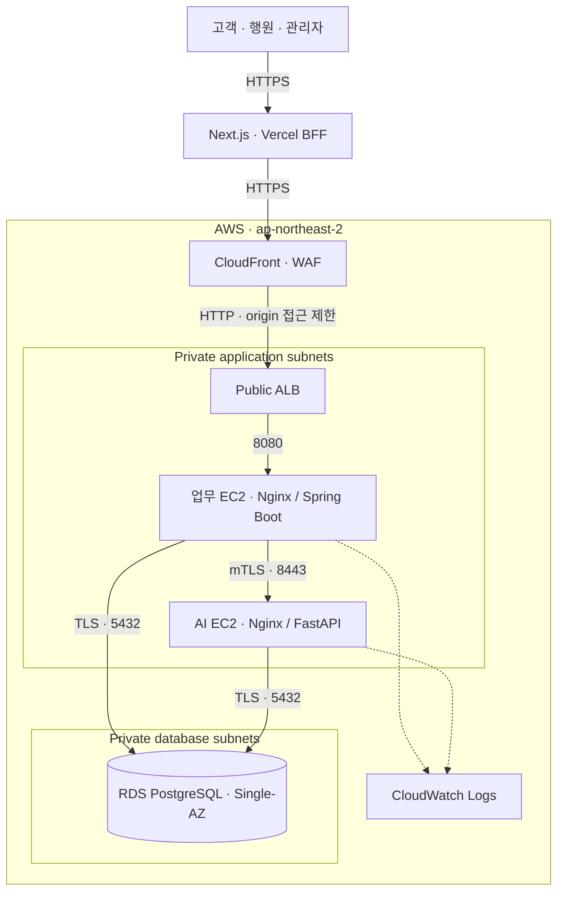

# ALZ's well

**금융생활 변화 확인 서비스를 AWS에 배포하고, 접근통제·배포 검증·장애 대응·운영 종료까지 다룬 프로젝트입니다.**

고객 개인의 평소 금융생활과 최근의 차이를 설명하고, 고객의 응답을 은행 직원의 검토로 연결합니다. 질병이나 사기를 판정하지 않으며, 합성 데이터만 사용합니다. 실제 송금·지급정지·상품 가입·가족 연락은 실행하지 않습니다.

> **현재 상태 · 2026-09-16** — Vercel·AWS 시연 배포는 2026-09-14 철거되었습니다. 현재 접속 가능한 데모가 아닌 **소스 코드와 과거 배포·검증 기록을 제공하는 포트폴리오**입니다. 아래 아키텍처는 배포 당시 구성과 저장소의 IaC 기준입니다.

[클라우드·인프라 설계와 운영 사례](./docs/CLOUD_INFRA_PORTFOLIO.md) · [배포 검증 기록](./docs/RELEASE_V0_1_4.md) · [인프라 코드](./infra/aws-staging/foundation.yaml)

## 담당 역할

**전체 인프라 설계·구축·배포·운영을 담당했습니다.** AWS 네트워크와 컴퓨팅·DB 구성, IAM·비밀 관리, 컨테이너 배포 환경, 배포 검증 및 운영 종료까지 인프라 전반을 맡았습니다. 아래 링크에서 구성 코드와 실행 기록을 함께 확인할 수 있습니다.

## 먼저 살펴볼 내용

| 검토 주제 | 구현 내용 | 코드·증적 |
|---|---|---|
| AWS 인프라 구성 | CloudFormation으로 VPC·서브넷·보안 그룹·EC2·RDS·ALB·CloudFront·WAF 구성 | [IaC](./infra/aws-staging/foundation.yaml) |
| 접근통제 | Private EC2/RDS, SSM 접근, 역할별 IAM·DB 권한, 업무–AI mTLS, RDS 인증서 검증 | [인프라 운영 안내](./infra/aws-staging/README.md), [mTLS 런북](./docs/runbooks/AWS_AI_MTLS.md) |
| 배포 재현성 | ECR 불변 이미지 digest, 용도별 Secrets 주입, Flyway, readiness 확인 | [업무 배포 스크립트](./infra/aws-staging/deploy-app-host.sh), [AI 배포 스크립트](./infra/aws-staging/deploy-ai-host.sh) |
| CI·보안 검사 | 테스트·커버리지, CodeQL, Gitleaks, 의존성·컨테이너 취약점 검사, Compose 통합 검증 | [CI workflow](./.github/workflows/ci.yml), [보안 게이트](./docs/CI_SECURITY_GUIDE.md) |
| 운영 수명주기 | CloudWatch 로그, 장애·롤백 런북, 비용 추정, 삭제 보호와 철거 후 잔여 리소스 확인 | [장애 대응](./docs/runbooks/AWS_FAILURE_RECOVERY.md), [비용 추정](./infra/aws-staging/COST_ESTIMATE.md), [운영 종료 요약](./docs/CLOUD_INFRA_PORTFOLIO.md#운영-종료와-비용-관리) |

## 배포 아키텍처



운영자는 SSM을 사용하며 EC2에 SSH를 공개하지 않습니다. CloudFront→ALB 구간은 HTTP이고 업무→AI는 mTLS, DB 연결은 `verify-full`로 인증서를 검증합니다. NAT Gateway 1개와 S3 gateway endpoint를 사용합니다. **서브넷은 2개 AZ에 구성하지만 업무·AI EC2는 각 1대, RDS는 Single-AZ인 staging**입니다. 고가용성 운영 구성으로 표현하지 않습니다.

## 확인한 결과와 범위

- **2026-09-05 배포 기록:** 합성 고객 300명·계좌 600개·거래 216,000건을 적재하고, 고객·행원·관리자의 BFF 경유 로그인·조회·권한 거부·로그아웃을 확인했습니다.
- **업무 흐름:** 정상·주의·오탐 시나리오와 AI 인용·폴백 여부를 검증했습니다. 고정 합성 데이터 결과이며 실고객 정확도나 대규모 부하 성능을 뜻하지 않습니다.
- **배포 후 권한 회수:** DB bootstrap·migration·이미지 게시 임시 권한을 비활성화한 기록이 있습니다.
- **2026-09-06 확장:** 승인된 합성 사건의 선택형 Bedrock 직원 초안을 검증했습니다. 기본값은 비활성화입니다. [검증 범위](./docs/BEDROCK_STAFF_DRAFT.md)

상세 결과는 [v0.1.4 증적](./docs/RELEASE_V0_1_4.md)에서 확인할 수 있습니다. 해당 시점의 검증이 이후 모든 커밋·화면의 배포 검증을 의미하지는 않습니다. 다중 AZ 장애 전환, 복구 목표 시간·데이터 손실 목표(RTO·RPO), 실제 고객 운영은 별도 검증이 필요합니다.

## 기술 구성과 저장소

| 영역 | 기술 | 위치 |
|---|---|---|
| 업무 API | Java 21 · Spring Boot 3.5 · Spring Security · Flyway | [backend](./backend/README.md) |
| AI 서비스 | Python · FastAPI · 하이브리드 검색 · 선택형 Bedrock | [ai-service](./ai-service/README.md) |
| 웹·BFF | Next.js · React · TypeScript | [frontend](./frontend/README.md) |
| 데이터 | PostgreSQL 17 · pgvector · 합성 데이터 | [데이터 런북](./docs/runbooks/SYNTHETIC_DATASET_V3.md) |
| 인프라·검증 | AWS · CloudFormation · Docker Compose · GitHub Actions | [infra](./infra/aws-staging/README.md), [CI](./.github/workflows/ci.yml) |

## 로컬 확인

인프라를 생성하지 않고 문서 경로와 API 카탈로그를 확인할 수 있습니다. Python 3가 필요합니다.

```bash
python3 scripts/validate_public_repository_metadata.py
python3 scripts/validate_api_catalog.py
```

서비스 실행은 환경변수와 비밀값 설정이 필요하므로 [백엔드 실행 안내](./backend/README.md), [프론트 실행 안내](./frontend/README.md), [AI 실행 안내](./ai-service/README.md)를 따릅니다. 주요 검증 명령은 다음과 같습니다. Java 21·Docker, Node.js 22 및 설치된 npm 의존성, uv가 필요합니다.

```bash
(cd backend && ./gradlew check)
(cd frontend && npm test)
(cd ai-service && uv run pytest)
```

AWS 재배포는 비용이 발생합니다. [배포 기준](./docs/AWS_BACKEND_DEPLOYMENT.md)과 [staging 체크리스트](./docs/STAGING_DEPLOYMENT_CHECKLIST.md)의 템플릿·change set·비용·권한 검토 후 수행합니다.

## 상세 문서

- 제품 목적과 안전 경계: [프로젝트 SSOT](./ALZS_WELL_PROJECT_SSOT.md)
- 기능·요청·응답 계약: [백엔드 API 명세](./docs/FINAL_BACKEND_API_SPEC.md)
- 고객·행원 이용 흐름: [프론트 흐름](./docs/CUSTOMER_STAFF_FRONTEND_FLOW.md)
- 시연 검증: [리허설](./docs/DEMO_REHEARSAL.md)
- 미검증 항목과 운영 전환 조건: [실서비스 준비도](./docs/PRODUCTION_READINESS.md)
- 개발 인수인계: [백엔드 인수인계](./docs/BACKEND_DEVELOPER_HANDOFF.md)
- 기여 규칙: [CONTRIBUTING](./CONTRIBUTING.md)
- 제3자 자료 이용 범위: [THIRD_PARTY_NOTICES](./THIRD_PARTY_NOTICES.md)

기능 사실은 현행 백엔드 코드·마이그레이션·명세를 기준으로, 배포 사실은 날짜와 버전이 명시된 기록을 기준으로 확인합니다. 제3자 원문 corpus는 공개 배포 artifact에 포함하지 않습니다.
